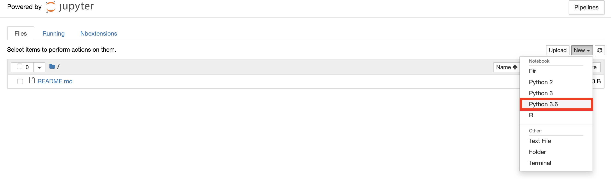
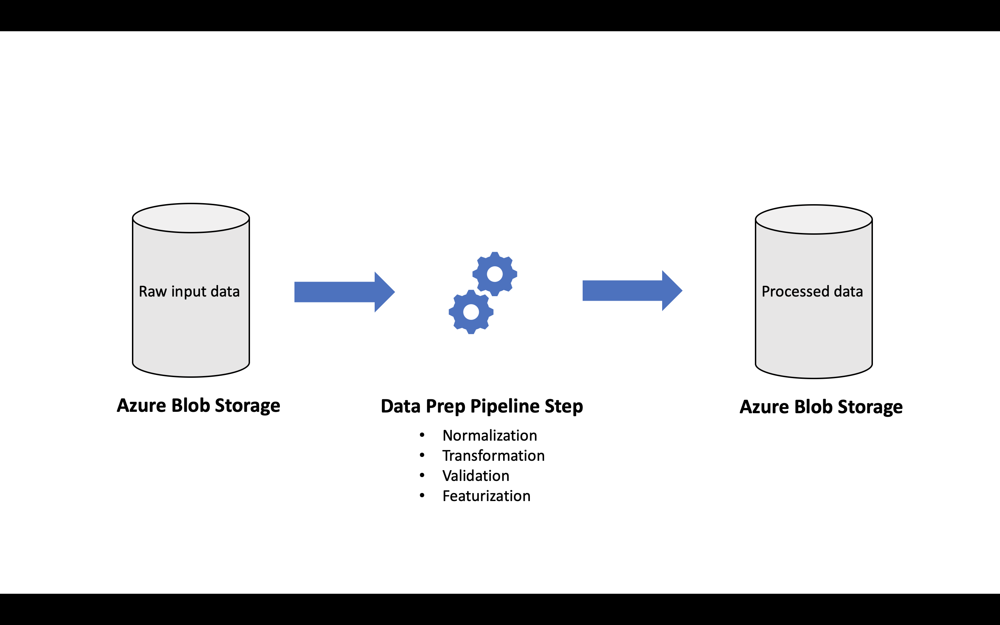
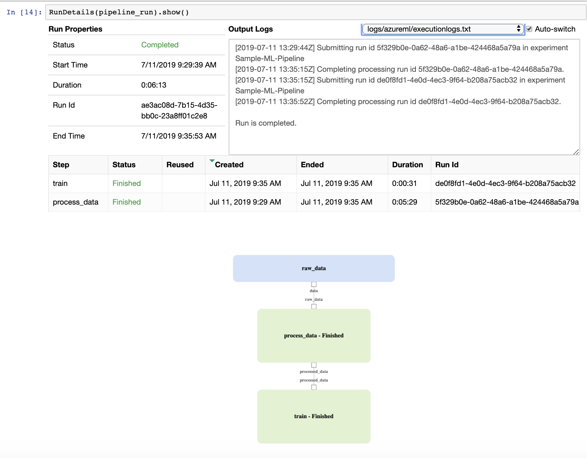
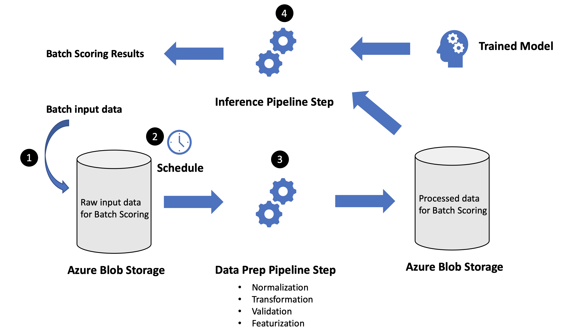

# Overview of machine learning pipelines using the Azure Machine Learning SDK

## What are machine learning pipelines?

Machine learning pipelines are cyclical and iterative in nature that facilitate both continuous improvement of model performance and deploying and making inferences on the best performing model to date. The pipelines comprise of distinct steps, for example, data preparation, model training, and batch predictions. Often data scientists, data engineers and IT professionals need to collaborate on building robust, scalable, and reusable machine learning pipelines.

The following diagram shows an example pipeline:


The [Azure Machine Learning SDK for Python](https://docs.microsoft.com/en-us/python/api/azureml-pipeline-core/?view=azure-ml-py) allows you to create ML pipelines, and also submit and track individual pipeline runs. You can build reusable pipelines that optimize your specific workflows and allows you to focus on your expertise, for example machine learning, instead of the infrastructure to build and manage the pipelines.

The purpose of this article to show how to build an example machine learning pipeline work flow, that includes repeatable data preparation, model training and batch predictions using the Azure Machine Learning SDK for Python within Azure notebooks.

## Create a New Notebook in Azure Notebooks

One of the ways to use the Azure Machine Learning SDK for Python is with Azure notebooks. In the introduction we saw how to get started with Azure notebooks. Here we will show how to create a new notebook to get started.

In Azure notebooks, when you select Run to start your project, it opens Jupyter Notebooks interface. From within the Jupyter Notebooks interface, create a new notebook with Python 3.6 kernel as shown.



Now you are ready to write your code in the notebook.

## Create AML Compute Cluster

Azure Machine Learning Compute is a service for provisioning and managing clusters of Azure virtual machines for running machine learning workloads. In the introduction we saw how to create Azure Machine Learning workspace in your subscription. The following steps create a new Aml Compute in the workspace, if it doesn't already exist. This compute target will be used to run all the pipelines.

```python
from azureml.core.compute import AmlCompute
from azureml.core.compute import ComputeTarget
from azureml.core.compute_target import ComputeTargetException

aml_compute_target = "aml-compute"

try:
    # Look to see if the compute target already available in the workspace (ws)
    aml_compute = AmlCompute(ws, aml_compute_target)
    print("found existing compute target.")
except ComputeTargetException:
    print("creating new compute target")
    provisioning_config = AmlCompute.provisioning_configuration(vm_size = "STANDARD_D2_V2",
                                                                min_nodes = 1, 
                                                                max_nodes = 1)    
    aml_compute = ComputeTarget.create(ws, aml_compute_target, provisioning_config)
    aml_compute.wait_for_completion(show_output=True, min_node_count=None, timeout_in_minutes=20)
```

## Create the Run Configuration

Run configuration defines enviroment needed to run the piplines on the above created compute target. In this example, we will be using the numpy, pandas and the scikit-learn libraries for data preparation, modeling training, and batch predictions tasks. These required libraries are included in the environment as application dependencies.

```python
from azureml.core.runconfig import RunConfiguration
from azureml.core.conda_dependencies import CondaDependencies
from azureml.core.runconfig import DEFAULT_CPU_IMAGE

# Create a new runconfig object
run_amlcompute = RunConfiguration()

# Use the cpu_cluster you created above
run_amlcompute.target = aml_compute_target

# Enable Docker
run_amlcompute.environment.docker.enabled = True

# Set Docker base image to the default CPU-based image
run_amlcompute.environment.docker.base_image = DEFAULT_CPU_IMAGE

# Use conda_dependencies.yml to create a conda environment in the Docker image for execution
run_amlcompute.environment.python.user_managed_dependencies = False

# Auto-prepare the Docker image when used for execution (if it is not already prepared)
run_amlcompute.auto_prepare_environment = True

# Specify CondaDependencies obj, add necessary packages
run_amlcompute.environment.python.conda_dependencies = CondaDependencies.create(pip_packages=[
    'numpy',
    'pandas',
    'scikit-learn',
    'sklearn_pandas'
])
```

## Creating a Pipeline for Repeatable Data Prep and Model Training

In this section we will describe how to use the Azure notebooks to build repeatable data preparation and model training pipeline with explicit dependency between the two pipeline steps.

### Create Data Preparation Pipeline Step

In the data preparation pipeline step, we take the raw input data, process the input data, and output the processed data that will be used in the model training step.



#### Create a DataReference for the raw input data

Assuming that you have uploaded the raw input data file('s) to the default datastore in your workspace. You can first get the default datastore associated with workspace, and then create a DataReference for the raw input data by specifying the path of the raw input data file('s) in the datastore. You will pass this DataReference as input to your Data Prep Pipeline step.

```python
from azureml.data.data_reference import DataReference

# Get reference to the default data store in your workspace
def_blob_store = ws.get_default_datastore()

# Create a DataReference to the raw data input file
raw_data = DataReference(datastore=def_blob_store, 
                                      data_reference_name="raw_data", 
                                      path_on_datastore=".../...")
```

#### Create a PipelineData object for the processed data

The intermediate data (or output of a Step) is represented by PipelineData object. PipelineData can be produced by one step and consumed in another step by providing the PipelineData object as an output of one step and the input of one or more steps. Thus, to save the processed data / output from the Data Prep Pipeline step, you need to create a PipelineData object. We will use the default datastore to save the processed data.

```python
from azureml.pipeline.core import PipelineData

# Create the PipelineData object to host the processed data
processed_data = PipelineData('processed_data', datastore=def_blob_store)
```

#### Create the Data Prep Pipeline Step object

In this example, we will create a PythonScriptStep object that will run the code in the specified python script file as part of the Data Prep Pipeline Step execution. Your script, `process.py`, can define custom input parameters, such as `process_mode` that is unique to your needs. In this example, since the Data Prep pipeline step will be used to process input data at both training and inference time, the script file expects a custom input parameter named `process_mode` to distinguish the context in which it is called. We will look at the code to create the pipeline step, followed by an example python script file that will be used in the step.

Here are some key parameters used to create the pipeline step:

- The `source_directory` is the path to the python file `process.py`
- The script takes three arguments as inputs: process_mode: 'train' or 'inference', input location, and output location
- This step is created to be used in the **Data Prep - Model Train** pipeline, thus process_mode is set to 'train'
- inputs specify the DataReference object where the raw input file(s) are available
- ouputs takes the PipelineData object to save the intermediate processed data generated as part of this step
- Specify the compute target and run configuration

```python
from azureml.pipeline.steps import PythonScriptStep

# Create the Data Prep Pipeline Step Object
dataPrepStep = PythonScriptStep(
    name="process_data",
    source_directory="...",
    script_name="process.py", 
    arguments=["--process_mode", 'train',
               "--input", raw_data,
               "--output", processed_data],
    inputs=[raw_data],
    outputs=[processed_data],
    compute_target=aml_compute,
    runconfig=run_amlcompute
)
```
Next, we will look at an example for the Data Prep python script file `process.py`

```python
import argparse
import os
import pandas as pd
import numpy as np

print("In process.py")

parser = argparse.ArgumentParser("process")
parser.add_argument("--process_mode", type=str, help="process mode: train or inference")
parser.add_argument("--input", type=str, help="input raw data")
parser.add_argument("--output", type=str, help="output directory for processed data")

args = parser.parse_args()

print("Argument 1: %s" % args.process_mode)
print("Argument 2: %s" % args.input)
print("Argument 3: %s" % args.output)

# Load the raw input data csv file in a pandas data frame
data = pd.read_csv(args.input)

# Process the raw input data based on the process_mode parameter
if(args.process_mode == 'train'):
    ...
elif(args.process_mode == 'inference'):
    # raw data at inference time will not include labels / target values
    ...
else:
    print('Invalid process_mode!')
    
# Save the processed data in the output folder
os.makedirs(args.output, exist_ok=True)
data.to_csv(os.path.join(args.output, "processed-data.csv"), header=True, index=False)
print('Processed data file saved!')
```

### Create Model Training Pipeline Step

In the model training pipeline step, we take the `processed_data` PipelineData as input, and save the trained model in another PipelineData object named `trained_model`:

```python
trained_model = PipelineData('trained_model', datastore=def_blob_store)

trainStep = PythonScriptStep(
    name="train",
    source_directory="...",
    script_name="train.py", 
    arguments=["--input", processed_data, "--output", trained_model],
    inputs=[processed_train_data],
    outputs=[trained_model],
    compute_target=aml_compute,
    runconfig=run_amlcompute
)
```
The training script file `train.py` includes the code to take the processed data from the Data Prep pipeline step, train the model, and save the trained model in the datastore.

### Create and Run the Data Prep - Model Training Pipeline

In the preceding sections, we created two pipeline step objects - `Data Prep` and `Model Training`. Next, we will look at how to create a pipeline, create an experiment, submit the pipeline run, and monitor the pipeline run. Note that there is implicit data dependency between the Data Prep and Model Training pipeline steps. The Model Training depends on the output from the Data Prep step. Thus, when we create the pipeline object, we only use the Model Training pipeline step. When you submit the pipeline run, it will resolve the dependency by first running the Data Prep step followed by Model Training step.

```python
from azureml.pipeline.core import Pipeline
from azureml.core import Experiment

# Create the pipeline object
pipeline = Pipeline(workspace=ws, steps=[trainStep])
print ("Pipeline is built")

# Validate the pipeline
pipeline.validate()
print("Simple validation complete")

# Create an experiment and submit the pipeline run
experiment_name = 'Sample-ML-Pipeline'
pipeline_run = Experiment(ws, experiment_name).submit(pipeline)
print("Pipeline is submitted for execution")

# Monitor the pipeline run
RunDetails(pipeline_run).show()
```

The RunDetails show the different steps of the pipelines, their execution status, and it also shows a visual of the implicit order and dependencies between different steps in the pipeline.

   
   
Note that as new training data is available, you can reuse the pipeline steps to train a new model with the new data to improve model performance.

## Creating a pipeline for repeatable data prep and batch scoring using Azure Notebooks

In this section, we are going to learn how to setup a `Batch Scoring` pipeline that leverages the data processing logic encapsulated in `process.py`, and uses the trained model form the `Data Prep – Model Training` pipeline to generate batch predictions on new input data.

The **Batch Scoring** pipeline comprises of two steps:

- **Data Prep Pipeline Step**: process the new batch input data

- **Inference Pipeline Step**: make inferences on the new processed data using the trained model from the `Data Prep – Model Training` pipeline

Thus the `Inference` step has implicit data dependencies on the output from the new instance of the `Data Prep` step and the output from the previous instance of the `Model Training` step.

In this example, raw input data is periodically uploaded in bulk to the Azure blob storage, and after each upload, we want to invoke the `Batch Scoring` pipeline to make predictions. This workflow, would require us to use a schedule to monitor changes to the blob storage, and repeatably use the `Batch Scoring` pipeline. There are four basic steps in this workflow: (1) new input dataset is uploaded to blob storage, (2) the schedule triggers the `Batch Scoring` pipeline, (3) The `Batch Scoring` pipeline runs the `Data Prep` step, and (4) The `Batch Scoring` pipeline runs the `Inference` step. The following diagram illustrates this workflow.



## Create the Data Prep Pipeline Step object

The new `Data Prep` pipeline step to process the input dataset requires the following:

- Create a new `DataReference` object for the location of the batch input data

- Create a new `PipelineData` object to output the processed data

- Create a new `PythonScriptStep` using the same `process.py` script file

There are two key differences in this `Data Prep` step compared to the `Data Prep` step used in the `Data Prep – Model Training` pipeline. First, the `process_mode` is set to `inference`, and second, the `allow_reuse` property is set to `False`. The `allow_reuse` controls if the step can reuse previous results when re-run with the same settings. However, we want to repeatably call the pipeline step as new data is uploaded to storage, and thus we set `allow_reuse = False`.

```python

```
