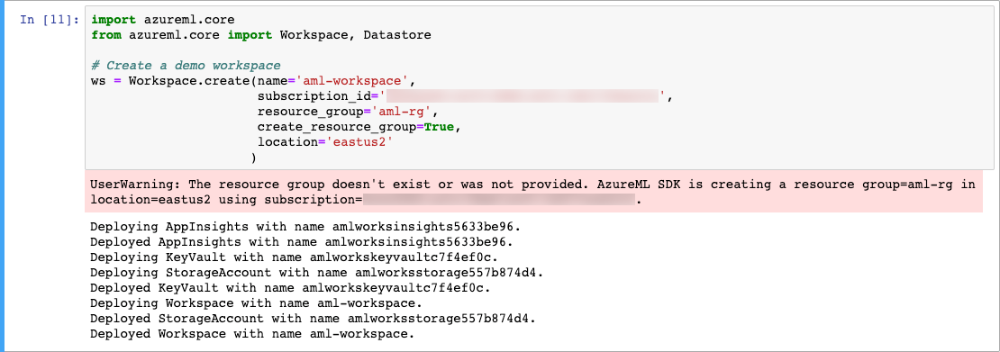
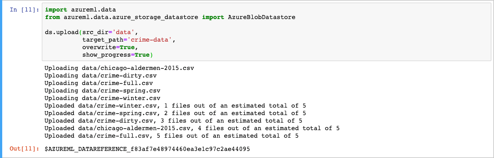
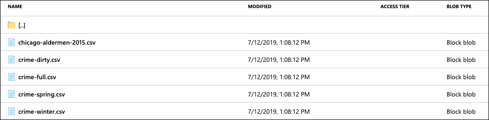
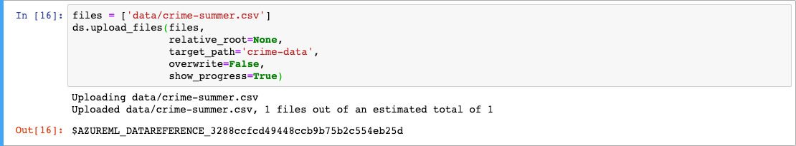
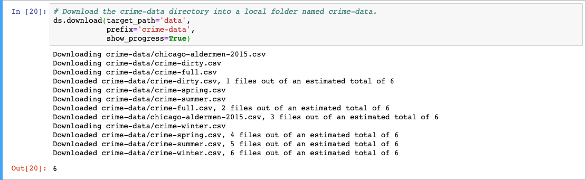
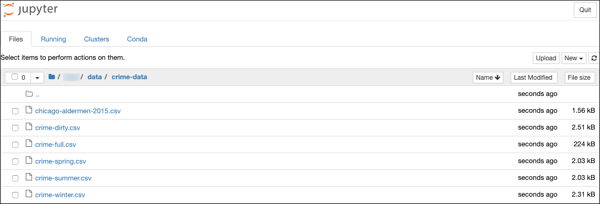
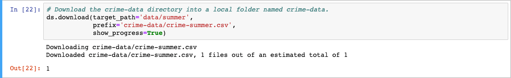

# Accessing data from various Azure services and working with AML datastores

Azure Machine Learning (AML) service uses **[datastores](https://docs.microsoft.com/azure/machine-learning/service/how-to-access-data)** to read and write data to and from various Azure storage services. Datastores are references that point to Azure storage services, such as a blob container. Essentially, a datastore is an abstraction over an Azure storage service that stores the information required to connect to it. This abstraction simplifies the process of accessing data stored within the storage service. Using datastores, you to connect to the underlying storage service by name, and do not need to remember connection information and secrets used to connect to data sources.

Also, datastores provide a storage service access mechanism that is independent of your [compute](https://docs.microsoft.com/azure/machine-learning/service/concept-compute-target) location. In Azure Machine Learning, the term **compute** (or **compute target**) refers to the machines or clusters that perform the computational steps in your machine learning pipeline. Compute location-independence means you can easily change your compute environment without changing your source code. Azure Machine Learning workflows ensure your datastore locations are accessible and made available to your compute context.

Throughout this article, we examine how datastores allow data access from the supported Azure storage services. We also review the management of datastores within your AML workspace using the Azure Machine Learning SDK for Python.

## Supported Azure storage services

Data is frequently stored in various formats and can be structured, semi-structured, or unstructured. AML service provides the flexibility to access multiple existing data sources by supporting the registration of the following Azure storage services as datastores:

- [Azure Blob Container](https://docs.microsoft.com/azure/storage/blobs/storage-blobs-overview)
- [Azure File Share](https://docs.microsoft.com/azure/storage/files/storage-files-introduction)
- [Azure Data Lake](https://docs.microsoft.com/azure/data-lake-store/data-lake-store-overview)
- [Azure Data Lake Gen2](https://docs.microsoft.com/azure/storage/blobs/data-lake-storage-introduction)
- [Azure SQL Database](https://docs.microsoft.com/azure/sql-database/sql-database-technical-overview)
- [Azure PostgreSQL](https://docs.microsoft.com/azure/postgresql/overview)
- [Databricks File System](https://docs.azuredatabricks.net/user-guide/dbfs-databricks-file-system.html)

> **Note**: Use of blob storage and blob datastores is the recommended approach, at this time. You can use either standard and premium storage, depending on your needs. Although more expensive, premium storage provides faster throughput speeds, which may help to improve performance during training runs, specifically if you are training against large data sets.

The remaining sections of this article provide specific details about how to register and access data within each of the supported Azure storage services.

## Working with datastores

To work with datastores in an AML workspace, you use the `Workspace` and `Datastore` classes in the [Azure Machine Learning SDK for Python](https://docs.microsoft.com/python/api/azureml-core/azureml.core.datastore(class)?view=azure-ml-py).

To provide a clean environment for the examples that follow, we are using a new AML workspace. The new workspace is created using the [Azure Machine Learning SDK for Python](https://docs.microsoft.com/python/api/overview/azure/ml/intro?view=azure-ml-py), following the instructions provided in the [Environment Setup article](../intro/environment-setup.md#Option-3-Python-SDK) of this guide.

> **Note**: You can also use an existing workspace by replacing `Workspace.create()` in the command below with `Workspace.from_config()` in a notebook within your existing workspace.

Use the following command to create the new workspace from a Jupyter notebook, adding in your subscription ID:

```python
import azureml.core
from azureml.core import Workspace

ws = Workspace.create(name='aml-workspace',
                      subscription_id='<azure-subscription-id>',
                      resource_group='aml-rg',
                      create_resource_group=True,
                      location='eastus2'
                     )
```



The workspace deployment process includes the creation of a new storage account, as you can see within the output from the command above. Within that storage account, both a blob container and file store are created and automatically registered as datastores in the workspace.

## Managing datastores

We start by exploring the methods provided by the SKD to manage the datastores within an AML workspace. The `Workspace` and `Datastore` classes include methods for listing, getting, registering, and removing datastores within an AML workspace.

### Listing datastores

You can generate a list of the datastores registered with the workspace using the `datastores` property of the `Workspace` class, as follows:

```python
ws.datastores
```

The output of `ws.datastores` is a dictionary of datastores. The dictionary contains the datastore name as the key and the datastore object as the value. For a new workspace, it should look like the following:

```json
{'workspaceblobstore': <azureml.data.azure_storage_datastore.AzureBlobDatastore at 0x7f962103aa58>,
 'workspacefilestore': <azureml.data.azure_storage_datastore.AzureFileDatastore at 0x7f9620f14a20>}
```

Let's use the `ws.datastores` property to capture the datastores dictionary in a variable. You can use this to access datastores by name and type in the examples below.

```python
#list all datastores registered in the current workspace
datastores = ws.datastores

# Example of printing each datastore name and type
for name, ds in datastores.items():
    print(name, ds.datastore_type)
```

### Getting datastores

To get a datastore, use the `get(workspace, name)` method of the `Datastore` class. The `get` method allows you to retrieve a datastore by name and returns the corresponding datastore. The return type is dependent upon the type of the requested datastore. As such, the properties and methods available vary based on the datastore type. The `get` method takes two parameters, a `Workspace` object and a string containing the name of the datastore to retrieve.

The following example retrieves the datastore by the name of `workspaceblobstore` from the workspace and then outputs the type of the datastore.

```python
# Get the datastore named 'workspaceblobstore' from the 'ws' workspace.
ds = Datastore.get(ws, 'workspaceblobstore')

# Output the type of the datastore
ds.datastore_type
```

Another option is to use the `datastores` variable created in the previous section to retrieve a specific datastore by its type. The `datastores` variable contains the name of each datastore and the datastore object itself. In the example below, the blob datastore is selected, and then the associated blob container name specified as the output:

```python
# Select the datastore object with a type of 'AzureBlob' from the 'datastores' dictionary.
ds = next(ds for name, ds in datastores.items() if ds.datastore_type == 'AzureBlob')

# Output the name of the underlying blob container
ds.container_name
```

> **Note**: The `container_name` property is specific to datastores referencing an underlying Azure Blob storage service. This property is note available on other datastores, such as one pointing to an Azure SQL Database. To view the properties and methods of a particular datastore module, you can use `dir(ds)`.

### The default datastore

Every AML workspace comes configured with a default datastore, and special methods have been added to both the `Datastore` and `Workspace` classes to retrieve it. The Azure blob container and blob datastore deployed when you create an AML workspace is automatically configured as the default datastore for the workspace and assigned a name of `workspaceblobstore`.

#### Getting the default datastore

There are two methods you can choose from to retrieve the default datastore. The `Workspace` class defines a `get_default_datastore()` method and the `Datastore` class provides a `get_default(workspace)` method.

To get the default datastore with the `Workspace.get_default_datastore()` method, use the following example:

```python
# Retrieve the default datastore from the workspace
ds = ws.get_default_datastore()

# Display the name of the default datastore
ds.name
```

The next example demonstrates how to use `Datastore.get_default(workspace)` to retrieve the default datastore. For this method, you must provide a `Workspace` object as a parameter.

```python
# Retrieve the default datastore from the 'ws' workspace
ds = Datastore.get_default(ws)

# Display the name of the default datastore
ds.name
```

#### Setting the default datastore

Depending on the primary data source you are using for training and running your models, you may want to change the default datastore to another Azure storage service. Should this be the case, you can change the default datastore for your workspace by using the `set_as_default()` method on any `Datastore` object. For example, let's change the default datastore of the `ws` workspace from the blob container to the file datastore.

```python
# Get the 'workspacefilestore' datastore.
fileDs = Datastore.get(ws, 'workspacefilestore')

# Set the 'workspacefilestore' as the default datastore
fileDs.set_as_default()
```

To verify the new default setting, run the following to get the default datastore from the workspace, and then display its name.

```python
# Retrieve the default datastore from the workspace
defaultDs = ws.get_default_datastore()

# Display the default datastore name
defaultDs.name
```

Changing the default datastore can also be accomplished using the `set_default_datastore(datastore_name)` method on the `Workspace` class. Using the same example as above, you set the default datastore as follows:

```python
# Define default datastore for current workspace
ws.set_default_datastore('workspacefilestore')
```

### Registering a new datastore

Using methods provided on the `Datastore` class in the SDK, you can register additional datastores in your workspace, as needed. On the `Datastore` class, there is an individual register method defined for each of the supported Azure storage services, each of which has the form `register_azure_*`. The specific details and required parameters for each register method are well documented on the [Datastore class page](https://docs.microsoft.com/python/api/azureml-core/azureml.core.datastore(class)?view=azure-ml-py) of Azure Machine Learning SDK for Python, so we do not cover those here. We do, however, provide a few examples to show how to use the register methods.

The introduction of this article mentioned that datastores abstract away the need to remember connection information and secrets used to connect to data sources. This abstraction is made possible by providing that information at the time of datastore registration. AML then securely stores the connection details for each datastore, so you don't have to enter it again each time you access a datastore. In the examples below, we provide details about the connection and secret information required to register new datastores for both Azure Data Lake Storage (ADLS) Gen2 and Azure SQL Database.

In the first datastore registration example, we demonstrate how to register an Azure Data Lake Gen2 datastore. For this, you need to [create ADLS Gen2 storage account](https://docs.microsoft.com/azure/storage/blobs/data-lake-storage-quickstart-create-account) (or refer to an existing one). The connection information required to complete the datastore registration includes:

- The ADLS Gen2 storage account name
- The ADLS Gen2 file system name, which you can now create through the Azure portal UI
- Your Azure Active Directory tenant ID/directory ID
- The application ID and password associated with an Azure Active Directory application service principal

    > To register an ADLS Gen2 datastore, you need to have the credentials (client ID and secret) of an Azure AD service principal that has been granted access to your ADLS Gen2 storage account. To learn how to create a service principal, read [Create an Azure service principal with Azure CLI](https://docs.microsoft.com/cli/azure/create-an-azure-service-principal-azure-cli?view=azure-cli-latest).

In the example below, replace the tokenized values and then execute this within a cell in a Jupyter notebook in your AML workspace.

```python
adlsGen2DatastoreName = 'workspaceadlsstore'
fileSystemName = 'adls-fs'
storageAccountName = 'amladlsgen2'
tenantId = '<your-azure-ad-tenant-id>'
clientId = '<your-service-principal-application-id>'
clientSecret = '<your-service-principal-password>'

adlsDs = Datastore.register_azure_data_lake_gen2(ws,
                              adlsGen2DatastoreName,
                              fileSystemName,
                              storageAccountName,
                              tenantId,
                              clientId,
                              clientSecret,
                              resource_url=None,
                              authority_url=None,
                              protocol=None,
                              endpoint=None,
                              overwrite=False)
```

Now, list the datastores registered in your workspace, and you can see the newly added ADLS Gen2 datastore.

```python
ws.datastores
```

In the output, which should resemble the following, note the addition of the `workspaceadlsstore` datastore:

```json
{'workspaceblobstore': <azureml.data.azure_storage_datastore.AzureBlobDatastore at 0x7f9620368518>,
 'workspacefilestore': <azureml.data.azure_storage_datastore.AzureFileDatastore at 0x7f9620285ef0>,
 'workspaceadlsstore': <azureml.data.azure_data_lake_datastore.AzureDataLakeGen2Datastore at 0x7f9620285dd8>}
```

In the next example, you add an Azure SQL Database datastore. As with the Azure Data Lake Gen2 datastore, you need to provide the credentials (client ID and secret) of a service principal with access to your Azure SQL Database. You can use the same service principal as before or a different one depending on how you handle security and isolate resources within your environment.

> **Important**: Before running the datastore registration for an Azure SQL Database, the service principal must be an Azure Active Directory admin on the Azure SQL DB resource. The service principal cannot be added as an admin directly, so you need to create an Azure AD security group, add the service principal to that group, and then make the group the Azure AD admin on your SQL Database. Detailed steps to do this are available [here](https://blogs.technet.microsoft.com/stefan_stranger/2018/06/06/connect-to-azure-sql-database-by-obtaining-a-token-from-azure-active-directory-aad/).

The connection information required to complete the Azure SQL DB datastore registration is:

- The SQL server name
- The database name
- Your Azure Active Directory tenant ID/directory ID
- The application ID and password associated with an Azure Active Directory application service principal

```python
sqlDatastoreName = 'workspacesqlstore'
serverName = 'aml-db'
databaseName = 'aml-db'
tenantId = '<your-azure-ad-tenant-id>'
clientId = '<your-service-principal-application-id>'
clientSecret = '<your-service-principal-password>'

sqlDs = Datastore.register_azure_sql_database(ws,
                            sqlDatastoreName,
                            serverName,
                            databaseName,
                            tenantId,
                            clientId,
                            clientSecret,
                            resource_url=None,
                            authority_url=None,
                            endpoint=None,
                            overwrite=False)
```

Once again, list the datastores registered in your workspace.

```python
ws.datastores
```

In the output, note the addition of the `workspacesqlstore` datastore:

```json
{'workspaceblobstore': <azureml.data.azure_storage_datastore.AzureBlobDatastore at 0x7f96202cf8d0>,
 'workspacefilestore': <azureml.data.azure_storage_datastore.AzureFileDatastore at 0x7f96202c37b8>,
 'workspaceadlsstore': <azureml.data.azure_data_lake_datastore.AzureDataLakeGen2Datastore at 0x7f96202c39e8>,
 'workspacesqlstore': <azureml.data.azure_sql_database_datastore.AzureSqlDatabaseDatastore at 0x7f96202c3c50>}
```

### Unregister a datastore

Just as you can register new datastores to your workspace, the `Datastore` class also provides a method to remove them. The `unregister()` method of the `Datastore` class is used to accomplish this.

For example, use the following to unregister the ADLS Gen 2 datastore registered in the previous section.

```python
# Get the 'workspaceadlsstore' datastore.
adlsDs = Datastore.get(ws, 'workspaceadlsstore')

# Unregister the 'workspaceadlsstore'
adlsDs.unregister()
```

You can verify the removal of the datastore by listing the datastores registered with the workspace.

```python
# List the datastores registered with the workspace
ws.datastores
```

> **Note**: Unregistering a datastore only removes the datastore from your workspace. It does not delete the underlying storage service.

## Upload and download data

The `AzureBlobDatastore` and `AzureFileDatastore` classes provide methods that allow you to upload and download data to and from the underlying storage service. To upload, use the `upload()` and `upload_files()` methods and to download data use the `download()`.

For these examples, use the Azure Blob storage datastore. First, get the `workspaceblobstore` datastore using the `get` method, as described above.

```python
# Get the 'workspaceblobstore' datastore.
ds = Datastore.get(ws, 'workspaceblobstore')
```

### Upload

You can upload both directories and individual files to the datastore using the Python SDK. To use the upload methods, you must import the `azureml.data` namespace, and then import the appropriate `AzureBlobDatastore` or `AzureFileDatastore` class.

#### Upload directory

To upload a directory, use the `upload()` method. For this example, a folder named `data` has been added to the local workspace and is used to demonstrate the upload directory functionality. In the example below, the `data` folder is uploaded to the Azure Blob storage account, and placed in a folder named `crime-data`.

```python
import azureml.data
from azureml.data.azure_storage_datastore import AzureBlobDatastore

# Upload the directory to the target path
ds.upload(src_dir='data',
          target_path='crime-data',
          overwrite=True,
          show_progress=True)
```



You can verify the directory was uploaded by browsing to the storage account in the Azure portal, selecting Blobs and the `azureml-blobstore` container, and then opening the `crime-data` folder.



#### Upload individual files

To upload individual files, you use the `upload_files()` method. The example below uploads a file named `crime-summer.csv` located in the `data` directory to the `crime-data` folder in blob storage. You can upload any number of files, by adding the absolute path of each file to the list of files.

```python
# Create a list of absolute paths to individual files to upload
files = ['data/crime-summer.csv']

# Upload the files to the target path
ds.upload_files(files,
                relative_root=None,
                target_path='crime-data',
                overwrite=False,
                show_progress=True)
```



As you did above, you can verify that the individual file was upload by looking in the associated blob storage account.

### Download

To download folders and files, you use the `download()` method. For demonstration purposes, you will download the `crime-data` folder you uploaded in the steps above.

For the parameters, the `target_path` is the local directory into which you want to download files. The `prefix` parameter defines the path to the folder in the blob container to download. If `prefix` is set to `None`, the entire contents of the storage container are downloaded.

#### Download directory

To download an entire directory, specify the directory path in the `prefix` parameter.

```python
# Download the crime-data directory into a local folder named crime-data.
ds.download(target_path='crime-data',
            prefix='crime-data',
            show_progress=True)
```





#### Download individual file

To download an individual file, include the full path of the file in the `prefix` parameter. In the example below, `prefix` is set to `crime-data/crime-summer.csv`, so only that file is downloaded.

```python
# Download the crime-data/crime-summer.csv file into a local folder named data/summer.
ds.download(target_path='data/summer',
            prefix='crime-data/crime-summer.csv',
            show_progress=True)
```



## Next steps

You can continue learning about accessing data with AML by reviewing the links to additional resources below:

- [Access data from your datastores](https://docs.microsoft.com/azure/machine-learning/service/how-to-access-data)
- [Datastore class documentation](https://docs.microsoft.com/python/api/azureml-core/azureml.core.datastore(class)?view=azure-ml-py)
- [Workspace class documentation](https://docs.microsoft.com/python/api/azureml-core/azureml.core.workspace(class)?view=azure-ml-py)

In the next article, methods for reading and writing data to and from your datastores are examined.

Read next: [Load, transform, and write data with Azure Machine Learning and the AML Data Prep SDK](./loading-and-writing-data.md)
