# Overview of wrangling, exploring, and cleaning data

*Big Data* has become part of the lexicon of organizations worldwide, as more and more organizations look to leverage data to drive more informed business decisions. With this evolution in business decision-making, the amount of raw data collected, along with the number and diversity of data sources, is growing at an astounding rate. Raw data, however, is often noisy and unreliable and may contain missing values and outliers. Using such data for modeling can produce misleading results. For the data scientist, the ability to combine these large, disparate data sets into a format more appropriate for conducting advanced analytics is an increasingly crucial skill. In the field of data science, this skill is commonly known as **data wrangling**.

## What is data wrangling?

Data wrangling, also referred to as data munging or data transformation, is the process of cleaning, restructuring and enriching raw data to transform it into a format more suitable for use in common data science tasks, such as advanced data analytics and machine learning. It falls within the Data Acquisition and Understanding step of the [Data Science Lifecycle](./../data-science-lifecycle/tdsp-intro.md).

Real-world data is frequently gathered from multiple sources using varying processes, and collected in several different formats and data stores. This data may contain irregularities or corrupt data which can compromise the quality of the dataset, including:

- Incomplete data lacking attributes or containing missing values
- Noisy data with erroneous records or outliers
- Inconsistent data containing conflicting records or discrepancies

To build quality predictive models, data scientists must have quality data. This is where data wrangling comes into play. The process allows for the identification of data quality issues and decisions about the appropriate data processing and cleaning steps necessary to improve data quality, before using it for modeling. Data scientists adept at this process of organizing and structuring data prior to performing more in-depth analysis can help drive better insights from larger amounts of data, and typically do it in less time.

> The [Azure Machine Learning Data Prep SDK for Python](https://docs.microsoft.com/python/api/overview/azure/dataprep/intro?view=azure-dataprep-py) was designed to help you explore, cleanse, and transform data from machine learning workflows.

Similar to many other data analytics processes, data wrangling is iterative. The process typically follows a set of generalized steps, beginning with data discovery and exploration, followed by data transformation tasks, such as restructuring, cleansing, and augmenting, and ending with validating and publishing to a resultant dataset for future use. Each of these steps are covered in more detail below.

## Discover and explore

Before using data for building models and performing deeper analysis, it is necessary to understand the dataset, what it contains, how it is structured, and what issues may exist within it. The discovery and exploration step uses data summarization and visualization techniques to audit the dataset, to gain a better understanding of data quality and structure and highlight important and interesting aspects of the dataset. The information derived from this step informs how you go about transforming data by providing the details required to process data before it is ready for modeling.

This step begins with extracting the data in its raw form from the data source and using various techniques, such as data visualizations, data aggregation, and sorting, to describe and explore the data and uncover issues. The general quality of a dataset can be checked by:

- Examining the number of records
- Inspecting the number of attributes (or features as they are more commonly known in data science terms)
- Reviewing the feature data types (nominal, ordinal, or continuous)
- Checking features for and counting the number of missing values
- Looking at how well-formed the data is (e.g., checking that column and line separators always correctly separate columns and lines in TSV or CSV files)
- Checking for inconsistent data records, such as checking the range of allowable values for a feature (e.g., If the data contains student GPAs, check if the GPA is in the designated range, say 0.0 to 4.0)

An excellent place to start is to inspect the data visually. In the Python code below, sample crime data is read into an [Azure ML DataPrep Dataflow class](https://docs.microsoft.com/python/api/azureml-dataprep/azureml.dataprep.dataflow?view=azure-ml-py), and then the first 5 records are displayed using the `head()` function on the Dataflow.

```python
import pandas as pd
import azureml.dataprep as dprep

# Path for dataset
file_crime_dirty  = './data/crime-dirty.csv'

# Read the crime data into a Dataflow
crime_dirty = dprep.auto_read_file(path=file_crime_dirty)

# Display the first 5 records
crime_dirty.head(5)
```

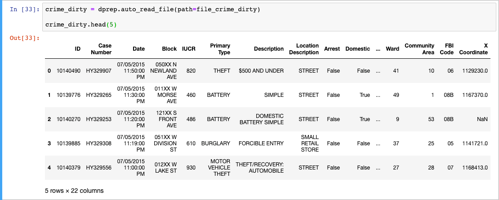

Inspecting the data contained within the dataset allows you to observe the types of data and some potential issues. For example, notice in the third record above, the `X Coordinate` field contains `NaN`, meaning the record contains a missing value.

To help you quickly perform many of the essential quality checks and gain a better understanding of the properties of your dataset, the [Azure ML Data Prep SDK](https://docs.microsoft.com/python/api/overview/azure/ml/intro) offers **data profiles**. Data profiles help you glimpse into the column types and summary statistics of a dataset. They can be accessed by using the `get_profile()` method on a Dataflow. In the example below, we profile the data within the sample crime dataset.

```python
# Profile the data
crime_dirty.get_profile()
```

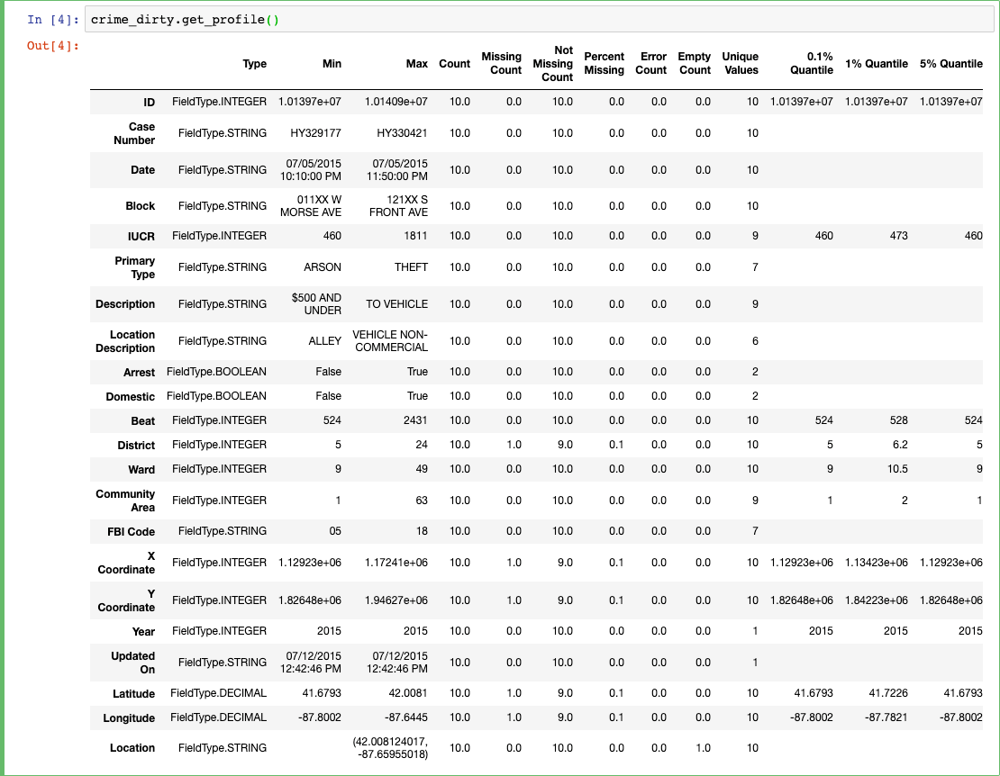

Take a moment to review the output from the `get_profiles()` method. It includes a number of common statistical aggregations and summarizations geared toward helping you better understand your data. These include data types, counts, ranges of values within each column, the number of missing or erroneous values, plus mean column values, and skewness.

This step helps drive the data processing steps that need to be taken to resolve any issues. Many data issues can be uncovered during this step, and corresponding methods can be applied to address those issues in later steps of the process. It is also important to ask questions about the source of any issues and how those issues may have been introduced.

## Transform

Using data discovery and exploration, you gain a better understanding of your data. The transformation step of the data wrangling process allows you to address the issues found during the discovery step. The data processing and preparation that occurs during this step involves data restructuring, normalization and cleansing, and augmentation. Transformation is about reshaping raw data into a form that can be more quickly and accurately analyzed.

### Restructure

The restructuring step is about organizing and integrating data collected from various sources. The purpose of this step is to make raw data derived from disparate sources and formats more consistent and accurate. Information revealed during the discovery and exploration step is used to restructure data in a way that allows combination, computation, and analysis to be conducted more easily. Rows may be appended, and columns and rows may be split or combined.

Using the sample crime data, consider a common occurrence in many datasets where data is split across multiple files. In the example below, seasonal crime data is read into Dataflows and then appended to the `crime_dirty` data from above.

```python
# Paths for additional datasets
file_crime_spring = './data/crime-spring.csv'
file_crime_winter = './data/crime-winter.csv'

# Datasets with the same schema as crime_dirty
crime_winter = dprep.auto_read_file(path=file_crime_winter)
crime_spring = dprep.auto_read_file(path=file_crime_spring)

# Append the rows from the spring and winter Dataflows
crime_all = (crime_dirty.append_rows(dataflows=[crime_winter, crime_spring]))

# Display a random sample of 4 records from the dataset
crime_all.take_sample(probability=0.25, seed=RAND_SEED).head(4)
```

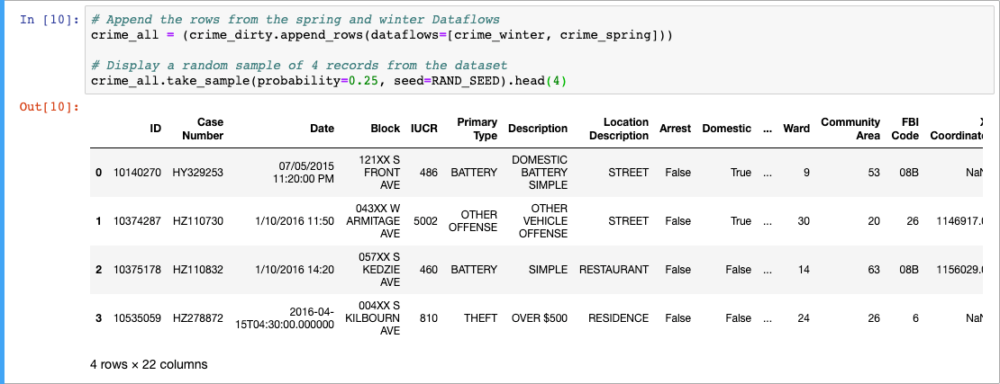

Appending rows from other files and data sources can provide a more unified view of data from various sources, and help you understand the differences between each source. As an example, in the results above, notice how the date formats vary between records. This is an indication that the different files and data sources store dates differently, and is an issue that needs to be addressed during the cleansing step.

Next, let's look at another example of a common task performed during this step: column splitting. In the crime dataset, the field `Block` contains both a block number and a street name. To make this data easier to work with during modeling, we are going to split this column into two, one for the block number and one for the street. In this example, we will use the `split_column_by_example()` method of the Azure ML Data Prep SDK's [builders module](https://docs.microsoft.com/python/api/azureml-dataprep/azureml.dataprep.api.builders?view=azure-ml-py).

```python
# Create a builder for the Block column
builder = crime_all.builders.split_column_by_example('Block', keep_delimiters=False)

# Add an example to use for splitting the data within the column
builder.add_example(example=('050XX N NEWLAND AVE', ['050XX', 'N NEWLAND AVE']))

# Display a preview of the existing column, and the new columns that are generated
builder.preview()
```

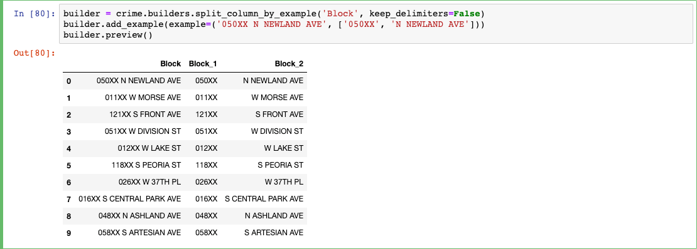

As you can see in the preview above, the `split_column_by_example()` method was able to infer how to split all the columns by using an example derived from the first row. Now, create a new Dataflow for the crime data using the builder. We also remove the original `Block` column and rename the new columns as appropriate.

```python
crime = builder.to_dataflow().drop_columns('Block').rename_columns({'Block_1': 'Block', 'Block_2': 'Street'})

crime.head(5)
```

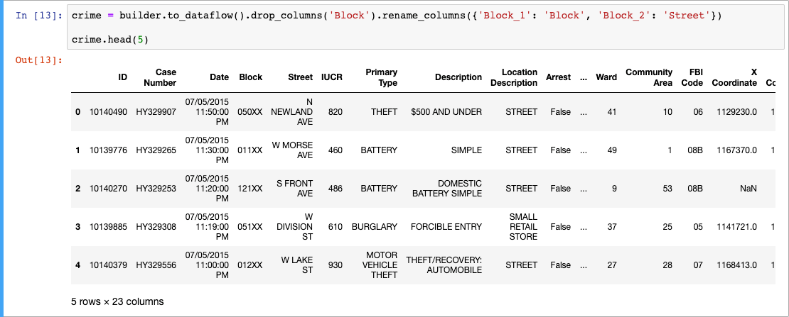

Observing the results, you can see how easy it was to create new columns that allow for more straightforward analysis of features within the dataset. Other typical tasks performed during this step include processing text to remove or replace embedded characters which may affect data alignment and correcting mixed data types in common fields.

As a final example for this step, let's correct the mixed data types associated with the `Date` field. From the three datasets being used, dates are represented by three different formats, some of which are detected by the `auto_read_file()` method as a `DateTime` type and others of which are inferred to be a `String` type. In the code below, we take a sample of the date column values in the `crime` Dataflow.

```python
# Take a sample of the date column
crime.keep_columns(['Date']).take_sample(probability=0.25, seed=RAND_SEED).head(4)
```

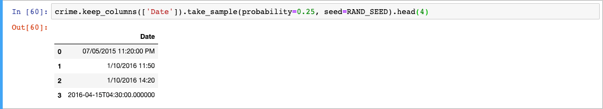

Note the various formats represented. The code below standardizes dates to a common `DateTime` data type across all the datasets.

```python
# Convert Date column to DateTime
crime = crime.to_datetime('Date')

# Take a sample of the date column
crime.keep_columns(['Date']).take_sample(probability=0.25, seed=RAND_SEED).head(4)
```

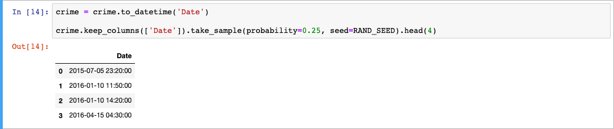

### Cleanse

In the previous steps, you identified data quality issues, such as null or missing values, out of range values, and inconsistent data formatting. During the data cleansing step, you address these issues, performing tasks such as standardizing and normalizing values, correcting or removing corrupt or inaccurate records from the dataset, fixing typographical errors and handling null values. The goal of this step is to increase the overall quality of the data.

During the data exploration and discovery step above, it was noted that some of the location information fields (e.g., `X Coordinate`) contained `NaN`, which is the equivalent of a `null` value. Several possible approaches for fixing this issue are highlighted below.

#### Impute missing values

One approach would be to impute or substitute values for the missing data. In the example code below, a new Dataflow is created with a limited set of columns. The location information is then imputed.

```python
# Extract fields for imputing location data
crime_loc = crime.keep_columns(['ID', 'Arrest', 'Latitude', 'Longitude'])

# Convert the Latitude and Longitude field to a numeric data type
crime_loc = crime_loc.to_number(['Latitude', 'Longitude'])

# Inspect a few records
crime_loc.head(5)
```

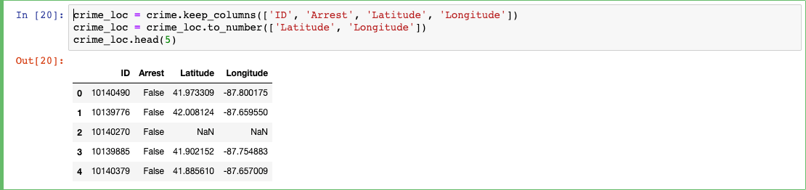

From the records displayed, it is clear that the data contains records with missing location information. To handle this using imputation, we insert the mean `Latitude` value for fields where no arrest was made as the substitute value for `Latitude` and a value of 42 for missing `Longitude` values.

```python
# Summarize the mean value of Latitude, grouped by the arrest column value
crime_loc_mean = crime_loc.summarize(group_by_columns=['Arrest'], summary_columns=[dprep.SummaryColumnsValue(column_id='Latitude', summary_column_name='Latitude_MEAN',summary_function=dprep.SummaryFunction.MEAN)])

# Retrieve the mean value where Arrest = False
crime_loc_mean = crime_loc_mean.filter(dprep.col('Arrest') == False)

#Display the average value
crime_loc_mean.head(1)
```

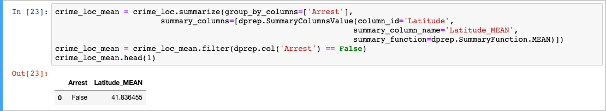

Next, the `impute_missing_values()` method of the builders module is used to create substitute values, and then substitute values are inserted into records with missing values in the `crime` Dataflow.

```python
# impute Latitude with MEAN
impute_mean = dprep.ImputeColumnArguments(column_id='Latitude', impute_function=dprep.ReplaceValueFunction.MEAN)

# impute Longitude with custom value 42
impute_custom = dprep.ImputeColumnArguments(column_id='Longitude', custom_impute_value=42)

# get instance of ImputeMissingValuesBuilder
impute_builder = crime.builders.impute_missing_values(impute_columns=[impute_mean, impute_custom], group_by_columns=['Arrest'])

# call learn() to learn a fixed program to impute missing values
impute_builder.learn()

# call to_dataflow() to get a dataflow with impute step added
crime_loc_imputed = impute_builder.to_dataflow()

# Show the top 5 records
crime_loc_imputed.head(5)
```

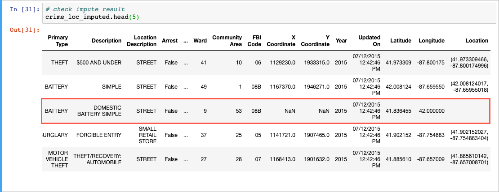

#### Replace values

Another possible approach is to replace missing values with a specified value. In the example code below, missing `Latitude` and `Longitude` values are replaced with a value of `42`.

```python
# Replace Latitude and Longitude values of null with 42
crime_replace = crime.replace(['Latitude', 'Longitude'], None, 42)

# Show the top 5 records
crime_replace.head(5)
```

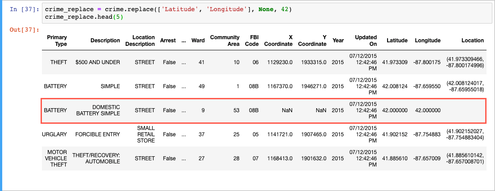

#### Fill nulls

Null values can also be filled with a specified value using the `fill_nulls()` method. In the example code below, null `Latitude` and `Longitude` values are replaced with a value of `42`.

```python
# Replace null Latitude and Longitude values with 42
crime_fill = crime.fill_nulls(['Latitude', 'Longitude'], 42)

# Show the top 5 records
crime_fill.head(5)
```

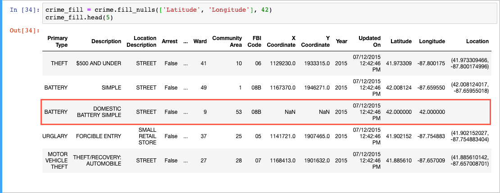

#### Fill Errors

The `error()` method enables the creation of Error values. This allows you to pass in the value you want to find, along with the Error code to use in any errors created. You can then use the `fill_errors()` method to replace all error values with another value. In this example, missing `Latitude` and `Longitude` values are assigned an error code of `Invalid value`. These invalid values are then replaced with a `-1` using the `fill_errors()` method.

```python
# Assign error code to records with a value of 890
crime_errors = crime.error(['Latitude', 'Longitude'], None, 'Invalid value')

# Fill errors with a value of -1
crime_errors = crime_errors.fill_errors(['Latitude', 'Longitude'], 42)

# Show the top 5 records
crime_errors.head(5)
```

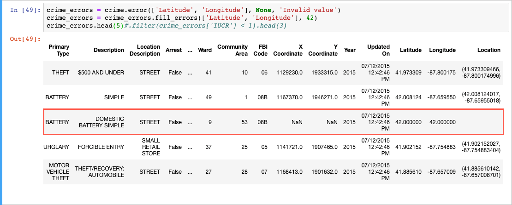

As you iterate through the cleansing process, you fix any inconsistencies and quality issues found in the dataset to create a dataset that is more easily consumable in modeling.

### Augment

Augmenting is where you look at how additional data could be used to enrich your dataset. At this step, you evaluate how you can leverage data you already have to make the dataset better and consider what other information could better inform your decision-making process.

As an example, let's augment the crime data with a second dataset containing information about politicians for each ward.

```python
# Path the aldermen data
file_aldermen = './data/chicago-aldermen-2015.csv'

# Read the alderman data into a Dataflow
aldermen = dprep.auto_read_file(path=file_aldermen)

# Display the first 5 records
aldermen.head(5)
```

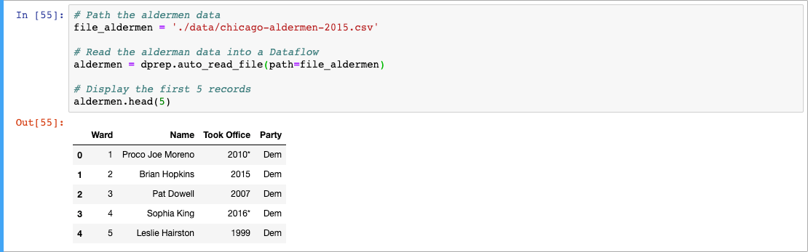

We can now augment the crime data with this dataset by joining them on the `Ward` field.

```python
# Join the crime and aldermen dataflows on Ward
crime.join(
    left_dataflow=crime,
    right_dataflow=aldermen,
    join_key_pairs=[('Ward', 'Ward')]
).head(5)
```

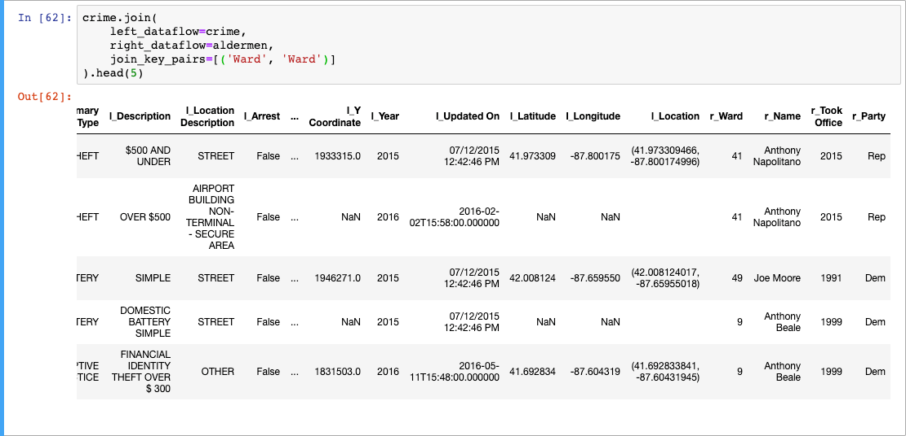

## Validate

The validation step of the data wrangling process is about verifying the consistency and quality of data. Checks during this step can be strict or fuzzy and might include checking for uniform distribution of features that should be normally distributed and cross comparing data against validated datasets (e.g., ensuring state abbreviations or postal codes are valid)

## Publish

The ultimate goal of data wrangling is to create a dataset that can be easily consumed by downstream processes and users. The wrangled data is published to a shared data store, such as Azure Data Lake Storage v2, where users and software can consume it for advanced analytics and machine learning.

## Tools

Data wrangling tasks can be carried out in a wide variety of environments, such as SQL or Hive or Azure Machine Learning Studio, and with various tools and languages, such as R or Python, depending on where your data is stored and how it is formatted. Since data wrangling is iterative, these tasks can take place at various steps in the workflow of the process.

To learn more about the tools, read the [What tools are used to do data engineering, data science, and AI?](../intro/tools.md)

## Next steps

Data wrangling is one of the core skills every data scientist must possess. You can continue learning about data wrangling, exploration, and cleaning by reviewing the links to additional resources below:

- [Azure Machine Learning Dataprep API](https://docs.microsoft.com/python/api/azureml-dataprep/?view=azure-ml-py)
- [Explore and prepare data with the Dataset class](https://docs.microsoft.com/azure/machine-learning/service/how-to-explore-prepare-data)
- [Tasks to prepare data for enhanced machine learning](https://docs.microsoft.com/azure/machine-learning/team-data-science-process/prepare-data)

Read next: [Accessing data from Azure Service and working with AML data stores](./accessing-data.md)
