# Load, transform, and write data with Azure Machine Learning and the AML Data Prep SDK

The [Azure Machine Learning (AML) Data Prep SDK](https://docs.microsoft.com/python/api/azureml-dataprep/azureml.dataprep?view=azure-ml-py) provides the core framework for loading, exploring, analyzing, and preparing data in Azure Machine Learning. Using the Data Prep SDK, you can read data from files and other data sources, apply transformations to those data, and write files to supported locations.

In this article, we review the various Data Prep SDK methods for reading and writing data to and from multiple file types and data sources. Methods for performing common data transformations and manipulations are also covered.

## Supported data sources

The Data Prep SDK supports data ingestion from multiple types of input data, including various file types and SQL data sources.

The table below lists the supported file types, and the functions used to read them. The function names link to the relevant Data Prep SDK documentation for each method.

| File type | Function | Description |
| --------- | -------- | ----------- |
| Auto-detect | [auto_read_file()](https://docs.microsoft.com/python/api/azureml-dataprep/azureml.dataprep?view=azure-ml-py&viewFallbackFrom=azure-dataprep-py#auto-read-file-path--filepath--include-path--bool---false-----azureml-dataprep-api-dataflow-dataflow) | Analyzes the file(s) at the specified path and returns a new Dataflow containing the operations required to read and parse them. |
| CSV | [read_csv()](https://docs.microsoft.com/python/api/azureml-dataprep/azureml.dataprep?view=azure-ml-py#read-csv-path--filepath--separator--str--------header--azureml-dataprep-api-dataflow-promoteheadersmode----promoteheadersmode-constantgrouped--3---encoding--azureml-dataprep-api-engineapi-typedefinitions-fileencoding----fileencoding-utf8--0---quoting--bool---false--inference-arguments--azureml-dataprep-api-builders-inferencearguments---none--skip-rows--int---0--skip-mode--azureml-dataprep-api-dataflow-skipmode----skipmode-none--0---comment--str---none--include-path--bool---false--archive-options--azureml-dataprep-api--archiveoption-archiveoptions---none--infer-column-types--bool---false--verify-exists--bool---true-----azureml-dataprep-api-dataflow-dataflow) | Creates a new Dataflow with the operations required to read and parse CSV and other delimited text files (TSV, custom delimiters like semicolon, colon, etc.). |
| Excel | [read_excel()](https://docs.microsoft.com/python/api/azureml-dataprep/azureml.dataprep#read-excel-path--filepath--sheet-name--str---none--use-column-headers--bool---false--inference-arguments--azureml-dataprep-api-builders-inferencearguments---none--skip-rows--int---0--include-path--bool---false--infer-column-types--bool---false--verify-exists--bool---true-----azureml-dataprep-api-dataflow-dataflow) | Creates a new Dataflow with the operations required to read Excel files. |
| Fixed-width | [read_fwf()](https://docs.microsoft.com/python/api/azureml-dataprep/azureml.dataprep#read-fwf-path--filepath--offsets--typing-list-int---header--azureml-dataprep-api-dataflow-promoteheadersmode----promoteheadersmode-constantgrouped--3---encoding--azureml-dataprep-api-engineapi-typedefinitions-fileencoding----fileencoding-utf8--0---inference-arguments--azureml-dataprep-api-builders-inferencearguments---none--skip-rows--int---0--skip-mode--azureml-dataprep-api-dataflow-skipmode----skipmode-none--0---include-path--bool---false--infer-column-types--bool---false--verify-exists--bool---true-----azureml-dataprep-api-dataflow-dataflow) | Creates a new Dataflow with the operations required to read and parse fixed-width data. |
| JSON | [read_json()](https://docs.microsoft.com/python/api/azureml-dataprep/azureml.dataprep?view=azure-dataprep-py#read-json-path--filepath--encoding--azureml-dataprep-api-engineapi-typedefinitions-fileencoding----fileencoding-utf8--0---flatten-nested-arrays--bool---false--include-path--bool---false-----azureml-dataprep-api-dataflow-dataflow) | Creates a new Dataflow with the operations required to read JSON files. |
| Parquet | [read_parquet_file()](https://docs.microsoft.com/python/api/azureml-dataprep/azureml.dataprep?view=azure-ml-py#read-parquet-file-path--filepath--include-path--bool---false--verify-exists--bool---true-----azureml-dataprep-api-dataflow-dataflow) | Creates a new Dataflow with the operations required to read Parquet files. |
| Text | [read_lines()](https://docs.microsoft.com/python/api/azureml-dataprep/azureml.dataprep#read-lines-path--filepath--header--azureml-dataprep-api-dataflow-promoteheadersmode----promoteheadersmode-none--0---encoding--azureml-dataprep-api-engineapi-typedefinitions-fileencoding----fileencoding-utf8--0---skip-rows--int---0--skip-mode--azureml-dataprep-api-dataflow-skipmode----skipmode-none--0---comment--str---none--include-path--bool---false--verify-exists--bool---true-----azureml-dataprep-api-dataflow-dataflow) | Creates a new Dataflow with the operations required to read text files and split them into lines. |
| Compressed CSV | [read_csv()](https://docs.microsoft.com/python/api/azureml-dataprep/azureml.dataprep?view=azure-ml-py#read-csv-path--filepath--separator--str--------header--azureml-dataprep-api-dataflow-promoteheadersmode----promoteheadersmode-constantgrouped--3---encoding--azureml-dataprep-api-engineapi-typedefinitions-fileencoding----fileencoding-utf8--0---quoting--bool---false--inference-arguments--azureml-dataprep-api-builders-inferencearguments---none--skip-rows--int---0--skip-mode--azureml-dataprep-api-dataflow-skipmode----skipmode-none--0---comment--str---none--include-path--bool---false--archive-options--azureml-dataprep-api--archiveoption-archiveoptions---none--infer-column-types--bool---false--verify-exists--bool---true-----azureml-dataprep-api-dataflow-dataflow) | Creates a new Dataflow with the operations required to extract, read and parse CSV and other delimited text files from a ZIP archive. |

The Data Prep SDK also supports the following non-file data sources:

| Data Source | Function | Description |
| ----------- | -------- | ----------- |
| Pandas DataFrame | [read_pandas_dataframe()](https://docs.microsoft.com/python/api/azureml-dataprep/azureml.dataprep?view=azure-ml-py#read-pandas-dataframe) | Creates a new Dataflow based on the contents of a given pandas DataFrame. |
| Parquet Dataset | [read_parquet_dataset()](https://docs.microsoft.com/python/api/azureml-dataprep/azureml.dataprep?view=azure-ml-py#read-parquet-dataset-path--filepath--include-path--bool---false-----azureml-dataprep-api-dataflow-dataflow) | Creates a new Dataflow with the operations required to read Parquet Datasets. |
| PostgreSQL | [read_postgresql()](https://docs.microsoft.com/python/api/azureml-dataprep/azureml.dataprep?view=azure-ml-py#read-postgresql-data-source--databasesource--query--str-----azureml-dataprep-api-dataflow-dataflow) | Creates a new Dataflow that can read data from a PostgreSQL database by executing the query specified. |
| SQL | [read_sql()](https://docs.microsoft.com/python/api/azureml-dataprep/azureml.dataprep?view=azure-ml-py#read-sql-data-source--databasesource--query--str-----azureml-dataprep-api-dataflow-dataflow) | Creates a new Dataflow that can read data from a Microsoft SQL or Azure SQL database by executing the query specified. |

## The Dataflow class

An important concept to understand as you begin working with data using the AML Data Prep SDK is the abstraction provided by the [Dataflow class](https://docs.microsoft.com/python/api/azureml-dataprep/azureml.dataprep.dataflow?view=azure-ml-py). Similar to a resilient distributed dataset (RDD) in Spark, a `Dataflow` represents an optimized execution plan for a series of lazily-loaded, immutable operations on the underlying data. "Lazily-loaded" means that data is not read from the source until specific action methods are called, such as `head()`, `to_pandas_dataframe()`, `get_profile()` or the write methods. This approach allows AML to optimize data retrieval based on the transformation operations or steps added to the `Dataflow`. Calling an action method on the Dataflow results in the execution of all defined operations. The resultant dataset is a [Pandas DataFrame](https://pandas.pydata.org/pandas-docs/stable/reference/api/pandas.DataFrame.html).

## Load data

To load data with the Data Prep SDK, use the `read_*` methods listed above. Each of these methods returns a `Dataflow` object that initially contains the steps required to read and parse data from the target data source. As you apply transformations to the data retrieved from a data source, steps are added to the `Dataflow`. When an action method, such as `write_to_csv()` is finally called, the Data Prep SDK determines the most efficient way to execute all of the steps on the `Dataflow` and then runs those steps.

Below we take a more in-depth look at some of the read methods and provide a series of examples to help you understand how to work with data using the Data Prep SDK. To follow along with the examples provided in this article, import the `azureml.dataprep` package.

```python
# Import the DataPrep SDK library
import azureml.dataprep as dprep
```

Data Prep supports reading data from a [Datastore](https://docs.microsoft.com/python/api/azureml-core/azureml.core.datastore.datastore?view=azure-ml-py), [DataPath](https://docs.microsoft.com/python/api/azureml-core/azureml.data.datapath.datapath?view=azure-ml-py) or [DataReference](https://docs.microsoft.com/python/api/azureml-core/azureml.data.data_reference.datareference?view=azure-ml-py), so let's also import the AML libraries associated with each of those.

```python
from azureml.core import Datastore
from azureml.data.datapath import DataPath
from azureml.data.data_reference import DataReference
```

> **Note**: The data files used in the examples below come from sample files included with each Azure Machine Learning workspace. The files have been moved from the default location (`./samples-1.0.48/how-to-use-azureml/work-with-data-dataprep/data`) to `./data` to shorten paths in the sample code snippets.

### Load file data

Each of the file `read_*` methods, including `auto_read_file()`, requires a path parameter. The path is a string value, which can point to a directory, an individual file, or can use a globbing pattern to match multiple files. For example, the commands below will create two `Dataflow` objects, one containing all of the files located in the `data` directory and another containing just the CSV files whose name starts with `crime` within the `data` directory.

```python
# Read all files in a the 'data' folder.
dflowAll = dprep.auto_read_file(path='./data/')

# Read all CSV files whose name starts with `crime-`.
dflowCrimeCsv = dprep.auto_read_file(path='./data/crime*.csv')
```

> **Note**: The `auto_read_file()` method will infer the file type, and columns based on the first file read when reading all contents of a directory. If you use this approach, carefully consider the folder structure used and types of data files that are stored together.

Additional parameters vary depending on the `read` method used. Specific details on required and optional parameters for each function are available in the Data Prep SDK documentation. You can access the documentation by selecting the links under the Function column in the supported data sources tables above.

#### Load data automatically

The Data Prep SDK provides the ability to load different kinds of text files automatically without specifying the file type. The `auto_read_file()` method accepts any text-based file (including Excel, JSON, and Parquet) and infers the file type and arguments required to parse and read it. It also attempts to identify column data types and apply type transforms on the columns it detects. The return value is a `Dataflow` object that contains all the operations or steps required to read the given file (or files) and convert their columns to the predicted types. The file path or `FileDataSource` object is the only required parameter. The optional `include_path` parameter adds a new column containing the path from which data was read. The path column is useful for identifying the source of a particular data row when reading from multiple files in a single operation.

As an example, let's start with a simple text file, `crime.txt`, which looks like the following:

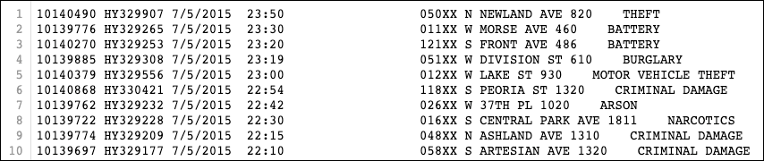

Using the `auto_read_file()` method, the Data Prep SDK inspects the incoming file to automatically detect its type and define the columns contained within it. It also attempts to determine the data type of each column.

```python
# Read a text file
dflow = dprep.auto_read_file(path='./data/crime.txt')

# Output the Dataflow steps
dflow
```

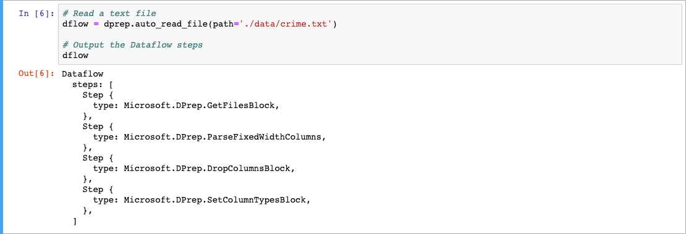

The code above outputs the resulting `Dataflow` object, which allows you to review the steps added to the Dataflow. These steps provide insight into the inferences made by the `auto_read_file()` method, and the type of file it determined the source to be. In this case, the file type was determined to be a fixed-width file. To gain more information about the columns and data types detected, call the `dtypes` attribute of the `Dataflow` object.

```python
# Display the inferred column data types
dflow.dtypes
```

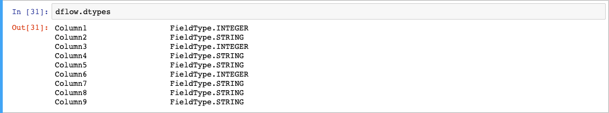

The `crime.txt` file does not contain column headers, so numbered column names are automatically assigned. The type assigned to each column should be compared against the data within the source file as part of your [data wrangling process](./data-wrangling.md).

> **Note**: More detailed information about the Dataflow can be viewed using the `get_profile()` method. We cover this method in more detail in the Transform sections below.

Finally, use an action method to display the first five rows of the file and observe how the data was parsed. As described above, calling the `head()` method forces execution of the Dataflow steps, and returns a pandas DataFrame.

```python
# Display the first five rows from the file
dflow.head(5)
```

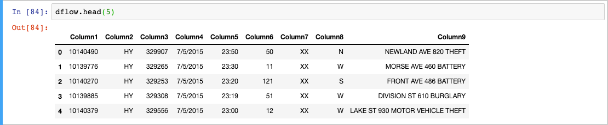

Comparing the source data file to the derived DataFrame, notice that some of the inferred column splits are not quite what you would expect based on the data. Depending on the type of file, and the data contained within it, the `auto_read_file()` method sometimes fails or produces unexpected results, as you see above. When this happens, you should consider using `detect_file_format()` or other read methods with the file type specified. We review these methods in more detail below. First, however, let's use the `auto_read_file()` method on another file type, Parquet.

```python
# Read a parquet file
dflow = dprep.auto_read_file(path='./data/crime.parquet')

# Display the first five rows from the file
dflow.head(5)
```

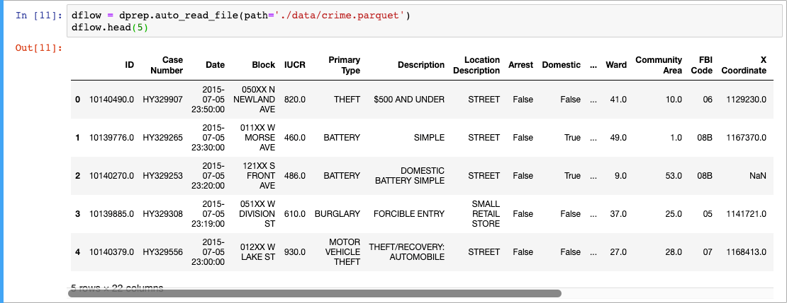

Inspecting the resultant DataFrame from reading a Parquet file, you can see the auto-detection process was much more successful. The extracted column headers, data types, and the columns better match the expected results.

The `auto_read_file()` examples above show how the Data Prep SDK makes the ingestion of a variety of text-based file types quick and easy. This method allows access files using only their location path and produces a Dataflow containing the steps required to read and parse those files. However, the examples also reveal that there are some limitations with the inferences the method can make. In these cases, it is better to use the file type-specific read methods.

#### Detect file format

Behind the scenes, `auto_read_file()` uses a [FileFormatBuilder](https://docs.microsoft.com/python/api/azureml-dataprep/azureml.dataprep.api.builders.fileformatbuilder?view=azure-ml-py) that has learned information about the contents of a given file and how to parse it. Using the `detect_file_format()` method allows you to create a `FileFormatBuilder` and take advantage of the intelligent learning aspects of `auto_read_file()`, while also providing the ability to modify the learned information, correcting erroneous results from the `auto_read_file()` function.

Returning to the `crime.txt` fixed-width file example from above, let's look at how `detect_file_format()` can be used to improve the overall output.

```python
# Get a FileFormatBuilder by calling detect_file_format()
builder = dprep.detect_file_format('./data/crime.txt')

# Output the contents of the file_format attribute
print(builder.file_format)
```

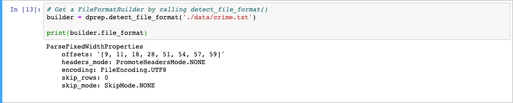

Calling `detect_file_format()` returns a `FileFormatBuilder` whose `learn` method has been called. Calling `learn` populates the `file_format` attribute on the Builder with information learned about the file. In the case of our fixed-width file, the `offsets` property defines where each column begins, so manipulating the values in this array allows us to define the desired columns. Continuing with the fixed-width file example, update the `offsets` list to refine the column definitions and then call `builder.to_dataflow()` to create a new `Dataflow` containing the updated steps for parsing the data source.

```python
# Update the column offset list to define better where data from the file should be split
builder.file_format.offsets = [9, 18, 34, 57]

# Create a new Dataflow using the updates offsets
dflow = builder.to_dataflow()

# Display the first five rows from the file
dflow.head(5)
```


Our refined column offsets provide improved parsing of the data. Notice, however, that the last column contains both a street address and the type of crime committed. The addresses entered into the file are of varying lengths and do not conform to a fixed-width. We review how to address these kinds of issues using data transformation methods later in this article.

Before moving on, let's look at the inferred data types on the new Dataflow. Call the `dtypes` property on the Dataflow to examine these.

```python
# Display the inferred column data types
dflow.dtypes
```

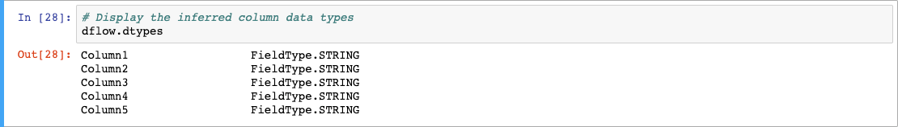

Not all of the columns contain string data, so let's look at how the `builders` property on the new Dataflow can be used to perform type inference. This property exposes different builders capable of learning from a Dataflow and applying those learnings to produce a new dataflow, similar to the pattern employed above for the `FileFormatBuilder`. In this case, a `ColumnTypesBuilder` is used, and calling the `learn` method will create a list of possible conversion candidates for each column.

```python
# Call set_column_types() to create a ColumnTypesBuilder
typeBuilder = dflow.builders.set_column_types()

# Populates conversion_candidates with automatically inferred conversion candidates for each column
typeBuilder.learn()

# Output the inferred conversion candidates
typeBuilder.conversion_candidates
```

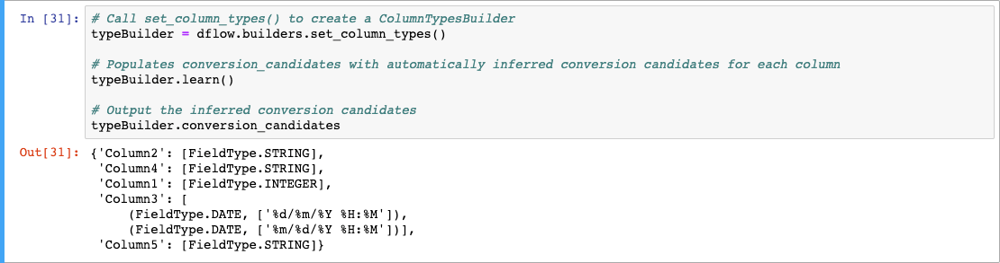

After learning, `typeBuilder.conversion_candidates` has been populated with information about the inferred types for each column. The candidates appear correct, but notice that `Column3` includes multiple candidate types. `Column3`, which contains the date and time of the incident, has two possible options for the date format. In this circumstance, you need to inform the Builder which candidate to choose. Use the `ambiguous_date_conversions_keep_*` method to tell the Builder which option to keep.

```python
# Set the desired date format on the builder
typeBuilder.ambiguous_date_conversions_keep_month_day()
```

Now, apply this `ColumnTypesBuilder` to create a new Dataflow with the columns converted to the desired types.

```python
# Convert the builder to a Dataflow
dflow_converted = typeBuilder.to_dataflow()

# Output the new column data types
dflow_converted.dtypes
```

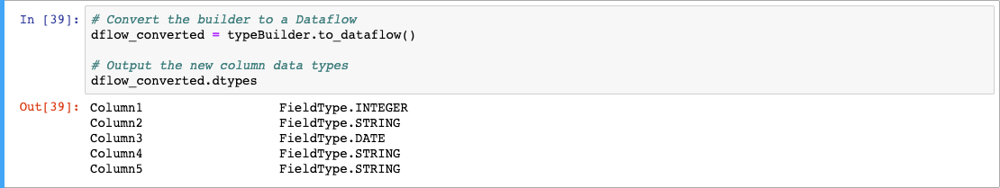

#### Read lines

Perhaps the easiest way to load data using the Data Prep SDK is to read it as lines of text. Use the `read_lines()` method to accomplish this.

```python
dflow = dprep.read_lines(path='./data/crime.txt')
dflow.head(5)
```

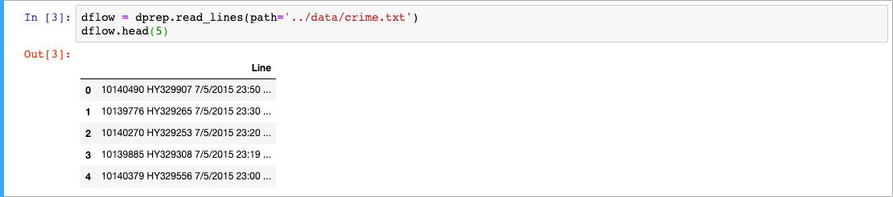

With the data loaded, you can begin your data preparation and transformation steps. Using the `read_lines()` method data preparation will likely start with parsing each line into the columns and data types that are appropriate for the data.

#### Read CSV and delimited files

The `read_csv()` method requires only the `path` parameter to load data from a delimited file. However, several other settings are available to modify the default behavior and provide more control over how the data are parsed and read. For this example, we load a file that has duplicate header rows using only its path.

```python
# Load the CSV file using the file path
dflow = dprep.read_csv(path='./data/crime_duplicate_headers.csv')

# Display the first five rows from the file
dflow.head(5)
```

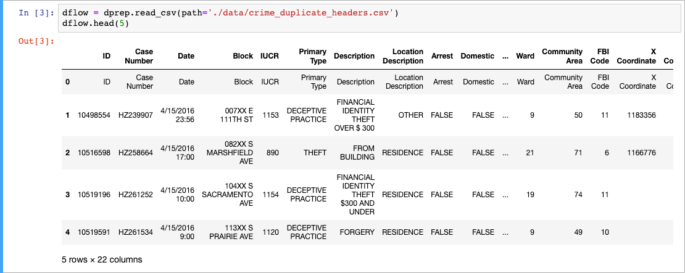

In the results, you can see the header row is correct, but the first row of data contains the duplicate header info. Use the `skip_rows` parameter to correct this issue. Observe in the results that skipping the first row removes the duplicated header info from the output.

```python
# Load the file, skipping the first row
dflow = dprep.read_csv(path='./data/crime_duplicate_headers.csv', skip_rows=1)

# Display the first five rows from the file
dflow.head(5)
```

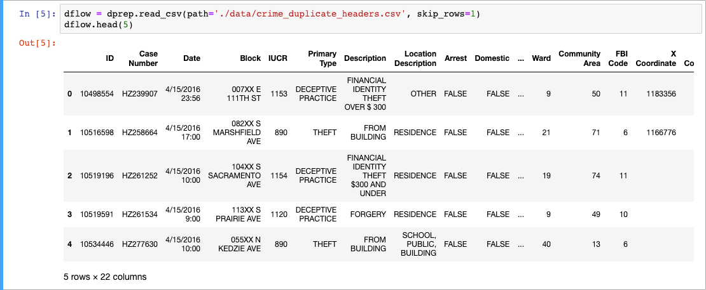

Quickly inspect the column data types of the resulting Dataflow, using the command below:

```python
# Output the column data types
dflow.dtypes
```

Notice in the output that every column has a data type of `STRING`. Let's use the `infer_column_types` parameter of the `read_csv()` method to see if this can be improved.

```python
# Load the file, skipping the first row
dflow = dprep.read_csv(path='./data/crime_duplicate_headers.csv', skip_rows=1, infer_column_types = True)

# Output the column data types
dflow.dtypes
```

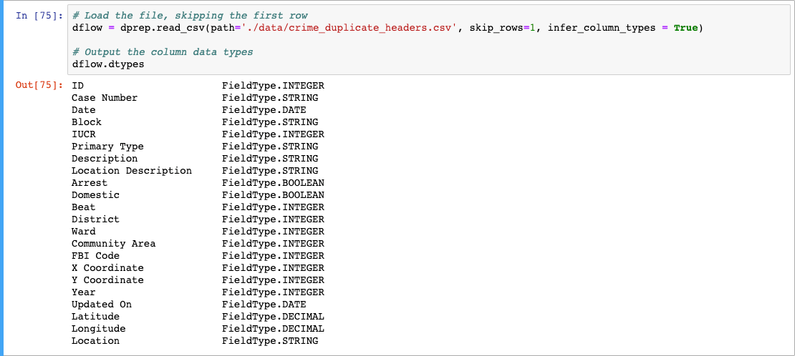

The `infer_column_types` parameter instructs the Data Prep SDK to inspect each column and decide about its data type. In the results, observe that columns now have data types more appropriate to the contents of the column.

#### Read from a Datastore

So far, the examples in this article have used files on the local file system as the source data. The `path` parameter can point to a file or directory on a local file system, or it can be a `DataReference` derived from a `Datastore` object. For the next example, we load a delimited file from the default (blob) datastore of an AML workspace. You can learn more about datastores in the [Accessing data from various Azure services and working with AML datastores](./accessing-data.md) article of this guide.

To load data from a registered Datastore, import the `Workspace` and `Datastore` classes, retrieve a reference to the workspace, and get the default datastores.

```python
# Import the Workspace, Datastore, and DataPath classes.
from azureml.core import Workspace, Datastore

# Get the current workspace using the from_config() method.
ws = Workspace.from_config()

# Get the default (blob) datastore
ds = ws.get_default_datastore()
```

Next, call the `read_csv()` method, using `ds.path()` to provide a `DataReference` to the data stored in the Datastore. Setting the `include_path` parameter to `True` will allow you to see the file path points to your storage account.

```python
# Read a CSV file from the Azure Blob Storage account represented by the Datastore, including the path of the file
dflow = dprep.read_csv(path=ds.path('crime-data/crime-winter.csv'), include_path = True)

# Display the first five rows from the file
dflow.head(5)
```

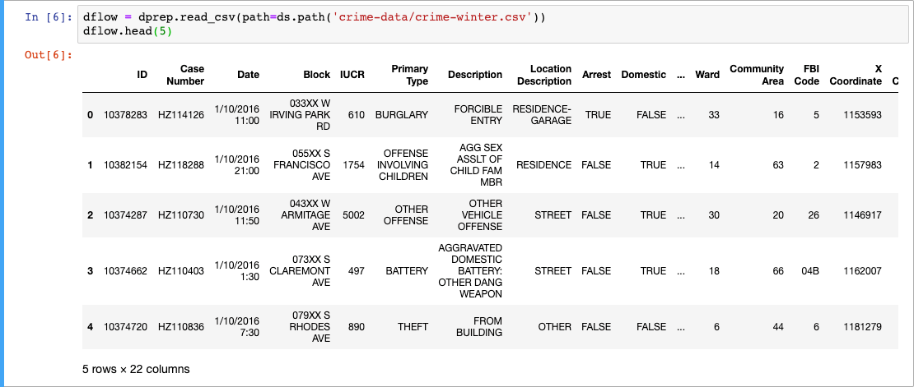

#### Read compressed CSV files

The Data Prep SDK also supports reading compressed delimited files from ZIP archives. The `archive_options` parameter on the `read_csv()` method allows you to specify the type of archive and glob pattern of entries in the archive to read. To access delimited files stored in a ZIP archive, import the `ArchiveOptions` class and `ArchiveType` enumerator from the `azureml.dataprep` package.

```python
# Import the ArchiveOptions class and ArchiveType enum
from azureml.dataprep import ArchiveOptions, ArchiveType
```

To read all of the files contained in a ZIP archive, set `path` to the name and location of the archive file, and then specify the `ArchiveOptions` parameter, setting the type to ZIP.

```python
# Read all the files contained in the ZIP archive
dflow = dprep.read_csv(path='./data/crime.zip',
                       archive_options=ArchiveOptions(archive_type=ArchiveType.ZIP))
dflow.head(5)
```

To target only specific files within the compressed archive, specify the matching criteria in the `entry_glob` parameter. For example, to read all files in the ZIP that have a name ending with "10-20.csv," run the following:

```python
# Read files whose name ends with '10-20.csv' from the ZIP archive
dflow = dprep.read_csv(path='./data/crime.zip',
                       archive_options=ArchiveOptions(archive_type=ArchiveType.ZIP, entry_glob='*10-20.csv'))
dflow.head(5)
```

#### Read JSON files

JSON, or JavaScript Object Notation, is a semi-structured format commonly used for transmitting data. Using the `read_json()` method, the Data Prep SDK attempts to extract the file data into a table.

```python
# Load a JSON file using only the path
dflow = dprep.read_json(path='./data/json.json')

# Display the first five rows from the file
dflow.head(5)
```

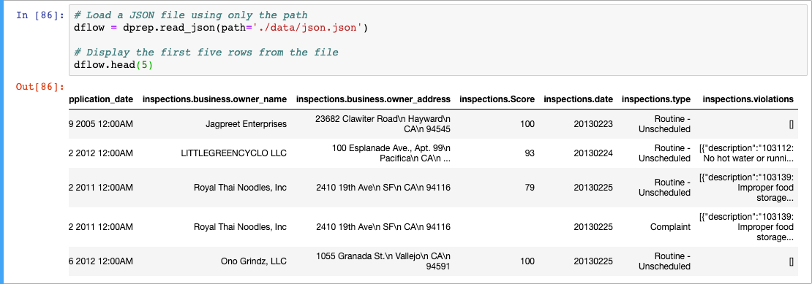

Within the output, notice the last column, `inspections.violations`, contains a nested JSON array. Tell Data Prep to flatten any nested JSON arrays using the `flatten_nested_arrays` parameter.

```python
# Load a JSON file, flattening any nested arrays
dflow = dprep.read_json(path='./data/json.json', flatten_nested_arrays=True)

# Display the first five rows from the file
dflow.head(5)
```

Using the `flatten_nested_arrays` parameter, the `inspections.violations` column is split into columns for each child property.


> **Note**: Setting the option to flatten nested arrays can potentially result in a much larger number of rows.

### Load SQL data

The DataPrep SDK also provides the ability to load data from a Microsoft SQL Server source. There are two ways the SQL Server data source can be specified. The first method is by creating an [MSSQLDataSource](https://docs.microsoft.com/python/api/azureml-dataprep/azureml.dataprep.mssqldatasource?view=azure-ml-py) object.

> For the example below, a simple `Crime` table was created in an Azure SQL Database, which contains the same data as in the `./data/crime.*` files above.

```python
# Set the SQL Server name and database
serverName = 'crime.database.windows.net'
databaseName = 'crime'

# Create a secret
secret = dprep.register_secret(value="Password.1!!")

# Create an MSSQLDataSource
ds = dprep.MSSQLDataSource(server_name=serverName,
                           database_name=databaseName,
                           user_name="demouser",
                           password=secret)
```

Now, use the `read_sql()` method, specifying both the `DataSource` and query parameters.

```python
# Read the data returned from the specified SQL query.
dflow = dprep.read_sql(ds, "SELECT * FROM [dbo].[Crime]")
dflow.head(5)
```

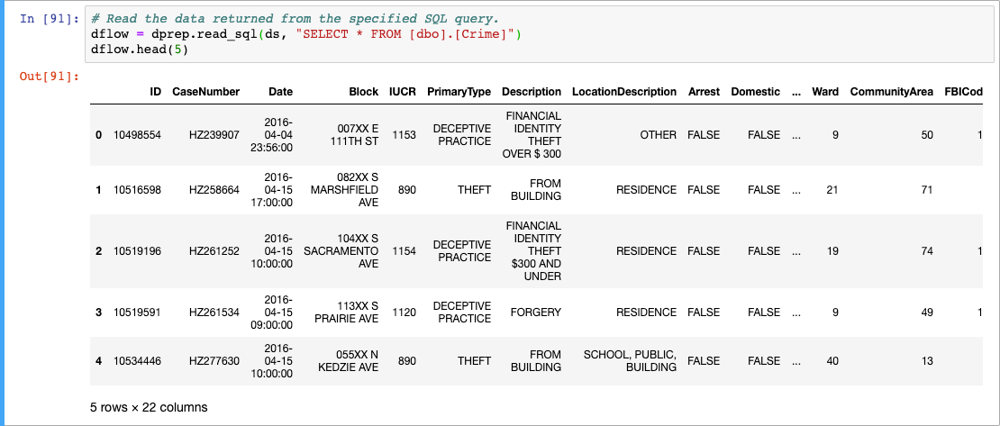

The second method for access data in the SQL Server database is to use a `Datastore` registered in an AML workspace. For more information on creating and working with SQL datastores, see the [Accessing data from various Azure services and working with AML datastores](./accessing-data.md) article in this guide.

```python
# Import the Workspace and Datastore classes.
from azureml.core import Workspace, Datastore

# Retrieve the datastore named 'workspacesqlstore' from the workspace object named 'ws.'
sqlDs = Datastore.get(ws, 'workspacesqlstore')

# Read the data returned from the specified SQL query.
dflow = dprep.read_sql(sqlDs, "SELECT * FROM [dbo].[Crime]")
dflow.head(5)
```

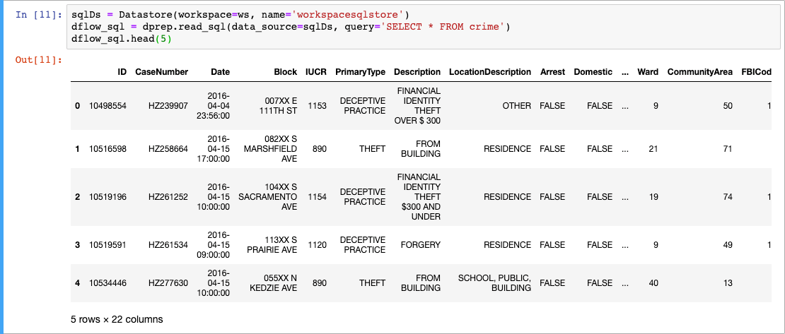

## Transform data

The Data Prep SDK offers numerous methods to help with transforming or wrangling data. These include functions that simplify adding columns, filtering out unwanted rows or columns, and imputing missing values. Transformation is about reshaping raw data into a form that can be more quickly and accurately analyzed. To learn more about data wrangling and transformation, read the [Overview of wrangling, exploring, and cleaning data](./data-wrangling.md) article in this guide. In the sections below, we provide examples of a few common data transformation tasks made easier by the Data Prep SDK.

For the following examples, we use the `./data/crime-dirty.csv` file and infer column types using the `read_csv()` method.

```python
# Load the CSV file using the file path
dflow = dprep.auto_read_file(path='./data/crime-dirty.csv')

# Display the first five rows from the file
dflow.head(5)
```

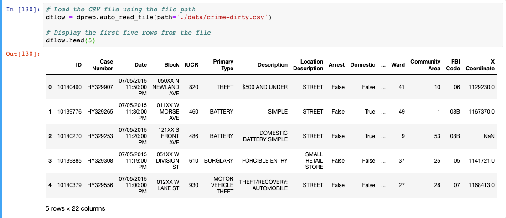

### Split column by example

Column splitting is a common transformation task performed. In the crime dataset, the field `Block` contains both a block number and a street name. To make this data easier to work with during modeling, let's split this column into two, one for the block number and one for the street. In this example, we will use the `split_column_by_example()` method of the Azure ML SDK's [builders module](https://docs.microsoft.com/python/api/azureml-dataprep/azureml.dataprep.api.builders?view=azure-ml-py).

```python
# Create a builder for the Block column
builder = dflow.builders.split_column_by_example('Block', keep_delimiters=False)

# Add an example to use for splitting the data within the column
builder.add_example(example=('050XX N NEWLAND AVE', ['050XX', 'N NEWLAND AVE']))

# Display a preview of the existing column, and the newly generated columns
builder.preview()
```

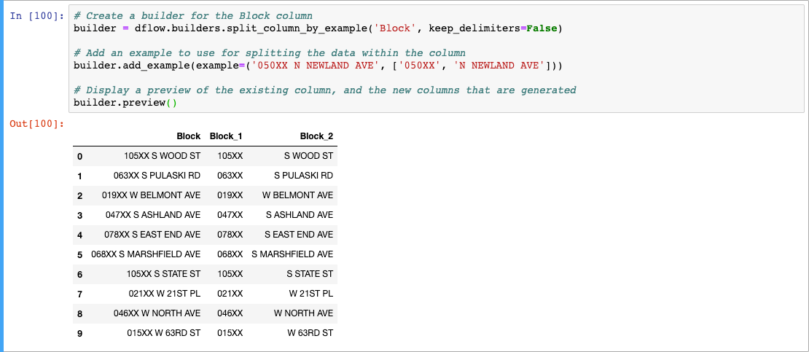

The preview reveals the `split_column_by_example()` method was able to infer how to split all the columns by using an example derived from the first row. Now, create a new Dataflow using the builder, removing the original `Block` column and renaming the new columns as appropriate.

```python
# Create a new Dataflow, dropping and renaming columns as needed
crime = builder.to_dataflow().drop_columns('Block').rename_columns({'Block_1': 'Block', 'Block_2': 'Street'})

# Display the first five rows of the Dataflow
crime.head(5)
```

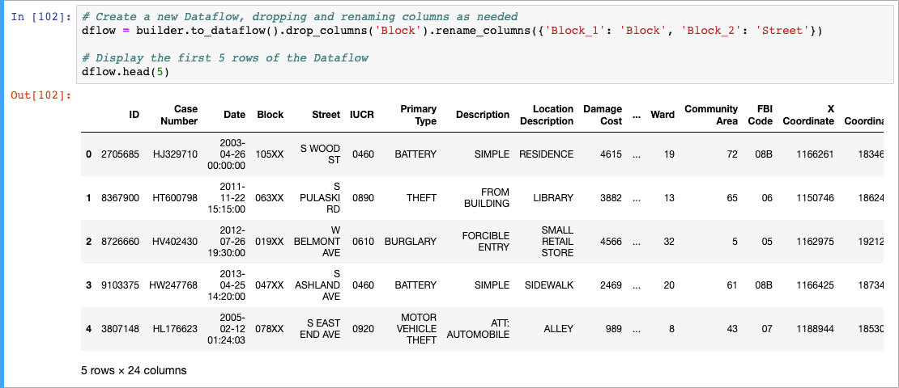

Observing the results, you can see how easy it was to create new columns that allow for a more straightforward analysis of features within the dataset.

### Add column using an expression

The Data Prep SDK includes `substring` expressions that can be used to derive a value from existing columns, and then insert that value into a new column. Use the `substring(start, length)` expression to extract the prefix from the `Case Number` column and put that string in a new column, `Case Category`. Passing the `substring_expression` variable to the expression parameter creates a new calculated column that executes the expression on each record.

```python
exp = dprep.col('Case Number').substring(0, 2)
case_category = dflow.add_column(new_column_name='Case Category',
                                    prior_column='Case Number',
                                    expression=exp)
case_category.head(3)
```

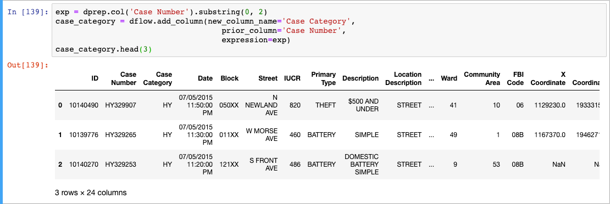

Note the new `Case Category` column in the output.

### Impute missing values

The Data Prep SDK can impute or substitute values for missing data. In the example code below, a new Dataflow is created with a limited set of columns. The location information is then imputed.

```python
# Extract fields for imputing location data
locDflow = dflow.keep_columns(['ID', 'Arrest', 'Latitude', 'Longitude'])

# Convert the Latitude and Longitude field to a numeric data type
locDflow = locDflow.to_number(['Latitude', 'Longitude'])

# Inspect a few records
locDflow.head(5)
```

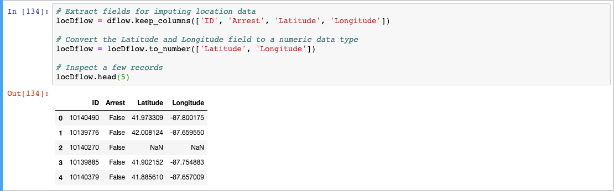

From the records displayed, you can see that the data contains records with missing location information. To handle this using imputation, insert the mean `Latitude` value for fields where arrest equals `False` as the substitute value for `Latitude` and a value of 42 for missing `Longitude` values.

```python
# Summarize the mean value of Latitude, grouped by the arrest column value
meanDflow = locDflow.summarize(group_by_columns=['Arrest'], summary_columns=[dprep.SummaryColumnsValue(column_id='Latitude', summary_column_name='Latitude_MEAN',summary_function=dprep.SummaryFunction.MEAN)])

# Retrieve the mean value where Arrest = False
avgDflow = meanDflow.filter(dprep.col('Arrest') == False)

#Display the average value
avgDflow.head(1)
```

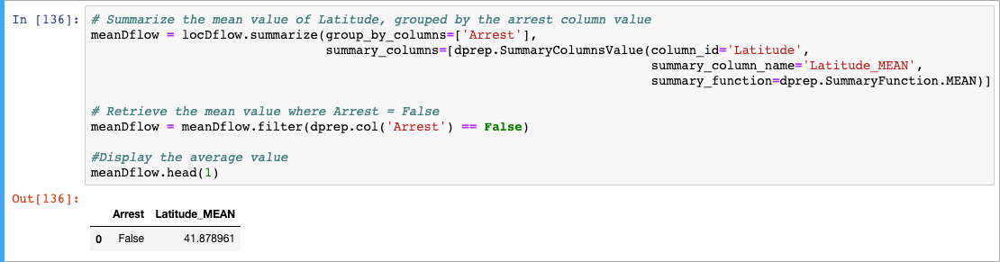

Next, the `impute_missing_values()` method of the builders module is used to create substitute values, and then substitute values are inserted into records with missing values in the `crime` Dataflow.

```python
# impute Latitude with MEAN
impute_mean = dprep.ImputeColumnArguments(column_id='Latitude', impute_function=dprep.ReplaceValueFunction.MEAN)

# impute Longitude with custom value 42
impute_custom = dprep.ImputeColumnArguments(column_id='Longitude', custom_impute_value=42)

# get instance of ImputeMissingValuesBuilder
impute_builder = dflow.builders.impute_missing_values(impute_columns=[impute_mean, impute_custom], group_by_columns=['Arrest'])

# call learn() to learn a fixed program to impute missing values
impute_builder.learn()

# call to_dataflow() to get a dataflow with impute step added
crime_loc_imputed = impute_builder.to_dataflow()

# Show the top 5 records
crime_loc_imputed.head(5)
```

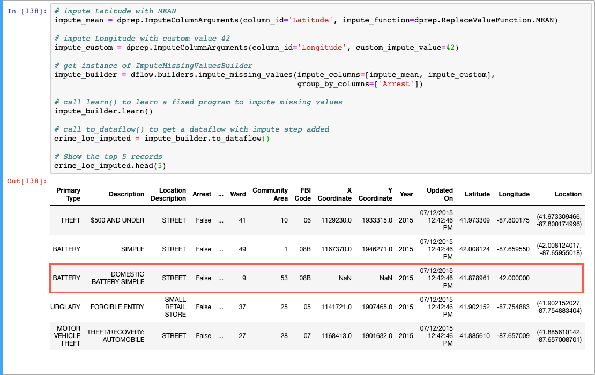

### Replace values

Another possible approach is to replace missing values with a specific value. In the example code below, missing `Latitude` and `Longitude` values are replaced with a value of `42`.

```python
# Replace Latitude and Longitude values of null with 42
crime_replace = dflow.replace(['Latitude', 'Longitude'], None, 42)

# Show the top 5 records
crime_replace.head(5)
```


### Fill nulls

Null values can also be filled with a specified value using the `fill_nulls()` method. In the example code below, null `Latitude` and `Longitude` values are replaced with a value of `42`.

```python
# Replace null Latitude and Longitude values with 42
crime_fill = dflow.fill_nulls(['Latitude', 'Longitude'], 42)

# Show the top 5 records
crime_fill.head(5)
```


### Fill Errors

The `error()` method enables the creation of Error values, allowing you to pass in the value you want to find, along with the Error code to use in any errors created. You can then use the `fill_errors()` method to replace all error values with another value. In this example, missing `Latitude` and `Longitude` values are assigned an error code of `Invalid value`. These invalid values are then replaced with a `-1` using the `fill_errors()` method.

```python
# Assign error code to records with a value of 890
crime_errors = dflow.error(['Latitude', 'Longitude'], None, 'Invalid value')

# Fill errors with a value of -1
crime_errors = crime_errors.fill_errors(['Latitude', 'Longitude'], 42)

# Show the top 5 records
crime_errors.head(5)
```


## Write data

The Data Prep SDK enables writing data out at any point in a Dataflow. These writes are added as steps to the resulting Dataflow and will be executed every time the Dataflow is executed. Since there are no limitations to how many write steps there are in a pipeline, this makes it easy to write out intermediate results for troubleshooting or to be picked up by other pipelines.

> **Important**: Execution of each write action results in the underlying data being pulled. For example, a Dataflow with three write steps will read and process every record in the dataset three times.

### Supported data types and locations

The following file formats are supported

- Delimited files (CSV, TSV, etc.)
- Parquet files

Using the Azure Machine Learning Data Prep Python SDK, you can write data to:

- A local file system
- Azure Blob Storage
- Azure Data Lake Storage

### Write to files

In order to parallelize writes, data is written to multiple partition files. A sentinel file named SUCCESS is also output once the write has completed. This makes it possible to identify when an intermediate write has completed without having to wait for the whole pipeline to complete.

> When running a Dataflow in Spark, attempting to execute a write to an existing folder will fail. It is important to ensure the folder is empty or use a different target location per execution.

To prepare a file to write, let's use everything you've learned above to load and transform the `crime.txt` file. For reference, quickly look at the `crime.txt` file using the `auto_read_file()` method.

```python
# Read a text file
dflow = dprep.auto_read_file(path='./data/crime.txt')
dflow.head(5)
```


As we noted above, `auto_read_file()` does not parse the `crime.txt` file property, so use the `detect_file_format()` function, along with a few transforms to get the data into a more appropriate shape.

```python
# Get a FileFormatBuilder by calling detect_file_format()
builder = dprep.detect_file_format('./data/crime.txt')

# Update the column offset list to define better where data from the file should be split
builder.file_format.offsets = [9, 18, 34, 57]

# Create a new Dataflow using the updates offsets
tempDflow = builder.to_dataflow()

# Call set_column_types() to create a ColumnTypesBuilder
typeBuilder = tempDflow.builders.set_column_types()

# Populates conversion_candidates with automatically inferred conversion candidates for each column
typeBuilder.learn()

# Set the desired date format on the builder
typeBuilder.ambiguous_date_conversions_keep_month_day()

# Convert the builder to a Dataflow
dflow = typeBuilder.to_dataflow()

# Create a builder for Column5, so it can be split into multiple columns
blockBuilder = dflow.builders.split_column_by_example('Column5', keep_delimiters=False)

# Add an example to use for splitting the data within Column5
blockBuilder.add_example(example=('N NEWLAND AVE 820 THEFT', ['N NEWLAND AVE', '820', 'THEFT']))

# Create a new Dataflow, dropping and renaming columns as needed
dflow = blockBuilder.to_dataflow().drop_columns('Column5').rename_columns({'Column5_1': 'Street', 'Column5_2': 'IUCR', 'Column5_3': 'Primary Type'})

# Rename columns
dflow = dflow.rename_columns({'Column1': 'ID', 'Column2': 'Case Number', 'Column3': 'Date', 'Column4': 'Block'})

# Display the first 5 rows of the transformed Dataflow
dflow.head(5)
```

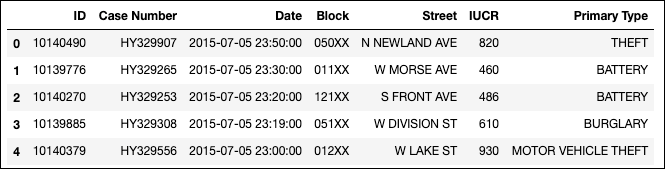

You can also take a quick look at the steps within the new Dataflow. As write operations are added to the Dataflow, we will look at this again to see how they are added.

```python
# Output the steps within the Dataflow
dflow
```

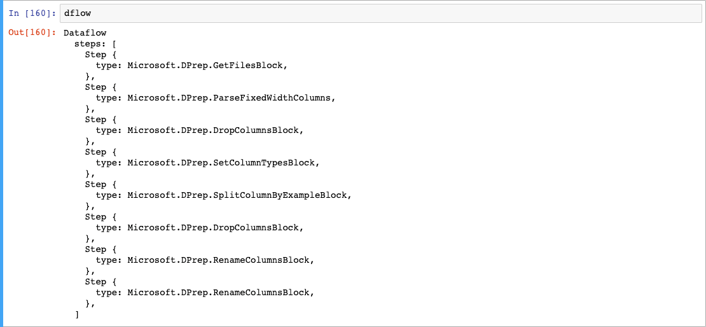

The transformed data is now in a better shape, and ready to be written to a new file.

#### Delimited files

Create a dataflow with a write to CSV step. This operation is lazy until we invoke `run_local` (or any operation that forces execution like `to_pandas_dataframe`), only then will we execute the write operation.

```python
# Add a write to CSV operation
dflow_write = dflow.write_to_csv(directory_path=dprep.LocalFileOutput('./crime-out/'))

# Output the steps within the Dataflow
dflow_write
```

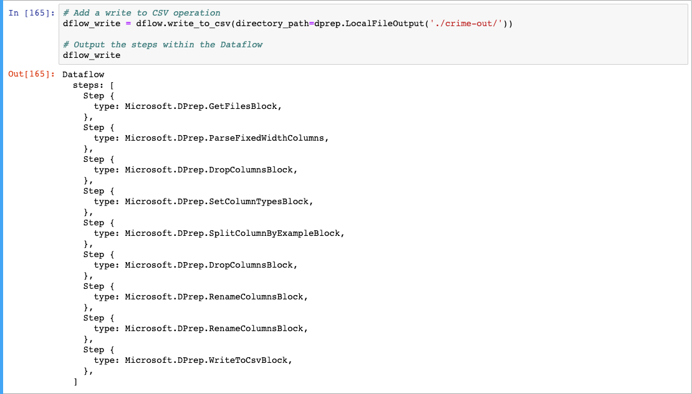

Now, call the `run_local()` method to force execution of the Dataflow.

```python
# Invoke run_local() to force execution of the Dataflow
dflow_write.run_local()
```

You can check the local file system on your compute target to view the newly written files.

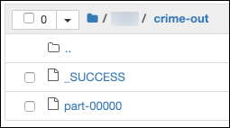

Notice that the output files are written to multiple partition (`part-*`) files. This is done to parallelize write operations. In addition, a sentinel file named `_SUCCESS` is also output once the write has completed. This makes it possible to identify when an intermediate write has completed without having to wait for the whole pipeline to complete.

Next, read the files written, and inspect the first few rows.

```python
# Retrieve the files written by the previous operation
dflow_written_files = dprep.read_csv('./crime-out/part-*')

# Display the first five lines of the files read from the write location
dflow_written_files.head(5)
```

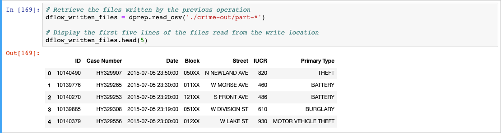

#### Parquet files

Similar to `write_to_csv`, `write_to_parquet` returns a new Dataflow with a Write Parquet Step which has not yet been executed. For this example, read data from SQL Server, as was done previously.

```python
# Load data from SQL Server
serverName = 'crime.database.windows.net'
databaseName = 'crime'

# Create a secret
secret = dprep.register_secret(value="Password.1!!")

# Register an MSSQLDataSource
ds = dprep.MSSQLDataSource(server_name=serverName,
                           database_name=databaseName,
                           user_name="demouser",
                           password=secret)

# Read the data returned from the specified SQL query.
dflow = dprep.read_sql(ds, "SELECT * FROM [dbo].[Crime]")
dflow.head(5)
```

In the SQL data, there are multiple rows that do not contain valid values for location information. Let's assign an error to these records.

```python
# Assign error code to records with a value of 890
dflow = dflow.error(['Latitude', 'Longitude'], None, 'Invalid value')
dflow.head(5)
```

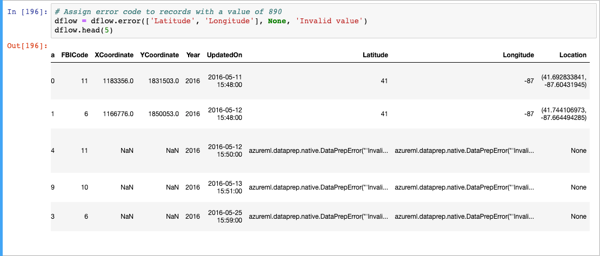

Next, we can parameterize handling errors in the `write_to_parquet()` method. Set the `error` parameter to 'BadData', and then execute the Dataflow with `run_local`.

```python
# Add a write to Parquet operation, setting errors to 'BadData'
dflow_out = dflow.write_to_parquet(directory_path=dprep.LocalFileOutput('./parquet-out/'),
                                        error='BadData')

# Invoke run_local() to force execution of the Dataflow
dflow_out.run_local()
```

Finally, read the Parquet files written to the file system. Notice in the results that records where `Location` is `None` have a value of `BadData` from the `Latitude` and `Longitude` fields.

```python
dflow_written = dprep.read_csv('./parquet-out/part-*')
dflow_written.head(5)
```

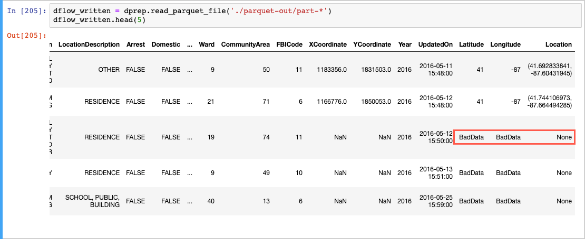

## Next steps

You can continue learning about accessing data with AML by reviewing the links to additional resources below:

- [Azure ML Data Prep SDK](https://docs.microsoft.com/python/api/azureml-dataprep/?view=azure-ml-py)
- [Load and read data with the AML Data Prep SDK](https://docs.microsoft.com/azure/machine-learning/service/how-to-load-data)
- [Transform data with the AML Data Prep SDK](https://docs.microsoft.com/azure/machine-learning/service/how-to-transform-data)
- [Write and configure data with the AML Data Prep SDK](https://docs.microsoft.com/azure/machine-learning/service/how-to-write-data)

Read next: [Overview of Feature Engineering, Model Training, Model Evaluation and Model Selection](../modeling/feature-engineering-training-evaluation-selection/README.md)
