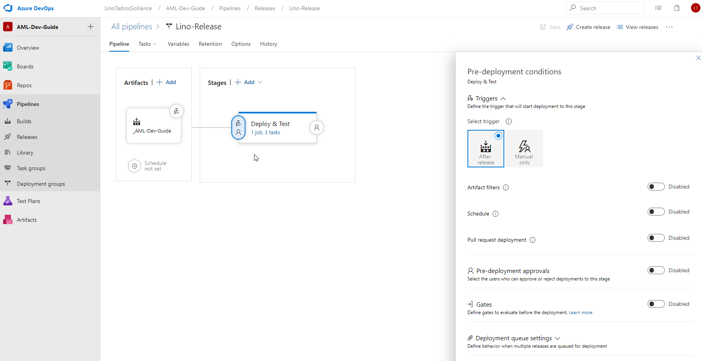
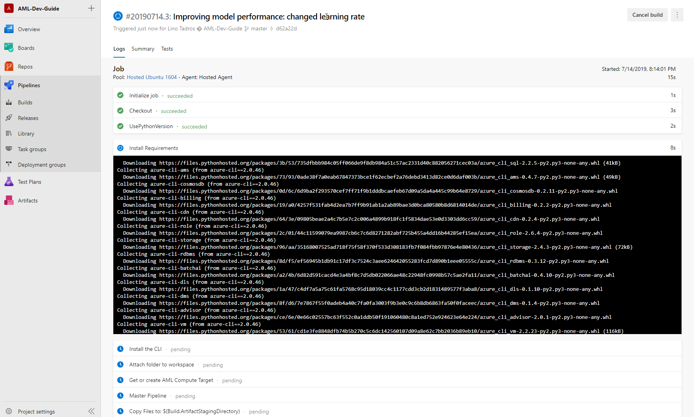

## What are **Gates**?

**Gates** are about collecting health signals internally or externally to your project to make a decision whether to promote a release or not based on these signals.

## ML through the Portal or Notebooks

In this AML Dev Guide, you went through the concepts of working with AML from the point of view of:
- Working with Azure Notebooks
- Collecting and preparing Data 
- Creating a Workspace
- Creating a Compute Cluster
- Submitting an Experiment
- Generating a Model and saving it
- Training the Model
- Evaluating the Model
- Deploying the Model
- Scoring & predicting

Now, in this part of the guide, we want to share what can be done in Azure DevOps **AFTER** the deployment in order to **MONITOR** and **MANAGE** tasks pertaining to the running cluster, current model and deployed service.

