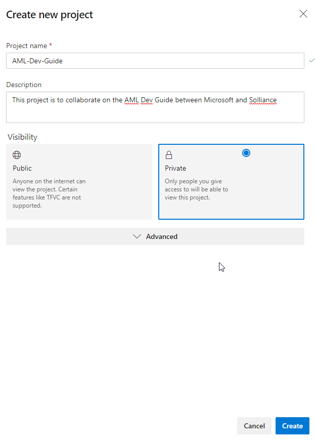
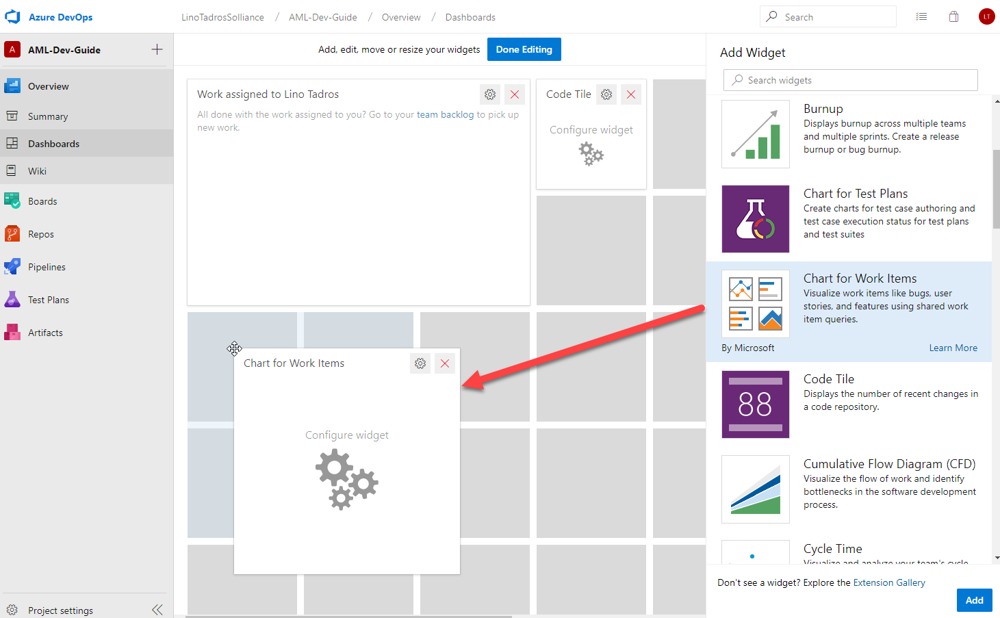
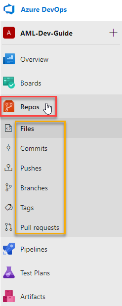
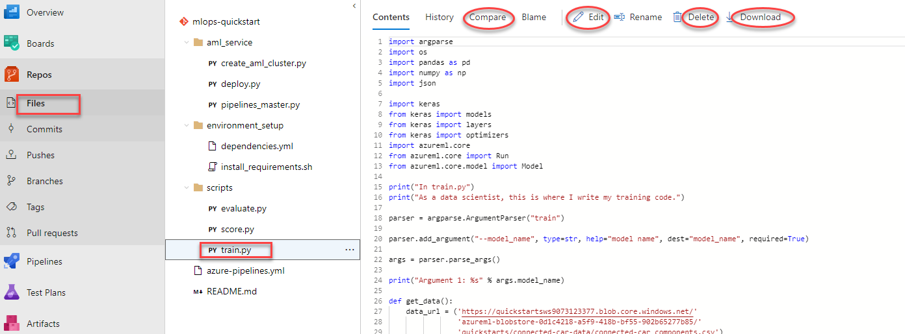
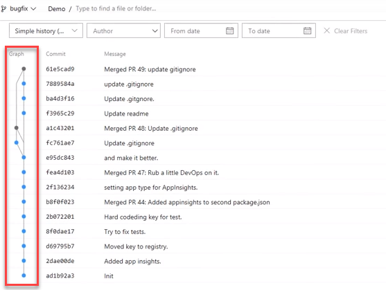
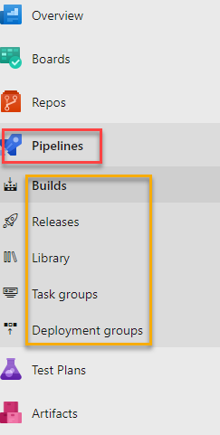
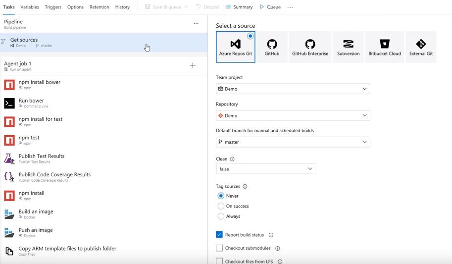
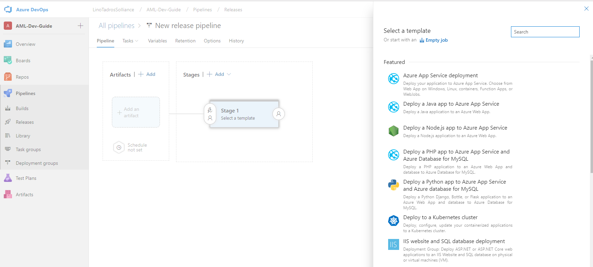

# Overview
The great news about using Azure DevOps is that it was developed to support solutions of any language and on any platform.

## Why Use Azure DevOps?
- It is perfect for turning your idea into a piece of Software.
- Plan your solution with Agile Tools
- Manage Test Plans from a web Interface
- Version your code Git and other first class source control systems
- Deploy your solution to Cross Platform CI/CD systems
- Full Tracability and Visability across your entire Development activities.

## How to Get started?

To get started, create an account on https://dev.azure.com
This is where you will have access to all your Projects and also your associated Organization.

## Create a Project
Click on the **Create Project** button to start a new Project in Azure DevOps.

Once the project is created, you will be able to manage Your project, Boards, Repositories, Pipeline, Test Plans, Artifacts and all your Project Settings from your DevOps Project screen.

## Overview
In this tab you will be able to see a summary of your Project, project stats and participating members on the team.

From the Dashboards sub tab you will be able to generate screens that utilize widgets to drag and drop into your dashboards to make it easy to oversee the health and progress of your project.

On the Wiki sub tab, you will be able to create a Wiki repository for your project to share information with the rest of your team reagrding the project, where markdown is supported.

## Boards
You can use Azure Boards to display Kanban boards to plan and check your entire release. You will be able to create sprints and move work items from different states until completion and release of your product.

In **Backlogs** you will be able to drag and drop your items to the desired sprint and monitor all your backlog items in the system that are yet to be completed.

In **Sprints** you will be able to track your progress on the **TaskBoard** and move items from one sprint to another easily.  You can even create **Branches** right from the board, if need be.

In **Queries**, this is where you would create your favorite queries about a group of items in the project's work items to quickly execute them in the future

## Repos

Repos in Azure DevOps are extremely important to manage your project files and source control, whether you are using a centralized source control or Distributed source control (like Git)

The Files sub tab will allow you to view the files and structure of your repository and make changes if desired.

**Commits**, allows you to see how all your branches come together.

**Pushes**, give you a historic view of all the changes made to the remote repository.

**Branches**, will enable to view all the branches and see if they are ahead or behind master.

**Tags**, will allow you to view all the Tags created for the project and even create new ones.

**Pull Requests**, will allow you review and participate in Pull Requests in the project.  You can also create policies to fire up a build automatically based on a pull request.

## Azure Pipelines

This is a rich Cross Platform CI/CD system capable of building any language targeting any platform.

From the summary page, you will be able to review commits, test results and perform many actions on your project. The Deployment section in the summary will be able to show you were in the release your project is currently.

The real power of Azure Pipelines starts manifesting itself when you get to the **Build** edit screen.

Azure Pipelines can pull your code from the most popular source control systems.

Azure Pipelines also offer hosted Windows, Mac and Linux operating build agents.

On the **Releases** sub tab, you will be able to create a new pipeline where you can start with an empty job or drag and drop a featured deployment pipeline from the many templates available in Azure Pipelines.

