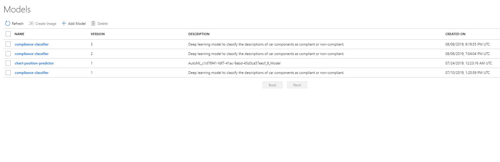

# Model version management (Code Sample)

Extending the classical DevOps approach to Machine Learning requires, among other things, extending the concept of source code management and versioning to model management and versioning. Through its model registry, Azure Machine Learning service provides the necessary capabilities to register, version, and manage trained machine learning models.

Here is an exmaple on how to register a model:

```python
model_description = 'Deep learning model to classify the descriptions of car components as compliant or non-compliant.'
model = Model.register(
    model_path='model.h5',  # this points to a local file
    model_name=args.model_name,  # this is the name the model is registered as
    tags={"type": "classification", "run_id": run.id, "build_number": args.build_number},
    description=model_description,
    workspace=run.experiment.workspace
)
```

The code above if from a `train.py` file used to train a model on a remote compute resource provided by Azure Machine Learning service. Notice the `tags` parameter which includes the `build_number` property that gets its value from the `build_number` parameter that is passed to the script when its executed. When the script is executed from a build pipeline in Azure DevOps, this tag property can be used to provide a very useful link between the trained model managed in Azure Machine Learning service and the build that run in Azure DevOps.

**Note**: Multiple calls to `Model.register()` using the same model name (in the same workspace) will result in new versions being created for the model. Version numbers start from 1 and are incremented by 1 each time the same model (based on name) is registered in a given workspace.

Here is an example of the result of multiple registrations of the same model:



Version 3 of the `compliance-classifier` model has been taged with the build number `20190809.2`:


Once a model is registered it can be retrieved at a later point in time either for deployment or for analysis/reevaluation.

To retrieve the latest version of a model, use the `Model` class:

```python
model = Model(ws, 'compliance-classifier')
```

To retrieve a model with a specific version, use the `Model` class and specify the version number:


```python
model = Model(ws, 'compliance-classifier', version=1)
```

To retrieve a model based on the value of one of its tags (e.g. `build_number`), the the `Model` class and specify the tag value:

```python
model = Model(ws, 'compliance-classifier', tags={'build_number': '20190809.2'})
```

## Next steps

You can learn more about model version management by reviewing these links to additional resources:

- [MLOps: Manage, deploy, and monitor models with Azure Machine Learning Service](https://docs.microsoft.com/en-us/azure/machine-learning/service/concept-model-management-and-deployment)

Read next: [Executing an end-to-end DevOps pipeline with Azure Machine Learning and Azure DevOps (Code Sample)](./e2e-pipeline-code-sample.md)