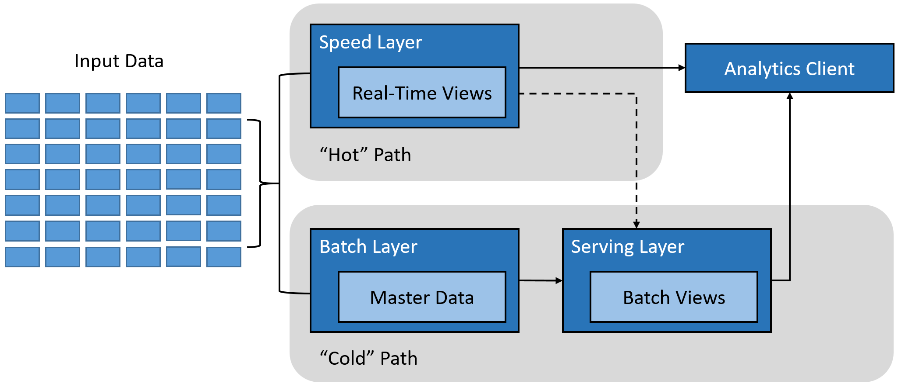
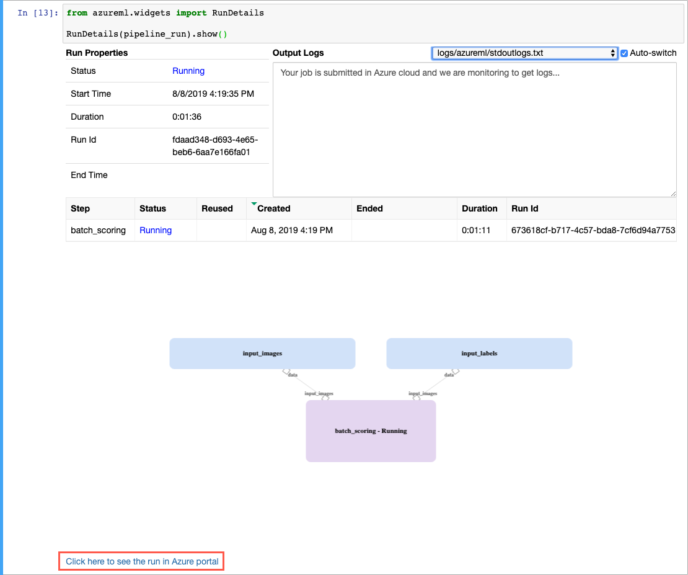
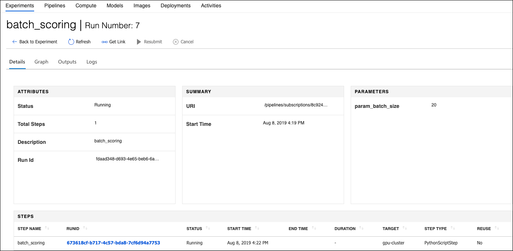
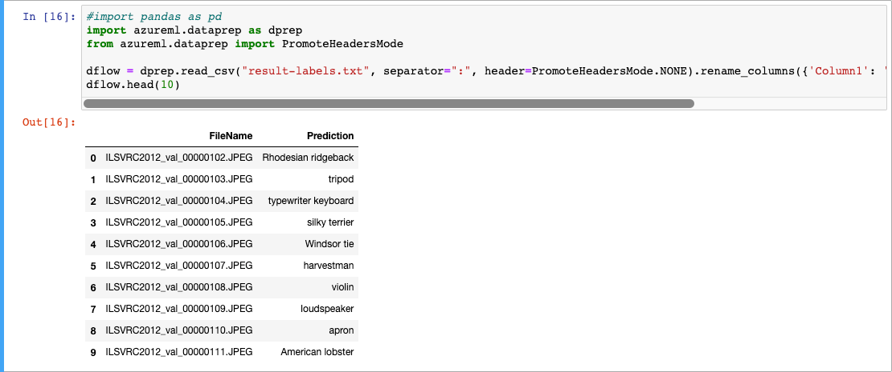

# Overview of Batch Inferencing

Batch inference, or batch scoring, is the process of using machine learning to make predictions on large quantities of existing data. Unlike real-time scoring, which makes predictions on data as it is received, batch inference is commonly run on a recurring schedule against data stored in a database or other data store. The resulting predictions are then written to a data store for later use by applications, data scientists, developers, or end-users.

Batch inference typically involves latency requirements of hours or days, so it does not require using trained models deployed to RESTful web services, as is done for real-time inference. Instead, batch predictions performed using Azure Machine Learning can take advantage of a host of high-throughput and scalable compute options, such as Azure Databricks or Azure Batch. This provides a cost-effective means of making predictions on terabytes of data asynchronously.

## When to use batch inference

You should consider using batch inference when:

- You do not need to make or act on predictions in real-time.
- Inferences for large sets of existing data can be created on a schedule and written to a data store for later use.
- Post processing or analysis on the predictions generated during inference are needed before exposing the results for further use.
- The complexity of data processing requires long-running scoring operations or the scale-out of compute resources to perform parallel processing.

## Combining real-time and batch inference

Due to the scheduled nature of batch inference, predictions are not usually available for new data. However, in many common real-world scenarios predictions are needed on both newly arriving and existing data. In these cases, the **lambda architecture**, first proposed by Nathan Marz, provides a good solution. In the lambda architecture, all data coming into the system goes through one of two paths:

- A **batch layer** (cold path) stores all of the incoming data in its raw form and performs batch inference on the data on a pre-defined schedule. The scored data is stored in a data store for later use.
- A **speed layer** (hot path) runs real-time inference on incoming data. This layer is designed for low latency.

The batch layer feeds into a serving layer that indexes the batch view for efficient querying. The speed layer updates the serving layer with incremental updates based on the most recent data.



Real-time inference is applied to data flowing into the hot path. Incoming data is sent to a REST API endpoint for scoring by a trained machine learning model, and predictions are returned for immediate use. Latency requirements are dictated by the speed layer to ensure data is processed as quickly as possible. Data entering the cold path, on the other hand, is persisted to a storage layer and processed on a recurring schedule. This processing is not constrained by low-latency requirements.

Eventually, the hot and cold paths converge at the analytics client application. If the client needs to respond to predictions in real time, it will acquire its result from the hot path. Otherwise, it will pull prediction results from the cold path. In other words, the hot path has data for a relatively small window of time, after which the results can be updated with data from the cold path.

For more details about the lambda architecture, refer to the [Azure Data Architecture Guide](https://docs.microsoft.com/azure/architecture/data-guide/big-data/#lambda-architecture)

## Deploying to AML Compute for batch inferencing

To demonstrate how to perform batch inferencing, let's create a machine learning pipeline using an [Azure Machine Learning Compute](https://docs.microsoft.com/azure/machine-learning/service/how-to-set-up-training-targets#amlcompute). AML Compute is created within your AML workspace to provide a managed infrastructure for single or multi-node compute.

For this example, we use the pre-trained [Inception-V3](https://arxiv.org/abs/1512.00567) computer vision model. The model is used to do batch scoring on unlabeled images pulled from the [ImageNet](http://image-net.org/) dataset.

### Prerequisites

To prepare your environment, retrieve a reference to your Azure Machine Learning workspace and the default datastore. Your workspace will be used to hold all of your pipeline resources. In a notebook within your AML workspace, execute the following code to get the workspace and default datastore:

```python
from azureml.core import Workspace
from azureml.core.datastore import Datastore

# Get the current workspace using the from_config() method.
ws = Workspace.from_config()

# Get the default (blob) datastore
ds = ws.get_default_datastore()

# Output the workspace and datastore details
print('Workspace name: ' + ws.name,
      'Azure region: ' + ws.location,
      'Subscription id: ' + ws.subscription_id,
      'Resource group: ' + ws.resource_group,
      'Default datastore: ' + ds.name,
      sep = '\n',)
```

> If prompted, sign in to the workspace by navigating to <https://microsoft.com/devicelogin> and entering the code provided in the output from the command above.

### Set up machine learning resources

The images required for this example have been added to a public blob storage account named `pipelinedata`. Use the command below to register the Blob Storage account as a datastore within your workspace. Note the `overwrite` parameter is set to `True`. This will result in any datastore with the name `images_datastore` already registered with your workspace being overwritten.

```python
account_name = "pipelinedata"
datastore_name="images_datastore"
container_name="sampledata"

batchscore_blob = Datastore.register_azure_blob_container(ws,
                      datastore_name=datastore_name,
                      container_name= container_name,
                      account_name=account_name,
                      overwrite=True)
```

Next, let's create data references to the data, adding references to each of the directories that are needed by the pipeline you will create below. The data references are configured as inputs to pipeline below.

```python
from azureml.data.data_reference import DataReference
from azureml.pipeline.core import PipelineData

# Create DataReference to the directory containing the input images
input_images = DataReference(datastore=batchscore_blob,
                             data_reference_name="input_images",
                             path_on_datastore="batchscoring/images",
                             mode="download"
                            )

# Create DataReference to the directory in which the pre-trained model is stored
model_dir = DataReference(datastore=batchscore_blob,
                          data_reference_name="input_model",
                          path_on_datastore="batchscoring/models",
                          mode="download"
                         )

# Create DataReference to the directory containing the labels
label_dir = DataReference(datastore=batchscore_blob,
                          data_reference_name="input_labels",
                          path_on_datastore="batchscoring/labels",
                          mode="download"
                         )

# Create DataReference to the output directory
output_dir = PipelineData(name="scores",
                          datastore=ds,
                          output_path_on_compute="batchscoring/results")
```

### Create working directory

To separate the resources for this example isolated, create a working directory in your AML workspace, and change to that directory.

```python
import os

# Create a working directory for the batch inference example
batch_dir = 'batchinference'
if not os.path.isdir(batch_dir):
    os.mkdir(batch_dir)

# Change the working path to the newly created batch folder
os.chdir(batch_dir)
```

### Set up a compute target

In Azure Machine Learning, a compute target refers to the machines or clusters that are used to perform the computational steps in a machine learning pipeline. For this example, you create an Azure Machine Learning compute.

Azure Machine Learning Compute is a managed-compute infrastructure that allows you to easily distribute processing across a cluster of CPU or GPU compute nodes in the cloud. The compute is created within your workspace region as a resource that can be shared with other users in your workspace. The compute scales up automatically when a job is submitted, and can be put in an Azure Virtual Network. The compute executes in a containerized environment and packages your model dependencies in a Docker container.

```python
from azureml.core.compute import AmlCompute, ComputeTarget

# choose a name for your cluster
aml_compute_name = os.environ.get("AML_COMPUTE_NAME", "gpu-cluster")
cluster_min_nodes = os.environ.get("AML_COMPUTE_MIN_NODES", 0)
cluster_max_nodes = os.environ.get("AML_COMPUTE_MAX_NODES", 1)
vm_size = os.environ.get("AML_COMPUTE_SKU", "STANDARD_NC6")

if aml_compute_name in ws.compute_targets:
    compute_target = ws.compute_targets[aml_compute_name]
    if compute_target and type(compute_target) is AmlCompute:
        print('found compute target. just use it. ' + aml_compute_name)
else:
    print('creating a new compute target...')
    provisioning_config = AmlCompute.provisioning_configuration(vm_size = vm_size, # NC6 is GPU-enabled
                                                                vm_priority = 'lowpriority', # optional
                                                                min_nodes = cluster_min_nodes,
                                                                max_nodes = cluster_max_nodes)

    # create the cluster
    compute_target = ComputeTarget.create(ws, aml_compute_name, provisioning_config)

    # can poll for a minimum number of nodes and for a specific timeout.
    # if no min node count is provided it will use the scale settings for the cluster
    compute_target.wait_for_completion(show_output=True, min_node_count=None, timeout_in_minutes=20)

     # For a more detailed view of current Azure Machine Learning Compute  status, use get_status()
    print(compute_target.get_status().serialize())
```

### Download and register the model

To make the pre-trained `Inception_V3` image classification model available to perform batch inference, download and register it with your workspace.

```python
from azureml.core.model import Model
import os
import tarfile
import urllib

model_dir = 'models'
if not os.path.isdir(model_dir):
    os.mkdir(model_dir)

# Download the model and extract it to the models folder.
url = "http://download.tensorflow.org/models/inception_v3_2016_08_28.tar.gz"
response = urllib.request.urlretrieve(url, "model.tar.gz")
tar = tarfile.open("model.tar.gz", "r:gz")
tar.extractall(model_dir)

# Register the downloaded model in your workspace, giving it a name of "inception."
model = Model.register(
    model_path="models/inception_v3.ckpt",
    model_name="inception",  # This is the name of the registered model
    tags={'pretrained': "inception"},
    description="ImageNet trained tensorflow inception",
    workspace=ws)
```

### Retrieve a copy of the batch scoring file

To perform batch inference, a script file named `batch_scoring.py` will be used. This script is located within the samples included in your AML workspace. The script below will create a copy of the file in your working directory.

```python
from shutil import copyfile

copyfile("../samples-1.0.53/how-to-use-azureml/machine-learning-pipelines/pipeline-batch-scoring/batch_scoring.py", "batch_scoring.py")
```

Take a quick look at this script to better understand what it is doing and how it works. The python script takes images as input and applies the image classification model to them. The output of the script is written to a results file.

The script `batch_scoring.py` takes the following parameters:

- --model_name: the name of the model being used, which is expected to be in the model_dir directory
- --label_dir : the directory holding the labels.txt file
- --dataset_path: the directory containing the input images
- --output_dir : the script will run the model on the data and output a `results-label.txt` to this directory
- --batch_size : the batch size used in running the model.

### Build and run the batch inference pipeline

Next, specify the conda dependencies for the script. This object will be used to create the pipeline step below.

```python
from azureml.core.runconfig import CondaDependencies, DEFAULT_GPU_IMAGE, RunConfiguration

cd = CondaDependencies.create(pip_packages=["tensorflow-gpu==1.13.1", "azureml-defaults"])

# Runconfig
amlcompute_run_config = RunConfiguration(conda_dependencies=cd)
amlcompute_run_config.environment.docker.enabled = True
amlcompute_run_config.environment.docker.gpu_support = True
amlcompute_run_config.environment.docker.base_image = DEFAULT_GPU_IMAGE
amlcompute_run_config.environment.spark.precache_packages = False
```

### Specify pipeline parameters

A subset of the parameters to the python script can be given as input when we re-run a PublishedPipeline. In the current example, we define `batch_size` taken by the script as such parameter.

```python
from azureml.pipeline.core.graph import PipelineParameter

# Set batch size parameter
batch_size_param = PipelineParameter(name="param_batch_size", default_value=20)
```

### Create the pipeline step

Create the pipeline step using the script, environment configuration, and parameters. Specify the compute target you already attached to your workspace as the target of execution of the script. We will use PythonScriptStep to create the pipeline step.

```python
from azureml.pipeline.steps import PythonScriptStep

inception_model_name = "inception_v3.ckpt"

batch_score_step = PythonScriptStep(
    name="batch_scoring",
    script_name="batch_scoring.py",
    arguments=["--dataset_path", input_images,
               "--model_name", "inception",
               "--label_dir", label_dir,
               "--output_dir", output_dir,
               "--batch_size", batch_size_param],
    compute_target=compute_target,
    inputs=[input_images, label_dir],
    outputs=[output_dir],
    runconfig=amlcompute_run_config
)
```

### Run the pipeline

The final steps are to run the pipeline and review the output.

Execute the code below within your notebook to run the pipeline.

```python
from azureml.core import Experiment
from azureml.pipeline.core import Pipeline

pipeline = Pipeline(workspace=ws, steps=[batch_score_step])
pipeline_run = Experiment(ws, 'batch_scoring').submit(pipeline, pipeline_params={"param_batch_size": 20})
```

When the cell above completes, monitor the progress if the pipeline run using the the following:

```python
from azureml.widgets import RunDetails

RunDetails(pipeline_run).show()
```

The output from the `RunDetails.show()` method provide a graphical display of the pipeline's run progress.



At the bottom of the RunDetails.show() output is a link to view the run in the Azure portal. In the portal, you can view more details about the pipeline run.



The final command you need to issue for the pipeline is the `wait_for_completion()` method. This method provides notification within your notebook that the pipeline has finished, and the results are available.

```python
pipeline_run.wait_for_completion(show_output=True)
```

### Download and review the output

To retrieve the output file, run the following:

```python
step_run = list(pipeline_run.get_children())[0]
step_run.download_file("./outputs/result-labels.txt")
```

Finally, use the DataPrep SDK to open the `result-labels.txt` file and view the predictions made for the unlabeled images.

```python
import azureml.dataprep as dprep
from azureml.dataprep import PromoteHeadersMode

# Create a Dataflow, and provide column names.
dflow = dprep.read_csv("result-labels.txt", separator=":", header=PromoteHeadersMode.NONE).rename_columns({'Column1': 'FileName', 'Column2': 'Prediction'})
dflow.head(10)
```



## Next steps

For an additional example of how to create a pipeline for repeatable data prep and batch scoring, see the [Machine learning pipelines article](../creating-machine-learning-pipelines/machine-learning-pipelines.md) in this guide.

- [How to Run Batch Predictions](https://docs.microsoft.com/azure/machine-learning/service/how-to-run-batch-predictions)
- [Azure Data Architecture Guide: Lambda architecture](https://docs.microsoft.com/azure/architecture/data-guide/big-data/#lambda-architecture)

Read next: [Overview of Inferencing at the IoT edge](./iot-edge-inferencing.md)
