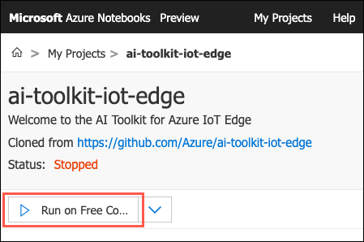

# Overview of Inferencing at the IoT edge

In the previous articles, we looked at [real-time inferencing](./read-time-inferencing.md) and [batch inferencing](./batch-inferencing.md) and how to quickly make decisions on incoming data using trained models deployed as web services. What happens, however, when making calls to cloud-hosted web services presents a challenge or is problematic? For example, consider cases where sending data to cloud-based web services violates data sovereignty or introduces an elevated security risk, or where bandwidth limitations, network latency and connectivity issues make transmitting data prohibitively expensive or too slow to allow time-critical decisions to be made reliably.

Internet of Things (IoT) solutions often include devices that are geographically distributed or running in remote locations with limited network connectivity, yet decisions based on the data those devices are collecting and transmitting need to be made as quickly as possible, sometimes within fractions of a second. In such cases, performing inference at or near the edge is the solution. This approach offers many advantages over making calls to cloud-hosted services, such as responding to changing conditions or using anomaly detection to quickly shut down a failing device, before it is damaged beyond repair. Running machine learning workloads at the edge can help reduce bandwidth costs and avoid transferring terabytes of raw data. You can clean, aggregate, and react to the data locally, and then only send the insights to the cloud for analysis.

In this article, we discuss the integration of Azure Machine Learning and Azure IoT Edge, and the benefits of inferencing at the edge. If you wish to follow along by executing the sample code, you need to set up your Azure Notebooks and visual interface environments per the instructions within [environment setup](../intro/environment-setup.md).

## Azure IoT Edge

To provide a framework capable of supporting inference and data analysis at the IoT edge, Microsoft built [Azure IoT Edge](https://docs.microsoft.com/azure/iot-edge/about-iot-edge). The service builds upon the capabilities provided by [IoT Hub](https://docs.microsoft.com/azure/iot-hub/about-iot-hub) and is designed to allow data to be analyzed directly on IoT devices or "at the edge," instead of in the cloud. To run your workloads at the edge using Azure IoT Edge, they are packaged into containers and those containers are then deployed to the edge. This allows you to move machine learning inference to the edge and respond to events more quickly.

Azure IoT Edge is made up of three components which work together to provide a complete solution for running, managing, and monitoring inference on the IoT edge.

- [IoT Edge modules](#iot-edge-modules)
- [IoT Edge runtime](#iot-edge-runtime)
- [IoT Edge cloud interface](#iot-edge-cloud-interface)

### IoT Edge modules

IoT Edge modules are Docker-compatible containers that enable running business logic, including artificial intelligence, at the edge. Each module is a unit of execution that runs locally on an IoT Edge device. You can develop your own custom modules or package certain Azure services, such as Azure Stream Analytics, Azure Functions, and Azure Machine learning, into modules that provide insights offline and at the edge. You develop custom modules using the same programming models employed by other Azure IoT services. To facilitate more complex data processing pipelines, you can also chaining multiple modules together, configuring them to communicate with each other. Both Windows and Linux are supported, so you can select the platform of your choice. In addition, Java, .NET Core 2.0, Node.js, C, and Python are supported, allowing your developers to code in a language they already know and use existing business logic.

### IoT Edge runtime

The IoT Edge runtime is the backbone for running and managing modules on IoT Edge devices. The runtime is deployed on all IoT Edge devices and it enables custom and cloud logic to execute on a comprehensive set of IoT Edge devices running both Windows and Linux operating systems, from devices smaller than a Raspberry Pi 3 to industrial servers. Installed on each IoT Edge device, the runtime performs management and communication operations, including:

- Installing and updating workloads
- Ensuring security standards are maintained
- Keeping IoT Edge modules running
- Reporting the health of modules to IoT Hub for remote monitoring
- Managing communication between modules, between devices, including downstream leaf devices, and between the device and the cloud

The IoT Edge runtime has three components:

- The **IoT Edge security daemon** starts each time an IoT Edge device boots and bootstraps the device by starting the IoT Edge agent.
- The **IoT Edge agent** facilitates deployment and monitoring of modules on the IoT Edge device, including the IoT Edge hub.
- The **IoT Edge hub** manages communications between modules on the IoT Edge device, and between the device and IoT Hub.

### IoT Edge cloud interface

Managing and monitoring devices in typical IoT solutions can be very complex. It is not uncommon for thousands, or even millions, of devices of different makes and models to be geographically scattered, each requiring workloads to be created and configured based on the particular device. Workloads must then be deployed to each device and monitored for issues. Given the large number of devices frequently used in these types of solutions, management and monitoring activities must be done at scale.

To facilitate remote monitoring and management of IoT Edge devices at scale, Azure IoT Edge uses a cloud-based interface. This interface provides a single control plane that allows you to:

- Create and configure device-specific workloads
- Deploy workloads to devices
- Remotely monitor device workloads

## Deploying models to IoT devices using the Azure IoT Edge

To enable the application of artificial intelligence and machine learning to data collected on the edge, Azure IoT Edge allows for the integration of Azure Machine Learning workloads. All machine learning models created using AML can be deployed as modules to IoT Edge devices and gateways that are running the Azure IoT Edge runtime.

> **Important**: Support for deploying AML workloads to the edge is currently in _preview_, and only available for Linux devices.

### Prerequisites

For the example below, you will need to create a Linux device or virtual machine, which will serve as your IoT Edge device. To accomplish this, use the Azure Cloud Shell and the Azure Command Line Interface (CLI).

The first step is to add the Azure IoT extension to the cloud shell instance. At the Cloud Shell prompt, enter and run the following command:

```shell
az extension add --name azure-cli-iot-ext
```

Now, create a new resource group to use for resources this demo. If you prefer to use an existing resource group, you can skip this step.

```shell
az group create --name aml-iot-edge-demo --location westus2
```

**Important**: Copy the resource group name and location values and save them. These values are needed in the Azure Notebook below.

#### Create an IoT Hub

The next step is to create an IoT Hub using Azure CLI. You should be able to use the free level of IoT Hub for this demo. However, if you already free hub running in your subscription you will get an error running the command below, because only one free hub is allowed per subscription. You can choose to use that already provisioned free IoT hub, if you like, or you can change the SKU in the command below to S1.

The following code creates a free F1 hub in the resource group aml-iot-edge-demo. Replace {hub_name} with a unique name for your IoT hub.

```shell
az iot hub create --resource-group aml-iot-edge-demo --name {hub_name} --sku F1
```

> If you get an error that the IoT Hub name isn't available, it means that someone else already has a hub with that name. Try a new name.

**Important**: Copy and save the IoT Hub name, as this value is needed below and in the Azure Notebook used in subsequent steps.

#### Create an IoT Edge device

To simulate an IoT Edge device, use a Linux virtual machine. It is recommended that you use the Microsoft-provided Azure IoT Edge on Ubuntu virtual machine image, which pre-installs everything you need to run IoT Edge on a device. Create the virtual machine using this image by running the following commands in the Azure Cloud Shell:

```shell
az vm image accept-terms --urn microsoft_iot_edge:iot_edge_vm_ubuntu:ubuntu_1604_edgeruntimeonly:latest
az vm create --resource-group aml-iot-edge-demo --name EdgeVM --image microsoft_iot_edge:iot_edge_vm_ubuntu:ubuntu_1604_edgeruntimeonly:latest --admin-username demouser --generate-ssh-keys
```

> **Note**: It will take a few minutes to provision and start the EdgeVM virtual machine.

When the new virtual machine finishes provisioning, note the `publicIpAddress` in the output. This value will be required to connect to the VM below.

> If you would like to use your own device for running the Azure IoT Edge runtime, follow the instructions to [Install the Azure IoT Edge runtime on Linux](https://docs.microsoft.com/azure/iot-edge/how-to-install-iot-edge-linux).

### Register the IoT Edge device

Once you device VM finishes provisioning, the device must be registered with your IoT Hub. In the process, you will create a identity for your IoT Edge device to enable communication with your IoT Hub.

IoT Edge devices behave and are managed differently than typical IoT devices, so use the `--edge-enabled` flag when creating this identity. The flag specifies the device identify is for an IoT Edge device.

Create a device named `demoEdgeDevice` in your hub by running the following command at the Azure cloud shell prompt. **Note**: Make sure to replace {hub_name} with the unique name you used above.

```shell
az iot hub device-identity create --hub-name {hub_name} --device-id demoEdgeDevice --edge-enabled
```

> If you get an error about iothubowner policy keys, make sure that your cloud shell is running the latest version of the `azure-cli-iot-ext` extension.

The device identity lives in the cloud, and you use a unique device connection string to associate a physical device to a device identity. To retrieve the connection string for your device, run the following, replacing {hub_name} with the unique name you used above:

```shell
az iot hub device-identity show-connection-string --device-id demoEdgeDevice --hub-name {hub_name}
```

**Important**: Copy the value of the connectionString key from the JSON output and save it. This value is the device connection string. You'll use this connection string to configure the IoT Edge runtime in the next section.

### Configure the IoT Edge device

To be able to run modules on your IoT Edge device, you need to start the Azure IoT Edge runtime on the device.

If you created a device VM above using the Azure IoT Edge on Ubuntu virtual machine, then the IoT Edge runtime is already installed and running on your device. To complete the configuration, you need to configure your device with the device connection string that you retrieved in the previous section. To remotely run the configuration script on your VM, run the following command, making sure to replace {device_connection_string} with the device connection string you copied above.

```shell
az vm run-command invoke -g aml-iot-edge-demo -n EdgeVM --command-id RunShellScript --script "/etc/iotedge/configedge.sh '{device_connection_string}'"
```

If you chose to use your own device, you must install the IoT Edge runtime and its prerequisites on your device. Follow the instructions in [Install the Azure IoT Edge runtime on Linux](https://docs.microsoft.com/azure/iot-edge/how-to-install-iot-edge-linux), then return to this article to continue.

### View the IoT Edge runtime status

You can verify that the runtime was successfully installed and configured on your IoT Edge device by connect to it. Using a Linux virtual machine, use the public IP address that was in the output of the VM creation command. You can also find the public IP address on your virtual machine's overview page in the Azure portal. The following command opens an SSH connection to your virtual machine. If you used a username other than demouser, replace {demouser} below. Likewise, replace {publicIpAddress} with your VM's address.

```shell
ssh demouser@{publicIpAddress}
```

> **Important**: Use `sudo` in front of the commands below to run `iotedge` commands with elevated privileges on the VM.

To ensure the IoT Edge security daemon is running as a system service, run the following:

```bash
sudo systemctl status iotedge
```

Should you need to troubleshoot the service, you can retrieve the service logs using:

```bash
journalctl -u iotedge
```

You can also view a list of the modules running on your device with:

```bash
sudo iotedge list
```

### Create and deploy an IoT Edge module

To demonstrate how to create and deploy a custom Azure Machine Learning model, we will use resources provided in the [AI Toolkit for Azure IoT Edge Git repo](https://github.com/Azure/ai-toolkit-iot-edge/tree/master/IoT%20Edge%20anomaly%20detection%20tutorial). Using a Azure Notebook provided within that repo, we convert trained machine learning model files into an Azure Machine Learning service container.

Navigate to your Azure Notebooks project by signing into [Microsoft Azure Notebooks](https://notebooks.azure.com/home/projects) with your Azure account, or navigating to your Azure Machine Learning service workspace in the [Azure portal](https://portal.azure.com).

Once connected, select Upload GitHub Repo and enter `Azure/ai-toolkit-iot-edge` into the GitHub repository name field. Leave the Public box uncheck if you want to keep your project private, and then select Import.

Once the import completes, navigate into the new `ai-toolkit-iot-edge` project and open the `IoT Edge anomaly detection tutorial` folder. Verify that your project is running. If not, select Run on Free Compute.



Within the `IoT Edge anomaly detection tutorial` folder, select the `aml_config` folder and then open `config.json`. Edit the config file, adding values for your Azure subscription ID, the name of the resource group you are using for this demo, and your Azure Machine Learning service workspace name. You can get all these values from the Overview section of your workspace in Azure. Save the config file once you are done making edits.

Next, open the `00-anomaly-detection-tutorial.ipynb` file, select the Python 3.6 kernel, when prompted, and then select Set Kernel.

Edit the first cell in the notebook according to the instructions in the comments, using the same resource group, subscription ID, and workspace name that you added to the config file. Follow the instructions within the notebook to train an anomaly detection model, build it as a Docker container image, push that image to an Azure Container Registry, test the model, and finally deploy it to your IoT Edge device.

Run each notebook cell by selecting it and then selecting Run or pressing Shift + Enter.

> **Note**: Some of the cells in the anomaly detection tutorial notebook are optional, because they create resources that some users may or may not have yet, like an IoT Hub. If you put your existing resource information in the first cell, you'll receive errors if you run the cells that create new resources because Azure won't create duplicate resources. This is fine, and you can ignore the errors or skip those optional sections entirely.

### View container repository

To ensure your container image was successfully created and stored in the Azure container registry associated with your machine learning environment, open the [Azure portal](https://portal.azure.com), and navigate to your Machine Learning service workspace. From the Overview blade, select the Registry value, which should be your workspace name followed by random numbers.

On the container registry blade, select Repositories. You should see a repository called `tempanomalydetection`. This repository was created by the notebook you ran above.

Select `tempanomalydetection`, noting that the repository has one tag: 1.

With the registry name, repository name, and tag, you can create the full image path of the container. Image paths look like `<registry_name>.azurecr.io/tempanomalydetection:1`. The image path can be used to deploy this container to IoT Edge devices.

In the container registry, select Access keys from the left-hand menu, and observe the list of access credentials, including Login server and the Username, and Password for an admin user. These credentials can be included in the deployment manifest to give your IoT Edge device access to pull container images from the registry.

Now you know where the Machine Learning container image is stored. The next section walks through steps to view the container running as a module on your IoT Edge device.

### View generated data

You can view messages being generated by each IoT Edge module, and you can view messages that are delivered to your IoT hub.

#### View data on your IoT Edge device

On your IoT Edge device, you can view the messages being sent from every individual module.

You may need to use `sudo` for elevated permissions to run `iotedge` commands.

> **Tip**: Signing out and signing back in to your device automatically updates your permissions.

To see a list of all the modules running on your IoT Edge device, open the command prompt on your IoT Edge device again, or use the SSH connection from the Azure CLI, and enter the following command:

```bash
sudo iotedge list
```

You can view the messages being sent from a specific module using the following command. Using the example above, replace `<module-name>` with "machinelearningmodule."

```bash
sudo iotedge logs <module_name> -f
```

> **Note**: IoT Edge commands are case-sensitive when referring to module names.

You can also watch the messages arrive at your IoT hub by using the [Azure IoT Hub Toolkit extension for Visual Studio Code](https://marketplace.visualstudio.com/items?itemName=vsciot-vscode.azure-iot-toolkit).

## Next steps

Read next: [Reducing model deployment dependencies and improving model inferencing performance with ONNX](./deployment-with-onnx.md)
