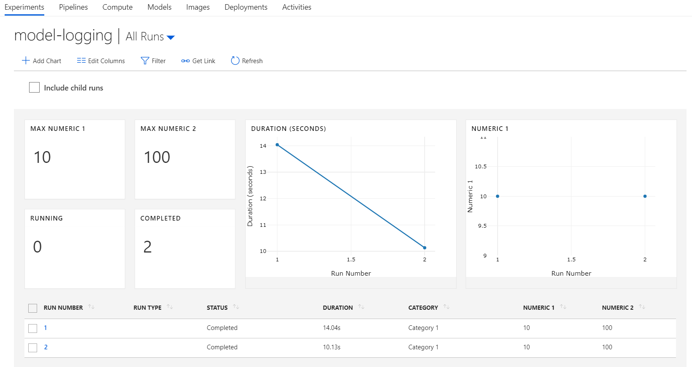
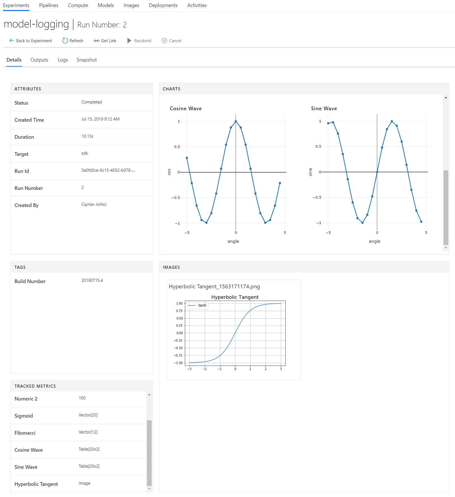
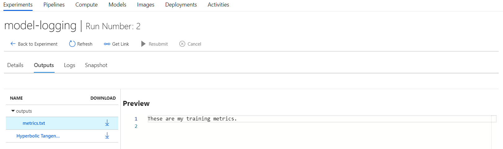
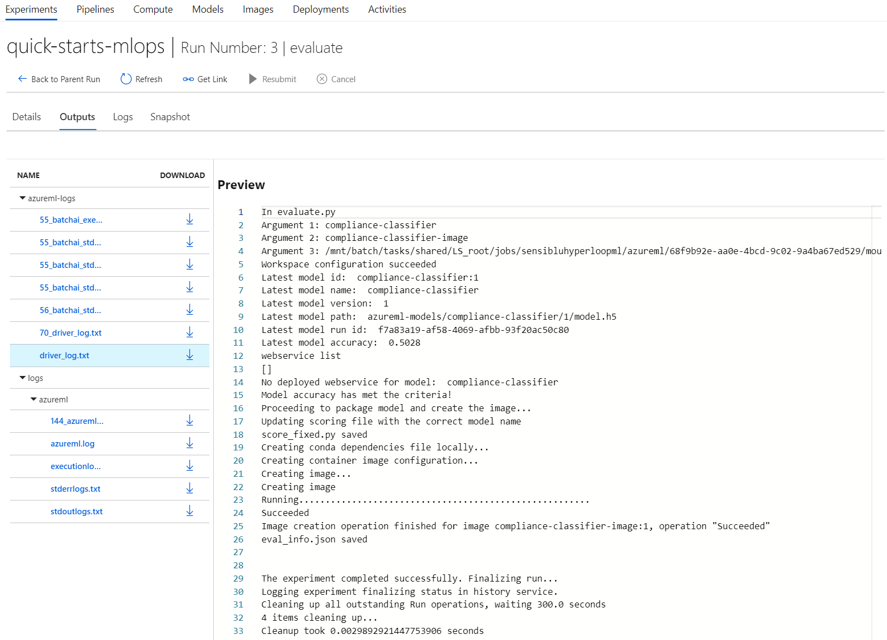
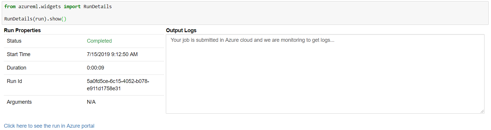
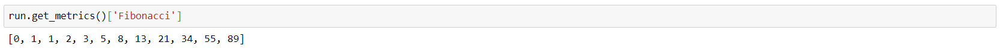
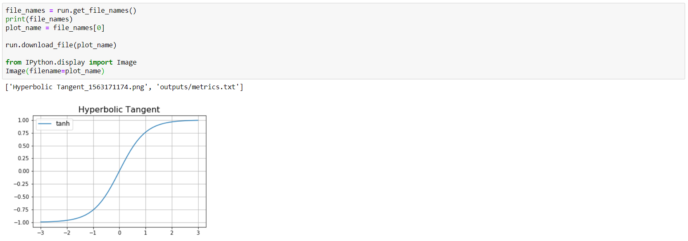

# Capturing and querying model performance data with AML Experiments

Within the context provided by an Experiment, each Run is associated with the following information that can be used to track valuable information about the training process:

| Name                  | Description                                                                                                                                                                                                                                                                                                 |
| --------------------- | ----------------------------------------------------------------------------------------------------------------------------------------------------------------------------------------------------------------------------------------------------------------------------------------------------------- |
| Attributes (metadata) | Values like Status, Created Time, Duration, Run Id, Run Number, and others.                                                                                                                                                                                                                                 |
| Tags                  | String values associated with the Run like `azureml.nodeid`.                                                                                                                                                                                                                                                |
| Tracked Metrics       | Performance metrics like `loss` and `acc`. The list depends on the algorithm used to train the model.                                                                                                                                                                                                       |
| Charts                | You can log vectors and/or tables from code using `run.log_list(name, value, description)` and then view charts based on these values in the Azure Portal.                                                                                                                                                  |
| Images                | You can log image files or `matplotlib` plots from code using `run.log_image(name, path, plot)` and then view them in the Azure Portal.                                                                                                                                                                     |
| Outputs               | Output files that are either collected automatically by the experiment or are explicitly uploaded by you.                                                                                                                                                                                                   |
| Logs                  | Various log files generated during the execution of the training script.                                                                                                                                                                                                                                    |
| Snapshot              | When submitting a run, the directory that contains the script file is sent in a compressed form to the compute target being used and also stored as a snapshot. The actual content of the directory that ends up in the zip file can be controlled by placing in it an `.amlignore` or a `.gitignore` file. |

## Using the SDK to capture data

The following types of values can be logged during the model training process using the SDK:

- Scalar values (string or numerical) - logging the same metric multiple times will result in a vector
- Vector (list)
- Row
- Table
- Image
- File
- Tag

The following example shows how to use the SDK to log different types of values during an experiment run (the initialization of the Workspace object is omitted):

```python
%matplotlib inline
import numpy as np
import matplotlib.pyplot as plt
from tqdm import tqdm

exp = Experiment(workspace=ws, name='model-logging')
run = exp.start_logging()

# String metrics
run.log(name='Category', value='Category 1')

# Numeric metrics
run.log(name='Numeric 1', value=10)
run.log(name='Numeric 2', value=100)

# Run the same numeric value repeatedly to generate a line chart
for i in tqdm(range(-10, 10)):
    run.log(name='Sigmoid', value=1 / (1 + np.exp(-i)))

# Vector metrics
fibonacci_values = [0, 1, 1, 2, 3, 5, 8, 13, 21, 34, 55, 89]
run.log_list(name='Fibonacci', value=fibonacci_values)

# Table metrics
# Create a dictionary to hold a table of values
sines = {}
sines['angle'] = []
sines['sine'] = []

for i in tqdm(range(-10, 10)):
    angle = i / 2.0

    # log a 2 (or more) values as a metric repeatedly. This will generate a 2-variable line chart if you have 2 numerical columns.
    run.log_row(name='Cosine Wave', angle=angle, cos=np.cos(angle))

    sines['angle'].append(angle)
    sines['sine'].append(np.sin(angle))

# log a dictionary as a table, this will generate a 2-variable chart if you have 2 numerical columns
run.log_table(name='Sine Wave', value=sines)

# Image metrics

# Create a plot
angle = np.linspace(-3, 3, 50)
plt.plot(angle,np.tanh(angle), label='tanh')
plt.legend(fontsize=12)
plt.title('Hyperbolic Tangent', fontsize=16)
plt.grid(True)

# Log the plot to the run.  To log an arbitrary image, use the form run.log_image(name, path='./image_path.png')
run.log_image(name='Hyperbolic Tangent', plot=plt)

# File metrics
file_name = 'outputs/metrics.txt'

with open(file_name, "w") as f:
    f.write('These are my training metrics.\n')

# Upload the file explicitly into artifacts
run.upload_file(name = file_name, path_or_stream = file_name)

run.tag('Build Number', value='20190715.4')

run.complete()
```

**Note**: For the sake of simplicity, the example above does not perform any model training per se, it just demonstrate the use of various methods of the `Run` objects to capture telemetry.

Notice the use of the `outputs` folder when uploading an arbitrary file as an artifact during the model training process. All files uploaded there will be available in the Azure Portal in the `Outputs` section of the run object.

Also worth noting is the tagging example. If your run is executed in the context of an Azure DevOps build pipeline, tagging the run with the build number of the Azure DevOps build is an very useful approach, enabling you to create a contextual link between the build in Azure DevOps and the run in Azure Machine Learning service. Using the tag, you can get access to the run at any later point in time.

## Viewing captured data in the Azure Portal

Once a run like the one presented in the example above is complete, its results are visible in the Azure Portal:



Notice the scalar values (`Category`, `Numeric 1`, and `Numeric 2`) that are displayed as columns directly in the list of runs. Also notice the widgets for `Numeric 1` and `Numeric 2` displaying the maximum values - these are quite useful in the case of real model metrics, helping you to get a global view of the results coming from multiple runs.

Clicking on a specific run will display all its details:


Scrolling down in the CHARTS and TRACKED METRICS sections will display the reminder of the logged data artifacts:



Finally, in the `Outputs` section, the file artifacts are available:



As noted previously, this example is a simplified one (no actual model training is performed) aiming to demonstrate the data capturing features of Azure Machine Learning. In the case of more complex runs, multiple outputs will be available (ones that are generated automatically and ones that are captured explicitly by the model training code). Here is such an example:



## Querying captured data with the SDK

All data captured during a run is available through the SDK as well. The SDK has a useful widgets module that allows you to monitor a run even while it is executing:



Note the link to the Azure Portal provided by the widget.

To get full access to the metrics, you can use the `get_metrics` method of the Run object. You will get a dictionary containing all the metrics logged for the run:


Using the dictionary, you can get access to any individual collection of metrics:



To get access to the files that were logged, you can use the `get_file_names` method of the Run object, followed by a call to the `download_file`. Here is an example:



## Using properties and tags to find runs

Earlier we noted the use of the custom `Build Number` tag to show how tags can be used to link Azure DevOps builds to Azure Machine Learning sevice runs. Here is an example of how the build number can be used to identify a specific run:


### Properties vs. tags

The example at the beginning of this article uses the following approach to tag the run:

```python
run.tag('Build Number', value='20190715.4')
```

An alternative approach is to use properties instead of tags:

```python
run.add_properties({'author': 'John Doe'})
```

Retrieving a run based on its properties is similar to retrieving it using tags:

```python
exp.get_runs(properties={'author': 'John Doe'})
```

The main difference between properties and tags is that properties are immutable while tags are mutable. Consequently, properties are better suited for cases when you need to create permanent records for auditing purposes.

## Next steps

You can learn more about capturing and querying model performance data by reviewing these links to additional resources:

- [Start, monitor, and cancel training runs in Python](https://docs.microsoft.com/azure/machine-learning/service/how-to-manage-runs)
- [Log metrics during training runs in Azure Machine Learning](https://docs.microsoft.com/azure/machine-learning/service/how-to-track-experiments)

Read next: [Training and Evaluating a simple model using Azure Machine Learning Studio (Code Sample)](./training-evaluating-model-with-aml-studio.md)
