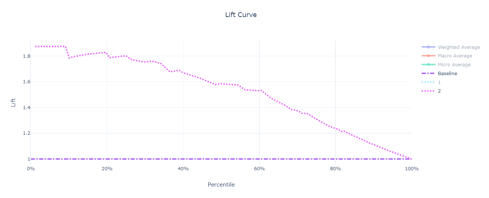
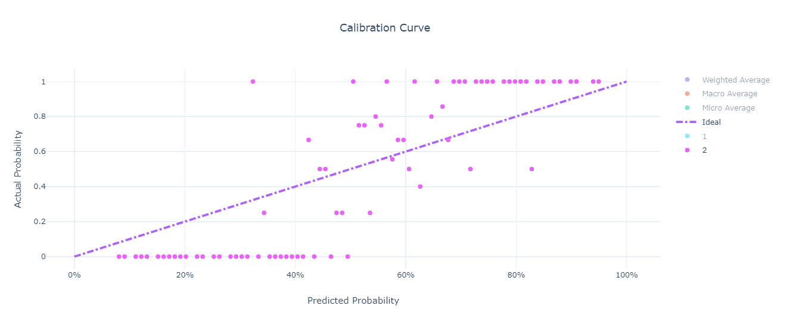

# Measuring performance of classification and regression models

## The basic principle of model performance measurement

Machine Learning classification and regression algorithms are one of the most widely used techniques in data science. From a mathematical point of view, the objective of a classifier/regressor is to predict the value of a feature `y` based on a set of input features `X` which may be non-categorical(continuous) or categorical (discrete). In the case of classificattion `y` is always categorical (or discrete), and in the case of regression `y` is numeric (continuous).

The core technique applied when training such models is based on splitting the input data (data for which we know the values of `y`) into two data sets:
- One training data set (which typically contains 75% - 85% of the input data)
- One testing data set (which typicall contains 25% - 15% of the input data)

Obviously, care must be taken when performing the split of the data to preserve as much as possible (in both data sets) the statistical properties of the input data set. How this happens is outside the scope of our discussion.

Once the training and testing data sets are available, the model is trained using the training data sets and then it is tested (validated) using the testing data sets. Once the trained model is created, it is applied usually to the full input data set for calculation of performance metrics. As always with Machine Learning models, measuring the peformance is very important - it helps deciding whether a version of a trained model is `good enough` to be promoted into a production environment.

## Classification models

 The following techniques are used to measure the performance of classifiers:

- Confusion matrix
- Gain and Lift charts
- Receiver operating characteristics (usually referred as ROC)
- Calibration plots

### A practical example

Some of the concepts associated with the techniques mentioned above are more abstract and slightly more difficult to understand using a purely theoretical approach. To make our discussion more relevant and easier to follow we will use a practical example - the problem of [Sonar Classification](https://archive.ics.uci.edu/ml/datasets/Connectionist+Bench+(Sonar,+Mines+vs.+Rocks)) where `y` has a cardinality of 2 (binary classification). In this particular case, `X` consists of 60 numerical features (normalized values of sonar readings at various angles) and `y` has two categories - Rock (R) or Mine (M). The problem at hand is to create a classifier that, given the sonar readings, will predict whether an object being detected is a rock or a mine (or, alternatively, whether an object being detected is a mine or not). The case R (not a mine) is coded as 1 and the case M (a mine) is coded as 2.

We used Azure Automated Machine Learning (AutoML) to run the experiment that trains our model. AutoML is described in detail in a separate section - [Simplify the process with Automated Machine Learning, a component of Azure Machine Learning service](../../simplify-process-with-automated-ml/README.md). Understanding the details of how AutoML works is not required to follow the reminder of this section. For now, it is enough to say that all the charts presented in this subsection dedicated to classifiers are the charts AutoML generated for the `VotingEnsemble` algorithm which managed to achieve an accuracy score of 0.85. 

**Note**: The charts can display multiple data sets (one for each distinct class of `y` plus some aggregated ones labeled `* Average`), which is typicall for multi-variate classifiers (where the cardinality of `y` is higher than 2). Our discussion will be limited to the binary classification case. Consequently only one dataset is selected on the charts, the one corresponding to the problem of correctly identifying class 2. In other words, the charts display the relevant metrics for the problem of predicting whether an object is a mine (2) or not (1).

For details on how does Azure Machine Learning service calculate various classifier performance metrics for the multi-variate case, read the [Evaluate training accuracy in automated ML with metrics](https://docs.microsoft.com/en-us/azure/machine-learning/service/how-to-understand-accuracy-metrics) article.

### Confusion matrix

The confusion matrix is a N x N matrix, where N represents the cardinality of `y` (the class being predicted). The lines of the matrix correspond to known values (also referred as **True values**). The columns of the matrix correspond to **Predicted values** - the ones inferred by the model. For a line in the matrix corresponding to a true value `v`, each element counts the number of predictions made by the model that were equal to each value in the class. It is quite easy to note that, ideally, all elements should be 0 except the element from the column corresponding to the same value `v`. Generally speaking, the ideal (or perfect) classifier would produce a diagonal confusion matrix - one in which all elements are 0 except the ones on the main diagonal.

The general form of a confusion matrix looks like this:

Class | V1 | V2 | ... | VN
--- | --- | --- | --- | ---
V1 | X11 | X12 | ... | X1N 
V2 | X21 | X22 | ... | X2N 
... | ... | ... | ... | ...
VN | XN1 | XN2 | ... | XNN

An ideal classifier would produce the following confusion matrix:

Class | V1 | V2 | ... | VN
--- | --- | --- | --- | ---
V1 | X11 | 0 | ... | 0 
V2 | 0 | X22 | ... | 0 
... | ... | ... | ... | ...
VN | 0 | 0 | ... | XNN

In other words, this classifier would predict the correct value for `y` for every case in the test data set.

To simplify the discussion, we will continue with the particular case of two-class (or binary) classification. In this case, `y` has a cardinality of 2 and its values are usually identified by `Positive` and `Negative` (or any equivalent notation). The confusion matrix in this case will be:

Class | Positive | Negative
--- | --- | --- 
Positive | TP (true positives) | FP (false positives) 
Negative | FN (false negatives) | TN (true negatives)

In our practical example, the confusion matrix is the following:

Class | Mine! | Not a mine 
--- | --- | --- 
Mine! | **103** | 8
Not a mine | 23 | **74**

Using this notation, the following metrics can be defined:

Name | Formula | Description
--- | --- | ---
Accuracy | (TP + TN) / (TP + FP + FN + TN) | The proportion of correct predictions.
Precision (Positive Predictive Value) | TP / (TP + FP) | The proportion of Positive cases that were correctly identified.
Support (Positive Predictive Rate) | (TP + FP) / (TP + FP + FN + TN) | The proportion of cases predicted to be Positive.
Negative Predictive Value | TN / (TN + FN) | The proportion of Negative cases that where correctly identified.
Recall (Sensitivity) | TP / (TP + FN) | The proportion of actual Positive cases that were correctly identified.
Specificity | TN / (TN+ FP) | The proportion of actual Negative cases that were correctly identified.
F1 Score | 2 * (Precision * Recall) / (Precision + Recall) | Conveys the ballance between Precision and Recall.

There are many real-life situations where FNs are much worse than FPs. Think about a model that makes predictions about the existence of a disease. While FPs can be further investigated (and probably cleared), FNs are just slipping under the radar leaving the disease potentially untreated. Why is this important? Because it turns out, Accuracy can be sometimes misleading. Sometimes it is simply more desirable to get a model with a lower accuracy but a higher predictive power. This is why Accuracy is never used alone to measure the performance of a classifier and is usually accompanied by at least Precision and Recall. Getting back to the disease prediction problem, a low Precision indicates a large number of FPs while a low Recall indicates a large number of FNs. 

**Note**: The problem with Accuracy being misleading is also referred as the [Accuracy Paradox](http://en.wikipedia.org/wiki/Accuracy_paradox).

In the ideal case, a perfect classifier would have Precision = 1 and Recall = 1. 

One useful element to consider is the Precision-Recall chart that displays a curve identifying the relationship between Precision and Recall. Here is an example of such a chart, generated automatically by Azure Machine Learning services (during an [Automated ML](../../simplify-process-with-automated-ml/README.md) experiment):

### Gain and Lift charts

Gain and Lift curves are two other useful techniques to measure the performance of classifiers. As they deal with rank ordering of the prediction probabilities, they are a little bit more elaborate than confusion matrices and thus, slightly more difficult to understand. Essentialy, they measure how much better you are expected to perform by using the classifier as opposed to doing random guessing.

From a mathematical point of view, a Gain chart displays the evolution of cumulated Sensitivity against cumulated population. In other words, displays the way in which the proportion of correctly predicted cases (mines in our example) increased as the proportion of analyzed population increases. To help understanding the chart, let's first look at the steps performed to create the chart:

- Use the trained model to calculate the probability of the `Mine` case for each entity in the input data set (the result in our case will be something like `Mine - 0.83` or something like `Not a mine - 0.64` which in the case of binary classification is equivalent to `Mine - 0.36`).
- Order the list in the descending order of the proabilities.
- Group entities in to buckets like deciles on centiles (percentiles). 
- Calculate the cumulated value of Sensitivity and population for each bucket.
- Display the chart of cumulated Sensitivity against cumulated population.

Here is the Gain chart for our example:

These are some examples of reading this chart:

- When using the model to select top 20% of objects most likely to be mines, we actually find 36% of all mines
- When using the model to select top 40% of objects most likely to be mines, we actually find 66% of all mines
- When using the model to select all objects, we actually find 100% of all mines (which explains the top right corner of the chart)

Note the baseline marked on the chart which corresponds to random selection (no help from any machine learning model at all). For example, the baseline says that if we randomly select 20% of objects, we will probably find within them 20% of all mines. Same for 40%, 60%, and so on.

One question you might have at this point is: `Well, that's interesting, but how is this relevant in practical cases?`. To answert that, let's suppose the following:
- We have trained two models, C1 and C2, and we have their respective Gain charts.
- We have a method for extensive analysis that can be applied to any entity that is suspect of being a mine. Unfortunatelly, that method is expensive (in terms of time and cost), so we have a practically limited number of entities that can be analyzed. Let's assume we can only perform 15,000 extensive tests.
- We have large batch of sonar readings that are not classified. Let's assume we have 100,000 new sonar readings.
- Between C1 and C2, we need to select the model that is capable of doing the better job at maximizing the probability of finding as many mines as possible, given the constraint posed by the liminted number of extensive tests we can perform.

At this point, the value of a Gain chart should be quite clear. Between C1 and C2, we will choose the model that has the highest Gain value at the 15th percentile. We will use that model to select the top 15,000 entities that are the most likely to be mines. Because the selected model has the highest gain value, our chances of finding the highest number possible of mines are maximized.

Now that you have a basic understanding of the Gain chart, the Lift chart is simple to grasp - it is merely a different way of representing the same information. 

Here is the lift chart for our example:

These are some examples of reading this chart:

- When using the model to select top 20% of objects most likely to be mines, we expect to find 1.8 times more mines than we would by random selection
- When using the model to select top 40% of objects most likely to be mines, we expect to find 1.65 times more mines than we would by random selection
- When using the model to select all objects, we expect to find the same number of mines that we would by random selection.

Note the baseline marked on the chart which corresponds to random selection (no help from any machine learning model at all). Naturally, the lift curve converges to 1 at the 100th percentile.

### Receiver operating characteristics (ROC)

The ROC curve is displaying the rate of TP (True Positives) against the rate of FP (false positives). In other words, it displays Sensitivity vs. Specificity.

Here is the ROC curve for our example:

These are some examples of reading this chart:

- Correctly predicting 86% of all mines will carry a "burden" of 20% of false alarms (out of the total number of false alarms expected)
- Correctly predicting 96% of all mines will carry a "burden" of 40% of false alarms (out of the total number of false alarms expected)

Note the random classifier and the ideal classifier that are marked on the chart as well. The random classifier identifies the case when we simply to random selection. The ideal classifier is the one that has no FPs (correctly predicting 100% of all mines carries no "burden" at all).

Directly derived from the ROC chart is the Area Under the Curve (AUC) indicator which is what its name implies - the area of the surface that lies under the ROC chart. It is easy to see that AUC is 0.5 for the random classifier and 1 for the ideal classifier. These are actually the limits of AUC. As a general rule of thumb, the following table can be used to judge classifiers based on AUC:

Min | Max | Model quality
--- | --- | ----
0.9 | 1.0 | Excellent
0.8 | 0.9 | Good
0.7 | 0.8 | Decent
0.6 | 0.7 | Poor
0.5 | 0.6 | Epic fail :)

### Calibration plots

A Calibration plot is a useful tool to analyze the confidence of a classifier. It shows the relationship between probabilities the model predicts and the actual probabilities. 

Here is the calibration curve for our example:

These are some examples of reading this chart:

- Among all entities for which the model predicts a probability between 0.94 (94%) and and 0.95 (95%) the proportion of entities that actually are mines is 1.0 (100%)
- Among all entities for which the model predicts a probability between 0.82 (82%) and and 0.83 (83%) the proportion of entities that actually are mines is 0.5 (50%)
- Among all entities for which the model predicts a probability between 0.53 (53%) and and 0.54 (54%) the proportion of entities that actually are mines is 0.25 (25%)
- Among all entities for which the model predicts a probability between 0.19 (19%) and and 0.20 (20%) the proportion of entities that actually are mines is 0.0 (0%)

Note the ideal classifier which is perfectly calibrated - for each bin of 1% the proportion of entities that actually are mines is identical to the bin. For example, among all entities for which the model predicts a probability between 0.48 (48%) and 0.49 (49%) the proportion of entities that actually are mines is 0.485 (48.5%). The closer the Calibration plot is to the ideal (formalized by the `y = x` function), the better calibrated the model is. The closer the Calibration plot is to the `y = 0` function, the more overconfident the model is.

It is also worth noting that there are several bins of size 1% that have missing values. When these bins are concentrated in the 30% - 60% range, this is actually a good thing indicating that the model is fairly discriminative.

One can easily see our model is fairly discriminative but in the same time a bit over-confident.

## Regression models

The following techniques are used to measure the performance of classifiers:

- Predicted vs. True
- Histogram of residuals

### A practical example

To make our discussion more relevant and easier to follow we will use a practical example - the [UCI Bike Sharing Dataset](https://archive.ics.uci.edu/ml/datasets/Bike+Sharing+Dataset) which is based on real data from the Capital Bikeshare company that maintains a bike rental network in Washington DC in the United States. The dataset represents the number of bike rentals within a specific hour of a day in the years 2011 and year 2012 and contains 17389 rows and 17 columns. The raw feature set contains weather conditions (temperature/humidity/wind speed) and the type of the day (holiday/weekday). The field to predict is the `cnt` count, which represents the bike rentals within a specific hour and which ranges from 1 to 977.

As we did with classifiers, we used Azure Automated Machine Learning (AutoML) to run the experiment that trains our model. AutoML is described in detail in a separate section - [Simplify the process with Automated Machine Learning, a component of Azure Machine Learning service](../../simplify-process-with-automated-ml/README.md). Understanding the details of how AutoML works is not required to follow the reminder of this section.

### Predicted vs. True charts

The Predicted vs. True chart displays the relationship between the predicted value and the true value. A common practice is to bin the true values into a number of bins, calculate the minimum predicted value and the maximum predicted values, and display them as a banded line chart.

Here is the Predicted vs. True chart for our example:

These are some examples of reading this chart:

- Among all 1459 entities with a true value of `cnt` between 2 and 9.96 (the second bin in the histogram), the minimum predicted value is 30.62, the maximum predicted value is 66.62, and the average predicted value is 48.62
- Among all 352 entities with a true value of  `cnt` between 65.69 and 73.65 (the tenth bin in the histogram), the minimum predicted value is 67.25, the maximum predicted value is 120.56, and the average predicted value is 93.91
- Among all 174 entities with a true value of `cnt` between 782.22 and 977 (the last bin in the histogram), the minimum predicted value is 494.43, the maximum predicted value is 583.53, and the average predicted value is 538.98

Note the ideal regressor which is perfectly accurate, for each true value is predicts the same value. The closer the average predicted value line is to the ideal regression, the more accurate our model is. 

Based on the underlying data the Predicted vs. True chart is based on, a number of core regression performance metrics are also calculated:

As one can easily see from both the Predicted vs. True chart and the list of performance metrics, our model is not too good of a regressor. As a matter of fact, we choose this model on purpose, to better highlight the divergence between the ideal line and the actual predicted values.

### Histogram of residuals

The Histogram of residuals is a histogram representing the (true `y` - predicted `y`) value. When a model has a fairly low bias, the histogram should approach a normal distribution (have a bell-like shape) centered around 0. In other words, the largest number of predictions should be in the two bins (+0 and -0) with the lowest prediction error.

Here is the Histogram of residuals for our example:

## Automatic vs. manual creation of charts

As mentioned in their associated notes, all charts presented above where created automatically by the Azure Machine Learning service during the execution of [Automated ML](../../simplify-process-with-automated-ml/README.md) experiments. In fact, this is currently the only scenario in which these charts are created automatically. For all other experiments, you can use the functionality exposed by the SDK to collect relevant data and create the associated charts. This functionality is discussed in detail in the [Capturing and querying model performance data with AML Experiments](./capture-query-model-performance-with-aml-experiments.md) article.

## Next steps

You can learn more about measuring the performance of classification and regression models by reviewing these links to additional resources:

- [Log metrics during training runs in Azure Machine Learning](https://docs.microsoft.com/en-us/azure/machine-learning/service/how-to-track-experiments)
- [Evaluate training accuracy in automated ML with metrics](https://docs.microsoft.com/en-us/azure/machine-learning/service/how-to-understand-accuracy-metrics)

Read next: [Tools to measure model performance](./measure-model-performance.md)