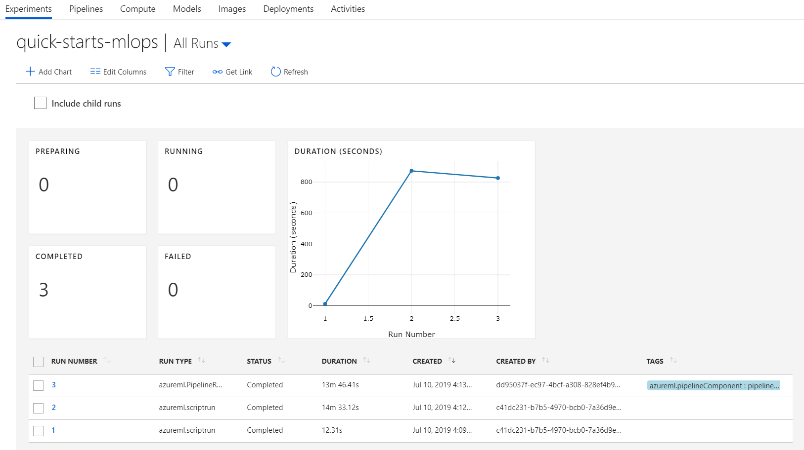
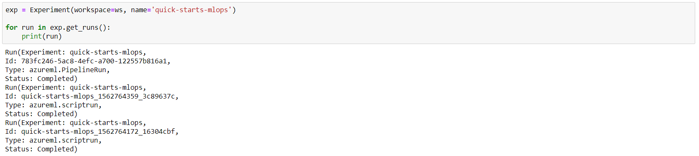
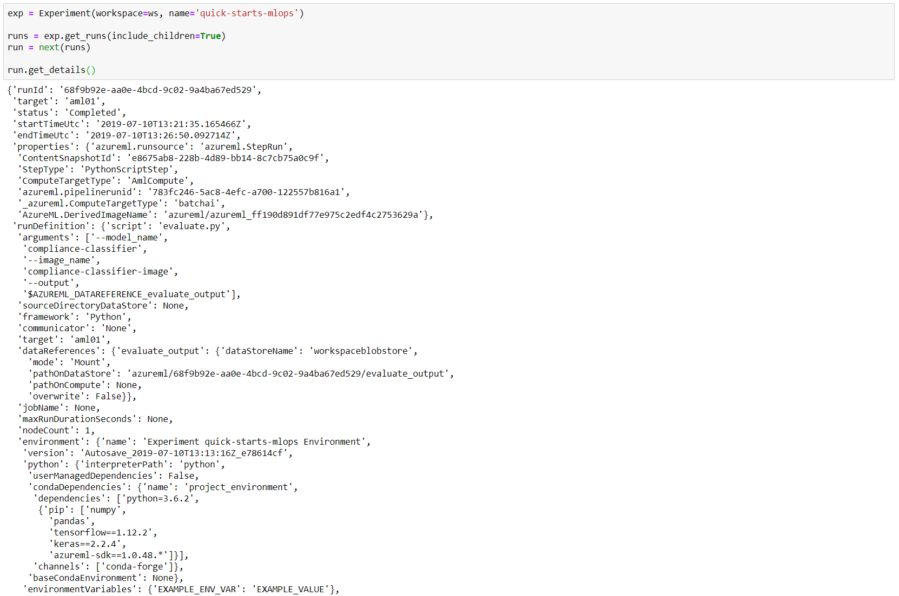
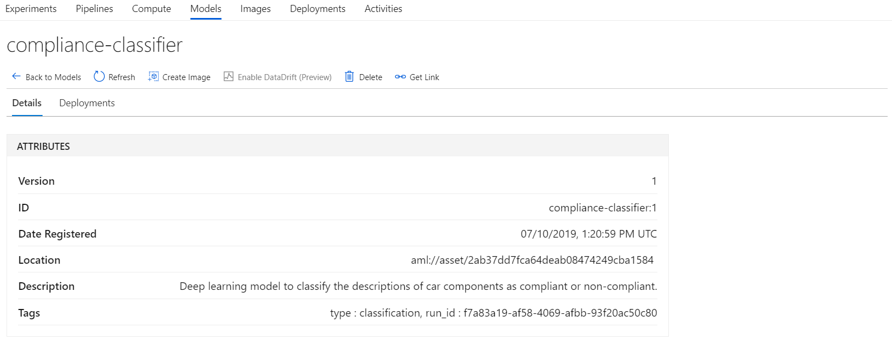
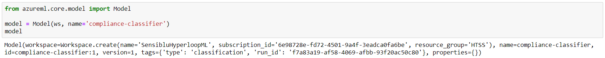

# Introducing the AML Experiment and Runs

An Azure Machine Learning Experiment is a generic context for handling runs. Think about it a logical entity you can use to organize your Model Training processes.

An Azure Machine Learning Run is used to build a trained model. Contains all artifacts associated with a training process, like output files, metrics, logs, and a snapshot of the directory that contains your scripts. A Run is always part of an Experiment.

The following picture displays the relationship between an Experiment and its Runs as seen in the Azure portal:



You can also interact programatically with Experiments and Runs using either the Azure Machine Learning SDK for Python or the Azure CLI (Command Line Interface).

Using the SDK, you need to intialize the Workspace class which will then give you access to Experiments and Runs.

```python
import azureml.core
from azureml.core import Workspace, Experiment, Run
from azureml.core import ScriptRunConfig

ws = Workspace.from_config()
exp = Experiment(workspace=ws, name="explore-runs")

# Start a run and its logging process
run = exp.start_logging()
run.log(name="message", value="Hello from run!")
```

Using the CLI, you need to login, attach a workspace configuration to the folder that contains your training script, and then start the run. `run_config_name` is the name of the run configuration file (run configurations are described later in this article). `train.py` is the name of Python code file that contains your code to be executed.

```
az login

az ml folder attach -w <workspace_name> -g <resource_group_name>

az ml run submit-script -c <run_config_name> -e <experiment_name> train.py
```

## Experiments

An Experiment is basically an entity used to group together mutiple runs of a specific script. An Experiment always belongs to a Workspace, and a Run always belongs to an Experiment. A new Experiment is automatically created if you submit a Run the specifies an Experiment name that does not exist.

An Experiment tracks all its associated Runs. You will be able to see the full list of Runs together with their associated states which can be one of the following:

- Preparing
- Running
- Completed
- Failed

As presented in the picture above, using the Azure Portal you can also configure and view charts with various metrics associated with the Runs.

The same information can be obtained programatically using the SDK.


You can also get the list of the Runs associated with an Experiment.



## Runs

Submitting a script to train a model produces a Run (in the context of a specified Experiment). The following elements are associated with a Run:

Name | Description
--- | --
Attributes (metadata) | Values like Status, Created Time, Duration, Run Id, Run Number, and others.
Tags | String values associated with the Run like `azureml.nodeid`.
Tracked Metrics | Performance metrics like `loss` and `acc`. The list depends on the algorithm used to train the model.
Charts | You can log vectors and/or tables from code using `run.log_list(name, value, description)` and then view charts based on these values in the Azure Portal.
Images | You can log image files or `matplotlib` plots from code using `run.log_image(name, path, plot)` and then view them in the Azure Portal.
Outputs | Output files that are either collected automatically by the experiment or are explicitly uploaded by you.
Logs | Various log files generated during the execution of the training script.
Snapshot | When submitting a run, the directory that contains the script file is sent in a compressed form to the compute target being used and also stored as a snapshot. The actual content of the directory that ends up in the zip file can be controlled by placing in it an `.amlignore` or a `.gitignore` file.

All these elements can be accessed using the Run class in the SDK.



There are four different ways to submit a Run in an Experiment using code:

- Use a Run Configuration (see the section below for details).
- Use an Estimator object (see [Introducing AML Estimators](./aml-estimators.md))
- Use the Azure CLI extension (via `az ml run submit-script`)
- Use the Visual Studio Code extension (see [Train and tune models from Visual Studio Code](https://docs.microsoft.com/en-us/azure/machine-learning/service/how-to-vscode-tools#train-and-tune-models))

### Run configurations

From the point of view of the development process, the most common scenario is the one in which you start working on your local machine. Once you are satisfied with the code being developed, you will want to run that traning script on a more powerfull/scalable compute resource. The concept of a Run Configuration implemented by the Azure Machine Learning service enables you to run the script of different compute targets without the need to make changes in the script itself.

A separate Run Configuration will be used for each compute target. The `RunConfiguration` class from the SDK implements the required functionalities. In adition to actually targeting a specific compute target, it also provides support for managing the environment and dependencies on the compute target.

Once you have access to the `Experiment` object in your code, you can use the `ScriptRunConfig` object to submit a run. `ScriptRunConfig` is a helper class that packages the `RunConfiguration` object mentioned above with the actual execution script that performs the training of the model.

```python
import azureml.core
from azureml.core import Workspace, Experiment, Run
from azureml.core import ScriptRunConfig

ws = Workspace.from_config()
exp = Experiment(workspace=ws, name="explore-runs")

from azureml.core import ScriptRunConfig
import os 

script_folder = os.getcwd()
# Create a configuration to target local compute.
src = ScriptRunConfig(source_directory = script_folder, script = 'train.py', run_config = run_local)
# Submit the run
run = exp.submit(src)
# Wait for the run to complete
run.wait_for_completion(show_output = True)
```

Switching to a different compute target is just a matter of changing the value of the `run_config` parameter in the `ScriptRunConfig` constructor. This is an example that would target Azure Machine Learning compute:

```python
# Create a configuration to target local compute.
src = ScriptRunConfig(source_directory = script_folder, script = 'train.py', run_config = run_local)
# Submit the run
run = exp.submit(src)
# Wait for the run to complete
run.wait_for_completion(show_output = True)
```

### Child runs

A Run can have child runs which can be viewed in the Azure Portal by checking the `Include child runs` option.


The same information can be obtained programatically using the SDK by setting the `include_children` parameter to `True` in the `get_runs()` method of the Experiment object. Notice the difference from the previous example - the list now also includes the child runs.


The typicall case involving child runs is the use on [Azure Machine Learning service Pipelines](https://docs.microsoft.com/en-us/azure/machine-learning/service/concept-ml-pipelines).

Conceptually, your code will look like this (parts were omitted for improved clarity):

```python
trainStep = PythonScriptStep(
    name="train",
    script_name="train.py", 
    arguments=["--model_name", <model_name>],
    compute_target=aml_compute,
    runconfig=run_amlcompute,
    source_directory=scripts_folder,
    allow_reuse=False
)

evaluate_output = PipelineData('evaluate_output', datastore=def_blob_store)

evaluateStep = PythonScriptStep(
    name="evaluate",
    script_name="evaluate.py", 
    arguments=["--model_name", <model_name>,  
               "--image_name", <image_name>, 
               "--output", evaluate_output],
    outputs=[evaluate_output],
    compute_target=aml_compute,
    runconfig=run_amlcompute,
    source_directory=scripts_folder,
    allow_reuse=False
)

# Link steps
evaluateStep.run_after(trainStep)
steps = [evaluateStep]

# Create pipeline
pipeline = Pipeline(workspace=ws, steps=steps)

# Execute pipeline
pipeline_run = Experiment(ws, experiment_name).submit(pipeline)

# Wait for pipeline to finish
pipeline_run.wait_for_completion(show_output=True)
```
For a more detailed discussion about pipelines see the [Overview of machine learning pipelines using the Azure Machine Learning SDK](../../../creating-machine-learning-pipelines/machine-learning-pipelines.md) section of this guide.

## Models

The most important result produced by a Run in the context of an Experiment is a Model. Basically, a trained Model is a piece of code that takes some inputs and produces some outputs and is registered with the Azure Machine Learning service. In additon to models trained by Runs, you can also register models that were trained elswhere than on a compute target provided by Azure Machine Learning. In fact, Azure Machine Learning supports any trained model that can be loaded through Python 3, regardless of where it was trained.

You can use the SDK to register a model programatically.

```python
model_description = 'Some model description.'
model = Model.register(
    model_path='model.h5',  # this points to a local file
    model_name=<model_name>,  # this is the name the model is registered as
    tags={"type": "classification", "run_id": run.id}, # tags associated to the model
    description=model_description,
    workspace=run.experiment.workspace
)
```

All registered models are available throughthe Azure Portal.



Each model can also be retrieved programatically using the SDK.



## Next steps

You can learn more about Experiments and Runs by reviewing these links to additional resources:

- [How Azure Machine Learning service works: Architecture and concepts](https://docs.microsoft.com/en-us/azure/machine-learning/service/concept-azure-machine-learning-architecture)
- [Start, monitor, and cancel training runs in Python](https://docs.microsoft.com/en-us/azure/machine-learning/service/how-to-manage-runs)
- [Set up compute targets for model training](https://docs.microsoft.com/en-us/azure/machine-learning/service/how-to-set-up-training-targets)
- [Get started with Azure Machine Learning for Visual Studio Code](https://docs.microsoft.com/en-us/azure/machine-learning/service/how-to-vscode-tools)
- [Build reusable ML pipelines in Azure Machine Learning service](https://docs.microsoft.com/en-us/azure/machine-learning/service/concept-ml-pipelines)


Read next: [Introducing AML Estimators](./aml-estimators.md)
