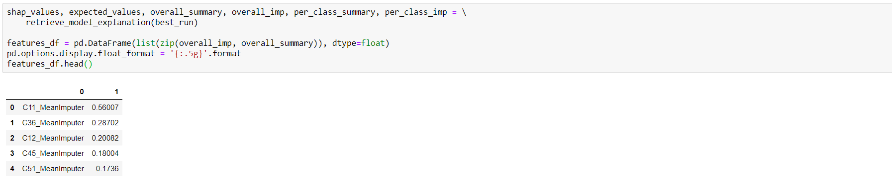

# Model explainability (Code Sample)

## Pre-requisites

This code sample uses the results of the [Classification AutoML code sample](../automl-for-classification-regression-forecasting/automl-classification-code-sample.md). Make sure you have in your Azure Machine Learning service workspace at least one successful experiment run that yielded a trained classification model.

Note: All code snippets in this section are designed to run in [Azure Notebooks](https://notebooks.azure.com/).

## Prepare your environment

he first step you will perform is installing/updating your Azure Machine Learning service SDK:

```python
!pip install --upgrade azureml-sdk[notebooks,explain,automl,contrib]
```

Once you have the latest version of the SDK, you will need to do the necessary imports and specify the identifier of the experiment run:

```python
import pandas as pd

from azureml.train.automl.run import AutoMLRun

from azureml.train.automl.automlexplainer import explain_model
from azureml.train.automl.automlexplainer import retrieve_model_explanation

experiment_name = 'sonar-binary-classifier'
run_id = 'AutoML_3629f91f-628e-4f84-af18-862bd66287e5'
```

Note: You need to specify the experiment run identifier only if you are trying to get model explainability separately from executing the run.

## Prepare input data

Once everything is in place, you will load your input data and split it into the training and testing data sets:

```python
data_flow = dprep.read_csv('https://quickstartsws9073123377.blob.core.windows.net/azureml-blobstore-0d1c4218-a5f9-418b-bf55-902b65277b85/sonar/sonar.all-data.csv', 
                           header=dprep.api.dataflow.PromoteHeadersMode.NONE,
                          infer_column_types=True)

X = data_flow.keep_columns(['Column{:d}'.format(x) for x in range(1,61)]).to_pandas_dataframe()
y = data_flow.keep_columns(['Column61']).to_pandas_dataframe()

X_train, X_test, y_train, y_test = train_test_split(
    X, y, test_size=0.2, random_state=111)
```

## Load the run

Next, you will get access to the run and retrieve the best model that was trained during execution:

```python
experiment = Experiment(ws, experiment_name)
automl_run = AutoMLRun(experiment, run_id)
best_run, fitted_model = automl_run.get_output()
```
Note: The creation of the `Workspace` variable `ws` is ommited for brewity.

## Explain your model (numerically)

Use the `retrieve_model_explanation` method to get the feature importance data for the best run.



Notice how the code assembles the global results into an easy to understand Pandas dataframe.

Since the predicted feature has two classes, the `per_class_imp` and `per_class_summary` variables will have a length of two, containing feature importance for each class. You can use the following code to retrieve feature importance for the first class:

```python
features_df = pd.DataFrame(list(zip(per_class_imp[0], per_class_summary[0])), dtype=float)
pd.options.display.float_format = '{:.5g}'.format
features_df.head()
```

## Explain your model (visually)

Use the `RunDetails` object to display the visual widget related to your run:

```python
from azureml.widgets import RunDetails
RunDetails(automl_run).show()
```

This will display the following dashboard:


Clicking on the top iteration (the best one) will enable you to view the graphical interpretation of the feature importance data:


## Next steps

You can learn more about Model Explainability by reviewing these links to additional resources:

- [What is automated machine learning?](https://docs.microsoft.com/en-us/azure/machine-learning/service/concept-automated-ml)
- [Model interpretability with Azure Machine Learning service](https://docs.microsoft.com/en-us/azure/machine-learning/service/machine-learning-interpretability-explainability)
- [Azure Machine Learning interpretability sample notebooks](https://github.com/Azure/MachineLearningNotebooks/tree/master/how-to-use-azureml/explain-model)

Read next: [Model deployment](../../../model-deployment/README.md)