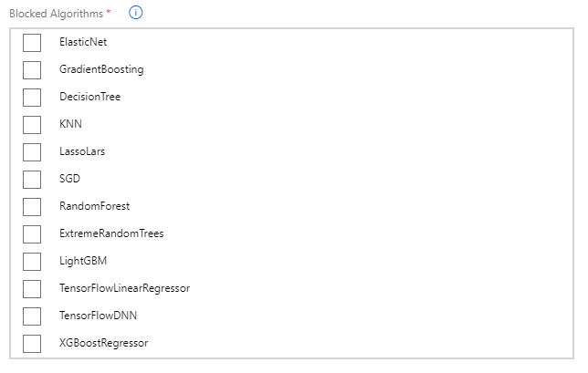

# Capabilities of automated machine learning (the feature): feature engineering, algorithm selection, hyperparameter tuning, and model explainability

The following table describes the most pwerful capabilities of autoML:

Name | Description
--- | ---
Feature engineering | Feature Engineering is a process which results in new features being derived from the original features available in the data set(s). In most cases, enrichment is followed by a feature selection process aimed towards reducing the dimensionality of the training problem. In addition to standard preprocessing which is included in every autoML experiment, you have an option to use advanced preprocessing which actually performs feature engineering. Read the [Feature Engineering introduced](../feature-engineering-training-evaluation-selection/feature-engineering-introduced.md) section for a conceptual introduction 
Algorithm selection | For any given machine learning task, there are a number of candidate machine learning algorithms that can be used to train models. AutoML has support for multiple algorithms that it will use during the automated experimentation process.
Hyperparameter tuning | Hyperparameters are algorithm parameters that govern the model training process. Within the context provided by the same algorithm, different values set for a hyperparameter will yield potentially very different results. Choosing the right value for a hyperparameter is one of the most important challenges faced when training machine learning models. An example of a hyperparameter is the number of nodes in a hidden layer of a deep neural net. AutoML has built-in capabilities for hyperparameter tuning.
Model explainability | AutoML enables you to understand the relative importance of each feature that was used to train a model. This is commonly referred as global feature importance. In the particular case of classification, the feature imporance can be assessed at class level rathen then globaly.

## Feature engineering

For each experiment running in autoML, the process of data preprocessing is split into the following stages:

- Standard preprocessing (occurs automatically)
- Advanced preprocessing - feature engineering (occurs optionally, if requested)

The standard preprocessing step deals with scaling and normalizing data using the following types of algorithms:

- StandardScalerWrapper
- MinMaxScalar
- MaxAbsScalar
- RobustScalar
- PCA
- TruncatedSVDWrapper
- SparseNormalizer

See the [Automatic preprocessing (standard)](https://docs.microsoft.com/en-us/azure/machine-learning/service/concept-automated-ml#automatic-preprocessing-standard) section in [What is automated machine learning?](https://docs.microsoft.com/en-us/azure/machine-learning/service/concept-automated-ml) for details about these algorithms.

The advanced preprocessing step deals with the actual feature engineering process. There are several types of actions performed like:

- Eliminate features with very high cardinality or no variance and impute missing values.
- Generate new features from `DateTime` and text values.
- Transform, encode, and/or embed features.
- Compute measures like `Weight of Distance` (WoE) or `Cluster Distance`.

See the [Advanced preprocessing](https://docs.microsoft.com/en-us/azure/machine-learning/service/how-to-create-portal-experiments#advanced-preprocessing) section in [Create and explore automated machine learning experiments in the Azure portal](https://docs.microsoft.com/en-us/azure/machine-learning/service/how-to-create-portal-experiments) for details about these approaches.

## Algorithm selection

The list of available algorithms for each type of prediction task supported by autoML (Classification, Regression, and Forecasting) includes multiple choices like `Logistic Regression`, `LightGBM`, `Decision Tree`, `Random Forest`, `Xgboost`, to name just a few. The availability of a given algorithm depends on the type of prediction task specified when configuring the autoML experiment. See the [Select your experiment type](https://docs.microsoft.com/en-us/azure/machine-learning/service/how-to-configure-auto-train#select-your-experiment-type) section in [Configure automated ML experiments in Python](https://docs.microsoft.com/en-us/azure/machine-learning/service/how-to-configure-auto-train) for details about all available algoritms.

By default, autoML will take into consideration all the algorithms that are available for a given type of prediction task. When configuring the experiment (either through the Azure Portal or the Python SDK), you have the option specify which ones should not be considered. This is especially useful when you're using autoML for a task about which you know upfront that one or more algoritms yield poor results.

The following image shows the options you have when using the Azure Portal:



One final interesting feature that autoML provides is support for [Ensemble Learning](https://en.wikipedia.org/wiki/Ensemble_learning) which basically combines the output of multiple models and derives from it a combined result. The ensemble learning will usually be the last step that an autoML experiment runs.

## Hyperparameter tuning

Hyperparameters are algorithm parameters that govern the model training process. Within the context provided by the same algorithm, different values set for a hyperparameter will yield potentially very different results. Choosing the right value for a hyperparameter is one of the most important challenges faced when training machine learning models. An example of a hyperparameter is the number of nodes in a hidden layer of a deep neural net. AutoML has built-in capabilities for hyperparameter tuning.

## Model explainability

Model explainability (also referred as model interpretability) gives you the information that is necessary to explain why a certain trained model made a certain prediction.

Here is an example that shows global feature importance for a classical machine learning prediction problem (the iris classification):


From this we can see that the most important feature when it comes to predict the type of iris is the `petal length (cm)`, followed by `petal width (cm)`. The least important is `sepal width (cm)`.

To get access to the model explainability features you will need to use the Python SDK. The core explainability functionality is built into the `azureml.explain.model` package and the dedicated autoML part into the `azureml.train.automl.automlexplainer` package.

Here is an example on how to use the SDK to get the model explainability once the experiment is finished:

```python
from azureml.train.automl.automlexplainer import explain_model

shap_values, expected_values, overall_summary, overall_imp, per_class_summary, per_class_imp = \
    explain_model(fitted_model, X_train, X_test)

#Overall feature importance
print(overall_imp)
print(overall_summary)

#Class-level feature importance
print(per_class_imp)
print(per_class_summary)
```

Note that you will need to provide a validation dataset if you want to get class-level feature importance. Also, if you set the `model_explainability` flag in the autoML configuration, feature important will become available for all iterations. In this case, you can use `retrieve_model_explanation` to get feature importance for a certain iteration, as follows:

```python
from azureml.train.automl.automlexplainer import retrieve_model_explanation

shap_values, expected_values, overall_summary, overall_imp, per_class_summary, per_class_imp = \
    retrieve_model_explanation(best_run)

#Overall feature importance
print(overall_imp)
print(overall_summary)

#Class-level feature importance
print(per_class_imp)
print(per_class_summary)
```

Read the [Understanding automated machine learning generated models, using the model explainability capability of automated machine learning](./automl-understand-models-with-explainability/README.MD) section for a detailed discussion about using the SDK to explain models.

## Next steps

You can learn more about the capabilities of automated machine learning (the feature) by reviewing these links to additional resources:

- [What is automated machine learning?](https://docs.microsoft.com/en-us/azure/machine-learning/service/concept-automated-ml)
- [Configure automated ML experiments in Python](https://docs.microsoft.com/en-us/azure/machine-learning/service/how-to-configure-auto-train)
- [Create and explore automated machine learning experiments in the Azure portal](https://docs.microsoft.com/en-us/azure/machine-learning/service/how-to-create-portal-experiments)
- [Model interpretability with Azure Machine Learning service](https://docs.microsoft.com/en-us/azure/machine-learning/service/machine-learning-interpretability-explainability)

Read next: [Leveraging automated machine learning to train models for classification, regression, and forecasting](./automl-for-classification-regression-forecasting/README.md)